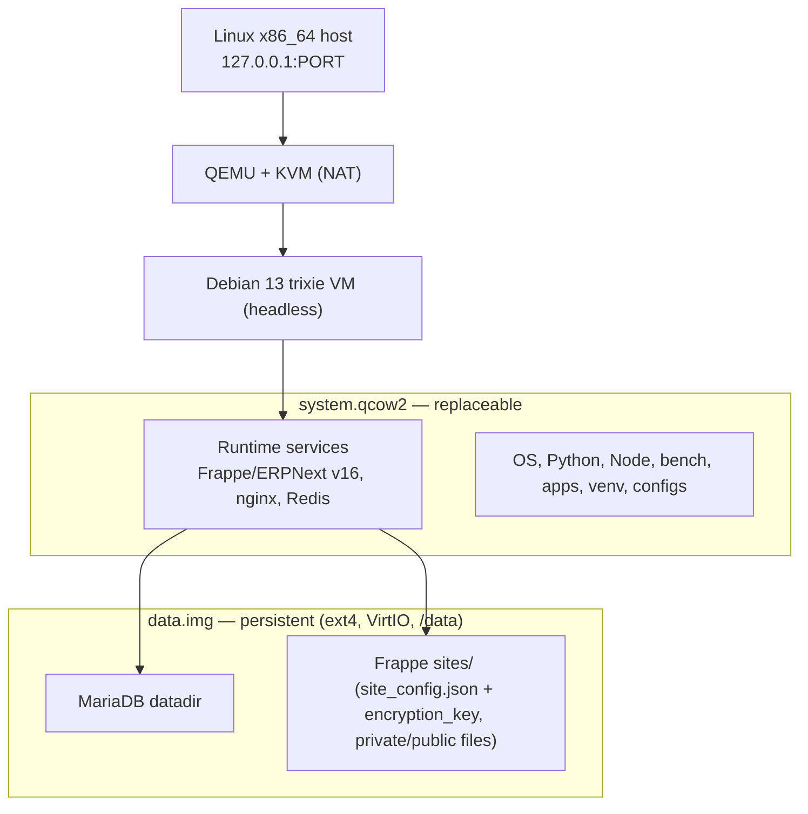
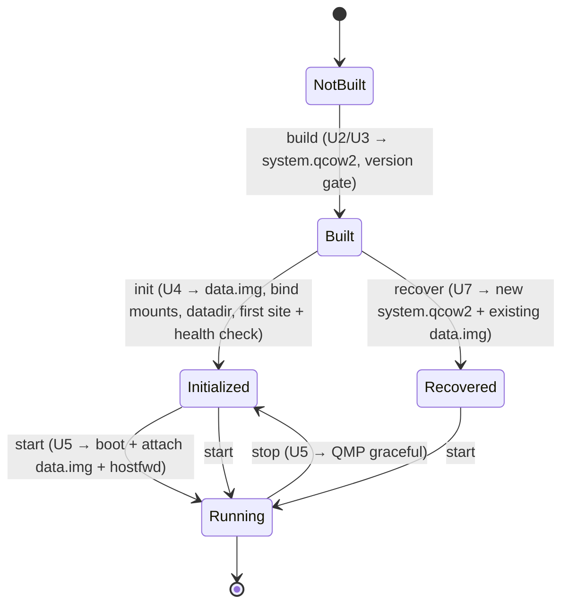
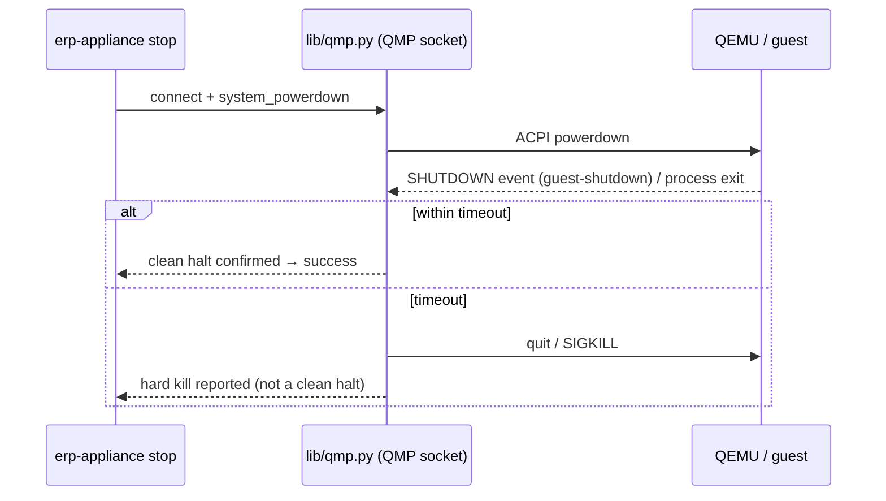

# QEMU ERPNext Appliance Prototype - Plan

> **Superseded** by `docs/plans/2026-08-21-002-feat-qemu-erpnext-appliance-go-host-plan.md` — that revision keeps this Product Contract unchanged and re-implements the host layer as a single cross-platform Go binary (no host-side shell, no Linux-native host deps). This document is retained as the record of the original Linux-only Bash + Python approach.

## Goal Capsule

- **Objective:** Prove that ERPNext v16 can run as a self-contained, headless Linux appliance under QEMU/KVM, with runtime code and persistent business data cleanly separated across two virtual disks.
- **Product authority:** This plan owns the Phase 1 prototype only. The future Go appliance manager, desktop GUI, cross-platform hosts, and application-level backup are out of active scope — structured for, not built here.
- **Open blockers:** None blocking planning. One carried build-time risk (v16 runtime-version requirements are still settling upstream) is handled by a build-time verification gate, not left open.

---

## Product Contract

### Summary

A headless Debian 13 (trixie) VM, provisioned from the official Debian cloud image via cloud-init, runs the full ERPNext v16 stack under QEMU/KVM and is reachable from the Linux host at `http://127.0.0.1:<port>`. Persistent business data (the MariaDB datadir and the Frappe `sites/` directory) lives on a separate `data.img`, so `system.qcow2` can be replaced without destroying customer data.

### Problem Frame

ERPNext is normally deployed as a hand-maintained Frappe Bench stack tied to one machine's OS. That couples the runtime (OS, Python, Node, app code) to the data (database, site files, encryption keys), so upgrading or rebuilding the environment risks the business data, and the environment can't be treated as portable or reproducible.

Phase 1 tests whether that coupling can be broken: package ERPNext as a reproducible QEMU appliance where the runtime disk is disposable and the data disk is durable. The specific trap this must survive is Frappe's per-site `encryption_key` — Frappe stores it in `site_config.json` and uses it to encrypt secrets held in the database. If that file rides on the runtime disk, replacing the runtime disk orphans the encrypted data even though the database itself was preserved. Getting the disk boundary right is the phase's central question, not an implementation afterthought.

### Key Decisions

- KD1. **Build and provision via Debian 13 cloud image + cloud-init** (session-settled: user-directed — chosen over Packer and debootstrap: fewest build-host dependencies and host-agnostic, so the build path ports cleanly to WHPX/HVF later). Governs R8.
- KD2. **Persist DB + `sites/` on `data.img`; keep all runtime on the replaceable system disk** (session-settled: user-directed — chosen over putting the whole `frappe-bench` on the data disk: app code and venv are runtime, not business data, and keeping them off the data disk is what makes the runtime genuinely replaceable). Governs R4, R5, R6.
- KD3. **Pin ERPNext v16 on Debian 13 trixie** (session-settled: user-directed — chosen over v15 on Debian 12: proves the go-forward target rather than an EOL-bound stack). Governs R1, R12. Conflict call-out **resolved during planning (2026-08-21, confirmed against the `version-16` branches):** Frappe v16 requires Python `>=3.14,<3.15` and Node `>=24` — both exceed trixie's defaults (Python 3.13.5, Node 20.19.2), so the build provisions them explicitly (KTD5); MariaDB 11.8 and Redis 8 in trixie satisfy the floors, so no external Redis source is needed. The R9 build-time gate still verifies rather than trusts these facts.
- KD4. **First-site creation is an init-time step against the attached data disk**, not baked into `system.qcow2`. Because the site DB and `sites/` directory live on `data.img` (KD2), `bench new-site` cannot run during image bake. Governs R14.
- KD5. **System-disk replacement recovery is a controlled command**, accepted in exchange for correct disk separation rather than making the system disk trivially interchangeable at the cost of Frappe/MariaDB correctness. The datadir on `data.img` couples to the MariaDB binary on the system disk, so recovery is bounded to same-or-newer MariaDB majors (with `mariadb-upgrade`); downgrades are unsupported. Governs R6.

### Architecture



### Requirements

**Appliance runtime**

- R1. A headless Debian 13 trixie x86_64 VM under QEMU/KVM runs the full ERPNext v16 stack (MariaDB, Redis, Frappe/ERPNext, web frontend) with no graphics, audio, USB, or host-directory sharing.
- R2. ERPNext is reachable from the Linux host at `http://127.0.0.1:<port>` through QEMU user-mode NAT port forwarding; the guest never requires LAN exposure or bridged networking.
- R3. One working Frappe site is provisioned and serves the ERPNext login. No company-management or multi-site UI is provided.

**Disk architecture and persistence**

- R4. The appliance uses two virtual disks: a replaceable `system.qcow2` (OS + runtime) and a persistent `data.img` (sparse RAW, ext4, attached as a VirtIO block device, mounted at `/data`). Governed by KD2.
- R5. All persistent business state lives on `data.img`: the MariaDB datadir and the Frappe `sites/` directory (including each site's `site_config.json` with its `encryption_key`, plus private and public site files). No persistent business data lives on `system.qcow2`. Governed by KD2.
- R6. Replacing `system.qcow2` while retaining the same `data.img` recovers the existing site and data through a documented recovery command (re-point the MariaDB datadir, bind `sites/`, run `mariadb-upgrade` when the MariaDB major changed, then run `bench migrate`), losing no business data. The replacement system disk must carry the same or a newer MariaDB major than the datadir was written with; MariaDB downgrades are unsupported. Governed by KD2, KD5.
- R7. A clean shutdown followed by restart preserves all data, and ERPNext and MariaDB recover to a working state. For durability under unclean termination, `data.img` is attached with a fsync-honoring QEMU cache mode (`cache=none` or `directsync`) and MariaDB runs with `innodb_flush_log_at_trx_commit=1`, so a committed transaction survives an unclean host or QEMU kill. Recovery behavior after unclean termination is exercised and documented; crash-proof operation is not otherwise guaranteed in Phase 1.

**Provisioning and version integrity**

- R8. The appliance is built reproducibly from setup tooling (download the Debian 13 cloud image, provision via cloud-init); large VM images are not committed to git. Governed by KD1.
- R9. The build verifies installed runtime versions (Python, Node.js, MariaDB, Redis) against explicit minimum versions kept in a checked-in config — derived from repo metadata where it exists (`requires-python` in Frappe's `pyproject.toml`, Node engines/`.nvmrc`) and hand-pinned for MariaDB and Redis, which have no machine-readable source. The build fails on any installed-below-pinned violation rather than proceeding. Governed by KD3.
- R10. The `bench` toolchain install completes successfully: `bench init`, `bench get-app erpnext`, and asset build finish without error.
- R11. A post-install health check proves ERPNext is functional before a build or init is considered successful: `erpnext` appears in the site's installed apps, the scheduler and background workers are running, an authenticated request returns real data, and a record is created and read back through the app layer. A login page rendering is not sufficient.
- R12. Installed runtime and app versions are pinned and recorded in the documented output. Governed by KD3.

**Lifecycle and operations**

- R13. Host-side commands provide at least `build`, `start`, `stop`, and `status`. `stop` issues a graceful (ACPI/QMP) powerdown and blocks until the guest confirms a clean halt (QMP `SHUTDOWN` event or QEMU process exit) within a bounded timeout, reporting success only then; on timeout it escalates to a hard kill and reports that it did. It never returns success while the guest may still be flushing to `data.img`.
- R14. A distinct init step creates `data.img`, initializes the MariaDB datadir on it, and creates the first site against the attached data disk. Governed by KD4.

**Portability**

- R15. The QEMU invocation and accelerator configuration are isolated so KVM can later be swapped for WHPX/HVF without redesigning the VM. The appliance does not depend on host bind mounts for ERP data, host-Linux filesystems, bridge networking, or `/dev/kvm` access outside the QEMU-launching layer.

### Key Flows

- F1. Build the appliance
  - **Trigger:** Operator runs the build command on a clean checkout.
  - **Steps:** Download the Debian 13 genericcloud image; boot with a cloud-init seed that installs Python/Node/MariaDB/Redis and the bench + ERPNext v16 stack; verify installed versions against the `version-16` branch requirements (R9); run `bench init` and `bench get-app erpnext` and build assets (R10); shut down cleanly to produce `system.qcow2`.
  - **Outcome:** A baked, replaceable `system.qcow2` containing runtime and app code but no business data. **Covers R8, R9, R10, R12.**
- F2. Initialize persistent data and first site
  - **Trigger:** Operator runs the init step against a fresh `data.img`.
  - **Steps:** Create the sparse ext4 `data.img`; initialize the MariaDB datadir under `/data`; create the first site (`bench new-site`) so its DB and `sites/` entry land on the data disk; run the post-install health check.
  - **Outcome:** A persistent data disk holding the working site, verified reachable. **Covers R3, R5, R11, R14.**
- F3. Start, access, stop
  - **Trigger:** Operator runs `start`.
  - **Steps:** Boot `system.qcow2` with `data.img` attached; services come up; host reaches `http://127.0.0.1:<port>`; `stop` performs a graceful powerdown.
  - **Outcome:** Running appliance reachable from the host; clean stop preserves data. **Covers R1, R2, R7, R13.**
- F4. Replace the system disk and recover
  - **Trigger:** Operator attaches a new `system.qcow2` (B) to an existing `data.img`.
  - **Steps:** Verify the disk's MariaDB major is same-or-newer than the datadir (reject a downgrade); re-point the MariaDB datadir; bind `sites/`; run `mariadb-upgrade` if the DB major changed; run `bench migrate`; run the R11 functional health check.
  - **Outcome:** The existing site and data recover on the new runtime disk with no data loss. **Covers R6.**

### Acceptance Examples

- AE1. Build-time version gate. **Covers R9.** **Given** an installed component (Python, Node, MariaDB, or Redis) below its pinned minimum, **when** the build runs, **then** the build fails with a message naming the component, its installed version, and the required minimum, and does not produce a `system.qcow2`.
- AE2. Post-install health check. **Covers R11.** **Given** a completed init, **when** the health check runs, **then** it confirms `erpnext` is installed, the scheduler and workers are running, an authenticated API call returns data, and a record created programmatically reads back correctly — reporting failure if any check fails; a rendering login page alone does not pass.
- AE3. Persistence across clean restart. **Covers R7.** **Given** identifiable test data created in ERPNext, **when** the appliance is shut down cleanly and started again, **then** the data remains and ERPNext and MariaDB recover to a working state.
- AE4. System-disk replacement. **Covers R6.** **Given** a working appliance on `system.qcow2` (A) plus `data.img`, **when** the system disk is replaced with `system.qcow2` (B) carrying the same or newer ERPNext v16 and the same or newer MariaDB major, and the recovery command runs (`mariadb-upgrade` if the DB major changed, then `bench migrate`), **then** the existing site and data recover with no business data lost. A disk carrying an older MariaDB major is rejected with a clear error.
- AE5. Unclean termination durability. **Covers R7.** **Given** a transaction committed in ERPNext and acknowledged, **when** QEMU is killed uncleanly and the appliance is restarted, **then** the committed record is present after recovery, and the observed MariaDB/ERPNext recovery behavior is documented.

### Scope Boundaries

**Deferred for later (structured for, not built now)**

- Multiple companies as separate Frappe sites, and any company-management UI.
- Application-level backup and restore (MariaDB/Frappe DB, site files, site config) stored outside `data.img`.
- A Go appliance-manager application and any QMP management layer beyond what the prototype usefully needs.

**Outside this prototype's identity**

- Windows, macOS, and ARM64 appliances (WHPX/HVF host support is designed toward via R15, not implemented).
- Wails, Svelte, desktop GUI, system tray/menu-bar, Windows Service, macOS launchd, installers, auto-update.
- Docker/Podman/Kubernetes or any container runtime; LAN/multi-user exposure; VM disk snapshots as the backup strategy; sophisticated monitoring.

### Dependencies / Assumptions

- Host is Linux x86_64 with QEMU and KVM hardware acceleration, CLI/scripts only, and network access to download the base image and packages.
- Debian publishes an official trixie `genericcloud` amd64 qcow2 suitable as the cloud-init base.
- v16 runtime floors are confirmed and pinned (see KTD5): Python `>=3.14,<3.15` and Node `>=24` are provisioned explicitly because they exceed trixie's defaults; trixie's MariaDB 11.8.3 and Redis 8.0.2 both satisfy the floors, so no external Redis source is required. R9 verifies installed-vs-pinned at build time rather than assuming.
- Redis is treated as ephemeral cache/queue on the system disk; losing pending background jobs on restart is acceptable for the prototype.

### Success Criteria

- The full acceptance workflow runs reliably from a clean checkout: clone → install documented host prerequisites → build/provision → init → start → open `http://127.0.0.1:<port>` → log in → create accounting/test data → stop → start → data intact.
- The resulting architecture makes the next phase (a Go appliance manager driving the same QEMU appliance and data model) possible without redesign.
- Primary question answered with evidence: can ERPNext be packaged as a reliable, reproducible, headless QEMU appliance whose runtime and persistent business data are cleanly separated?

### Outstanding Questions

**Resolved during planning** (see Key Technical Decisions)

- Host port / guest target → `127.0.0.1:18080` forwarded to guest nginx `:80` (production-shaped). KTD1.
- Host CLI name/shape and `init` verb → single `erp-appliance` CLI; `init` is a separate explicit verb; adds `recover`. KTD2.
- Graceful-shutdown mechanism → QMP unix socket (`system_powerdown` + wait for `SHUTDOWN`). KTD3.
- Exact pinned versions and Redis 8 sourcing → confirmed and pinned; Redis 8 + MariaDB 11.8 come from trixie, Python 3.14 + Node 24 provisioned explicitly. KTD5.
- MariaDB datadir / `sites/` placement on `/data` → in-guest bind mounts. KTD4.

**Resolve Before Planning**

- None. All product-scope decisions are resolved.

### Sources / Research

- `docs/plans/phase1.md` — the originating Phase 1 spec (objective, design goals, disk architecture, out-of-scope, acceptance criteria).
- ERPNext supported versions and v16 requirements (web, 2026): v16 is current stable (shipped Dec 2025), v15 EOL end-2027, v14 at EOL; v16 upstream requirement docs are inconsistent on exact Python/Node/Redis versions — the reason for the R9 build-time verification gate.

- Frappe v16 `pyproject.toml` (`requires-python = ">=3.14,<3.15"`) and `package.json` (`engines.node = ">=24"`), `version-16` branch — the machine-readable source for the R9 Python/Node floors (confirmed 2026-08-21).
- ERPNext v16 `pyproject.toml` (`requires-python = ">=3.14"`, `frappe = ">=16.21.0,<17.0.0"`), `version-16` branch.
- Debian 13 trixie default package versions (confirmed 2026-08-21): Python 3.13.5, Node.js 20.19.2, MariaDB 11.8.3, Redis 8.0.2 — establishing that Python and Node must be provisioned beyond trixie defaults while MariaDB and Redis are satisfied.
- QEMU QMP `system_powerdown` → `POWERDOWN`/`SHUTDOWN` event semantics and qcow2-vs-RAW cache-mode durability (`cache=none`/`directsync`, guest-flush dependency) — basis for KTD3 and KTD6.

---

## Planning Contract

### Product Contract preservation

Changed: **KD3's conflict call-out** and the **Redis dependency assumption** — refined to confirmed upstream version facts (Python 3.14 and Node 24 provisioned explicitly; MariaDB 11.8 and Redis 8 taken from trixie). This is an evidence-based clarification of a build-time assumption that R9 was designed to surface, not a product-scope change. All R / KD / F / AE IDs and their meaning are preserved; no requirement was split or re-owned.

### Key Technical Decisions

- **KTD1. Serve the guest via production nginx on `:80`, host-forwarded `127.0.0.1:18080 → :80` over QEMU user-mode NAT.** (session-settled: user-approved — chosen over the bench dev server `:8000`: production nginx serves built assets and proxies gunicorn/socketio, which R11's real-data check and asset delivery require; uses `bench setup production` with supervisor.) Governs R2; instantiates F3.
- **KTD2. One host CLI `erp-appliance` with verbs `build | init | start | stop | status | recover`; `init` is a separate explicit verb.** (session-settled: user-approved — chosen over folding first-run data-disk creation into `start`: keeps the destructive datadir init deliberate and matches R14/KD4; `recover` carries R6.) Governs R13, R14.
- **KTD3. Graceful shutdown over a QMP unix socket: issue `system_powerdown`, then block on the `SHUTDOWN` event (or QEMU process exit) within a bounded timeout, escalating to `quit`/SIGKILL and reporting the hard kill.** (session-settled: user-approved — chosen over HMP `-monitor` text-scraping: the structured event is the parseable clean-halt confirmation R13 requires and seeds the future Go QMP layer.) Governs R13.
- **KTD4. Relocate the MariaDB datadir and Frappe `sites/` onto `data.img` via in-guest bind mounts (`/data/mariadb → /var/lib/mysql`, `/data/frappe/sites → <bench>/sites`), declared in `/etc/fstab` and ordered before the mariadb/frappe services.** (session-settled: user-approved — chosen over editing MariaDB `datadir=` (drags AppArmor, socket, and systemd changes) and over symlinks (tool/AppArmor fragility): every tool keeps its canonical path, and `sites/` with its `site_config.json`/`encryption_key` rides `/data` automatically, directly satisfying R5's central trap.) Governs R5; instantiates KD2, KD4.
- **KTD5. Provision Python 3.14 (`>=3.14,<3.15`) and Node 24 (`>=24`) explicitly during the build; use trixie's MariaDB 11.8 and Redis 8 as-is. Pinned floors live in a checked-in `config/versions.yaml`, with Python/Node copied from Frappe repo metadata and MariaDB/Redis hand-pinned.** (session-settled: user-approved — resolves KD3's version uncertainty with confirmed upstream facts; the exact fetch mechanism for Python/Node is directional (recommended: standalone builds via `uv`/`fnm` to avoid third-party apt repos), and the R9 gate enforces correctness regardless.) Governs R9, R12; instantiates KD3.
- **KTD6. Attach `data.img` as a VirtIO block device (RAW, ext4) with a fsync-honoring cache mode (`cache=none,aio=native`) and MariaDB `innodb_flush_log_at_trx_commit=1`.** (session-settled: user-approved — gives committed-transaction durability under an unclean QEMU kill per R7; a RAW data image avoids the qcow2 metadata-flush hazard that affects the system disk, which is acceptable because the system disk carries no business data.) Governs R7.
- **KTD7. Isolate the QEMU invocation and accelerator selection behind a single launch module (`lib/qemu.sh`) so KVM ↔ WHPX/HVF is a one-line change and no `/dev/kvm`, host bind-mount, or bridge dependency exists outside it.** (session-settled: user-directed — per R15 and the portability design goal.) Governs R15.

---

## High-Level Technical Design

The disk/service boundary is shown in the Product Contract's Architecture diagram. Two additional shapes govern implementation: the appliance lifecycle and the graceful-shutdown protocol. Both are directional design guidance, not implementation specification.

**Lifecycle**



**Graceful shutdown (KTD3, R13)**



---

## Output Structure

```text
erp-appliance                 # host CLI dispatcher: build|init|start|stop|status|recover (KTD2)
config/
  versions.yaml               # pinned runtime floors, R9 source of truth (KTD5)
lib/
  qemu.sh                     # QEMU invocation + accelerator isolation (KTD7, R15)
  qmp.py                      # QMP client: system_powerdown + wait SHUTDOWN (KTD3)
  common.sh                   # shared helpers (mounts, logging)
build/
  build.sh                    # download base image + drive cloud-init bake (U2)
  verify-versions.sh          # build-time version gate (U3, R9/AE1)
  cloud-init/
    user-data                 # provision py3.14, node24, mariadb, redis, bench, erpnext, assets, production
    meta-data
init/
  init-data.sh                # data.img + bind mounts + datadir + first site (U4, R14)
health/
  healthcheck.py              # functional health check (U6, R11/AE2)
recover/
  recover.sh                  # system-disk replacement recovery + MariaDB major guard (U7, R6/AE4)
test/
  test-persistence.sh         # AE3
  test-durability.sh          # AE5
docs/
  results.md                  # recorded versions + persistence/replacement/durability results (R12)
README.md
.gitignore                    # ignores .artifacts/, *.qcow2, *.img, base images
.artifacts/                   # (gitignored) base image, system.qcow2, data.img
```

The tree is a scope declaration; the per-unit **Files** lists are authoritative and the implementer may adjust the layout.

---

## Implementation Units

### U1. Repo scaffold, version-pin config, and QEMU/accelerator isolation

- **Goal:** Establish the repo layout, the checked-in version-floor config (R9's source of truth), and a single QEMU-launch module that isolates the invocation and accelerator so KVM ↔ WHPX/HVF is a one-line change.
- **Requirements:** R9, R12, R15. Instantiates KTD5, KTD7.
- **Dependencies:** none.
- **Files:** `erp-appliance`, `lib/qemu.sh`, `lib/common.sh`, `config/versions.yaml`, `.gitignore`, `README.md` (skeleton).
- **Approach:**
  1. `config/versions.yaml` holds floors — `python: ">=3.14,<3.15"`, `node: ">=24"`, `mariadb: ">=10.6"`, `redis: ">=6"` — plus target app pins (`frappe >=16.21.0,<17`, `erpnext version-16`). Python/Node floors are copied from Frappe repo metadata; MariaDB/Redis are hand-pinned (no machine-readable source).
  2. `lib/qemu.sh` exposes one function that assembles the `qemu-system-x86_64` arg list from parameters (accel, cpu, mem, disks, netdev hostfwd, QMP socket, serial). The accelerator is a single variable (`ACCEL=kvm`) so WHPX/HVF is a one-line swap; no other code references `/dev/kvm` (R15).
  3. `erp-appliance` is the verb dispatcher delegating to the unit scripts.
- **Patterns to follow:** none local (greenfield); boring POSIX-shell conventions.
- **Test scenarios:**
  - `versions.yaml` parses and every required key resolves to a non-empty constraint; a missing or empty key is a hard error.
  - The `qemu.sh` arg-builder emits the given accelerator unchanged (`ACCEL=kvm` → `-accel kvm`; swapping the variable changes only that token), asserted by capturing the built arg list — proves single-point accelerator isolation without launching QEMU.
  - `erp-appliance` with no verb or an unknown verb prints usage and exits non-zero.
- **Verification:** `erp-appliance status` runs and reports "not built"; the config-parser and arg-builder checks pass.
- **Execution note:** mostly scaffolding/config — prefer unit checks on the config parser and arg-builder plus a CLI smoke over broad coverage.

### U2. Cloud-init build pipeline → baked `system.qcow2` (no business data)

- **Goal:** Reproducibly download the Debian 13 genericcloud image and provision it via cloud-init into a baked `system.qcow2` carrying the full v16 runtime and app code but zero business data.
- **Requirements:** R1, R8, R10. Instantiates KD1, KTD5.
- **Dependencies:** U1.
- **Files:** `build/build.sh`, `build/cloud-init/user-data`, `build/cloud-init/meta-data`.
- **Approach:**
  1. `build.sh` downloads the pinned trixie genericcloud amd64 qcow2 (checksum-verified) into the gitignored artifacts dir, builds a NoCloud seed ISO from `cloud-init/`, and boots the image headless via `lib/qemu.sh` with the seed attached.
  2. cloud-init `user-data` provisions: base packages; MariaDB 11.8 + Redis 8 from trixie; **Python 3.14** and **Node 24** via the recommended standalone mechanism (KTD5); `bench init` on the `frappe` `version-16` branch; `bench get-app erpnext --branch version-16`; `bench build`; `bench setup production` (nginx + supervisor).
  3. After the U3 version gate passes and assets build, the guest powers down cleanly to finalize `system.qcow2`. No `bench new-site` here (KD4 — the site DB lives on `data.img`, absent at bake time).
- **Patterns to follow:** Debian NoCloud cloud-init; the Frappe manual bench install for v16.
- **Test scenarios:**
  - A build from a clean checkout produces a `system.qcow2` and the base-image checksum matches the pin; a checksum mismatch aborts the build before provisioning.
  - The provisioned image contains bench, the `frappe` and `erpnext` apps at the pinned branches, and built assets (asserted inside the booted guest via `bench version`, not by a login page).
  - Re-running the build reuses the downloaded base image and does not duplicate apt sources or app installs (idempotent).
- **Verification:** `system.qcow2` exists, boots headless with services starting; `bench version` in the guest reports frappe 16.x / erpnext 16.x.
- **Execution note:** heavy and slow (image download + full provision — expect 30–60 min on first run); prefer runtime/smoke verification inside the booted guest over unit tests.

### U3. Build-time version verification gate

- **Goal:** Fail the build with a precise message when any installed runtime is below its pinned floor, before a `system.qcow2` is produced.
- **Requirements:** R9, R12. **Covers AE1.**
- **Dependencies:** U1 (reads the config); runs inside U2's provisioning.
- **Files:** `build/verify-versions.sh`.
- **Approach:** read `config/versions.yaml`; query the *provisioned* interpreters (`python3.14 --version`, `node --version`, `mariadbd --version`, `redis-server --version` — not the system `python3`); compare against floors with correct version comparison; on any below-floor, print `component / installed / required` and exit non-zero so `build.sh` aborts and removes the partial image; on success, record the resolved installed versions into `docs/results.md` (R12).
- **Test scenarios:**
  - Covers AE1. Given a stubbed below-floor version for each component in turn, the gate exits non-zero and the message names that component, its installed version, and the required minimum.
  - Given all components at or above floor, the gate exits zero and records the pinned/installed versions.
  - The comparator handles multi-digit and suffixed versions (`20.19.2` < `24`; `8.0.2` ≥ `6`; `+dfsg`/pre-release suffixes do not break comparison).
- **Verification:** run against a below-floor stub → non-zero + correct message; run against the real provisioned image → zero + recorded versions.
- **Execution note:** feature-bearing — unit-test the comparator and message with stubbed version strings (fast, deterministic); this is AE1's proof.

### U4. Data disk and first-site init (`init` verb) with the bind-mount boundary

- **Goal:** Create the persistent data disk, establish the bind-mount boundary, initialize the MariaDB datadir on it, and create the first Frappe site so its DB and `sites/` land on `data.img`.
- **Requirements:** R3, R4, R5, R14. Instantiates KD2, KD4, KTD4. Covers F2.
- **Dependencies:** U1, U2.
- **Files:** `init/init-data.sh`, the guest-side fstab/mount unit fragment shipped in the image (from U2), `lib/common.sh` (mount helpers).
- **Approach:**
  1. Create a sparse RAW `data.img`, `mkfs.ext4`, attach as VirtIO via `lib/qemu.sh`, mount at `/data`; create `/data/mariadb` and `/data/frappe/sites`.
  2. Establish bind mounts `/data/mariadb → /var/lib/mysql` and `/data/frappe/sites → <bench>/sites` in `/etc/fstab` with `x-systemd.requires`/ordering so the mariadb and frappe services start only after `/data` and the binds are active.
  3. With the binds active, run `mariadb-install-db` (datadir now physically on `/data`), start MariaDB, then `bench new-site` so the site DB and `sites/<site>` (including `site_config.json` + `encryption_key`) land on `data.img`; install the erpnext app onto the site (R3).
  4. Set the created site as the default site and regenerate the production frontend config (`bench setup nginx`), then reload nginx/supervisor so `:80` serves the new site without host-based routing (KTD1) — the bake-time `bench setup production` (U2) ran before any site existed, so its nginx config must be regenerated once the first site exists.
  5. Run the U6 health check.
- **Approach note:** the bind mounts MUST precede `mariadb-install-db` and `bench new-site` — initializing onto the canonical path before the bind is active strands data on the system disk.
- **Patterns to follow:** standard MariaDB datadir relocation via bind mount; Frappe `bench new-site`.
- **Test scenarios:**
  - After init, `SELECT @@datadir` resolves under the bind target and the bytes live on `data.img`: unmounting `/data` leaves `/var/lib/mysql` empty (R5).
  - `sites/<site>/site_config.json` containing `encryption_key` resides on `data.img` (same unmount check) — the R5 central-trap assertion.
  - `init` against an already-initialized `data.img` refuses to reinitialize (no destructive overwrite) and exits with a clear message.
  - On a boot with `/data` absent, the mariadb/frappe services do not start against empty canonical paths (fail safe rather than create a divergent datadir).
- **Verification:** init completes, the U6 health check passes, and the unmount check confirms both the datadir and `sites/` are on `data.img`.
- **Execution note:** feature-bearing correctness core of the phase — verify the *physical* on-disk location explicitly, not merely that services run.

### U5. Lifecycle commands with QMP graceful shutdown

- **Goal:** Provide the host CLI: `start` boots the appliance with the data disk attached and port-forwarded, `stop` performs a confirmed graceful shutdown, `status` reports state, and `build`/`init` delegate to U2/U4.
- **Requirements:** R2, R7 (attach + cache mode), R13. Instantiates KTD1, KTD2, KTD3, KTD6. Covers F3.
- **Dependencies:** U1; consumes U2 (`system.qcow2`) and U4 (`data.img`).
- **Files:** `erp-appliance` (verb bodies), `lib/qmp.py`, `lib/qemu.sh`.
- **Approach:**
  1. `start`: boot `system.qcow2` and attach `data.img` (VirtIO, RAW, `cache=none,aio=native` per KTD6); user-mode NAT with `hostfwd=tcp:127.0.0.1:18080-:80` (KTD1); QMP unix socket + serial log; background the process; wait until `http://127.0.0.1:18080` answers or a bounded timeout elapses.
  2. `stop`: `lib/qmp.py` connects to the QMP socket, issues `system_powerdown`, blocks on the `SHUTDOWN` event (or QEMU process exit) within a bounded timeout; on timeout issues `quit`/SIGKILL and reports the hard kill — never reporting success while the guest may still be flushing (KTD3, R13).
  3. `status`: report not-built / stopped / running (+ URL) by probing the QMP socket, process, and port.
- **Patterns to follow:** QEMU `-netdev user,hostfwd=...`; QMP over unix socket.
- **Test scenarios:**
  - Covers R2. After `start`, a host-side HTTP GET to `http://127.0.0.1:18080` returns the ERPNext login (200) with no LAN/bridged networking configured.
  - Covers R13. `stop` on a healthy guest returns success only after the QMP `SHUTDOWN` event / process exit is observed, reported as graceful.
  - Covers R13. `stop` against a guest that ignores `system_powerdown` (simulate by disabling guest ACPI handling) escalates to a hard kill after the timeout and reports it did — and still does not report a clean halt.
  - `status` reflects not-built → stopped → running → stopped correctly across the lifecycle.
- **Verification:** full `build → init → start →` open URL `→ stop` cycle; `stop` blocks and reports graceful; the forced-timeout path reports a hard kill.
- **Execution note:** feature-bearing on the shutdown contract — test the QMP wait/escalate logic in `lib/qmp.py` against a stub QMP server that emits or withholds `SHUTDOWN`.

### U6. Post-install functional health check

- **Goal:** Prove ERPNext is actually functional (not merely rendering) before any build or init is deemed successful.
- **Requirements:** R11. Covers AE2, F2.
- **Dependencies:** U4 (a site to check); consumed by U4 and U7.
- **Files:** `health/healthcheck.py`.
- **Approach:** against the running site — assert `erpnext` is in the site's installed apps; assert the scheduler is enabled and background workers are running (via bench/frappe APIs); make an authenticated API request that returns real data (not the login page); create a record programmatically (a throwaway ToDo/Note via the app layer) and read it back, then delete it; exit non-zero on any failure with a per-check message.
- **Test scenarios:**
  - Covers AE2. On a healthy site all four checks pass and the check exits zero.
  - Each check fails independently: erpnext absent → fail naming it; scheduler/workers down → fail; unauthenticated/HTML response → fail (a rendering login page alone does not pass); create-then-read mismatch → fail.
  - The probe record is removed after the check (no residue in the site).
- **Verification:** run against the initialized appliance → pass; run against a deliberately broken state (workers stopped) → fail with the correct message.
- **Execution note:** feature-bearing — this is AE2's proof and the gate reused by U4 and U7.

### U7. System-disk replacement recovery (`recover` verb) and version guards

- **Goal:** Recover an existing `data.img` onto a replacement `system.qcow2` with no business-data loss, rejecting an unsupported MariaDB downgrade.
- **Requirements:** R6. Instantiates KD5. Covers F4, AE4.
- **Dependencies:** U4, U5, U6.
- **Files:** `recover/recover.sh`.
- **Approach:**
  1. Read the MariaDB major the datadir was written with (from `/data/mariadb`, e.g. the `mysql_upgrade_info` marker) and the frappe/erpnext app versions the site was last migrated with; compare both against the replacement disk. Abort with a clear error if the replacement carries an older MariaDB major (KD5 — downgrades unsupported) **or** an older frappe/erpnext app version than the data (a schema downgrade `bench migrate` cannot perform safely).
  2. Boot the replacement `system.qcow2` with the existing `data.img`; establish the datadir and `sites/` bind mounts; if the major increased, run `mariadb-upgrade`; run `bench migrate`; then run the U6 health check.
- **Patterns to follow:** `mariadb-upgrade`; `bench migrate`.
- **Test scenarios:**
  - Covers AE4. Given a working appliance (system A + `data.img`), replacing with system B (same-or-newer v16, same-or-newer MariaDB major) and running `recover` leaves the pre-existing site and its test data present, with U6 passing and no data loss.
  - Covers AE4/KD5. A replacement disk with an older MariaDB major is rejected with an error naming both majors; no migration is attempted.
  - An app-version downgrade — a replacement disk carrying an older frappe/erpnext than the data was last migrated with — is rejected with a clear error before `bench migrate` runs.
  - When the MariaDB major increased, `mariadb-upgrade` runs before `bench migrate`; when unchanged, it is skipped.
  - An `encryption_key`-protected secret remains decryptable after recovery (read back an encrypted field value) — proving `sites/` and the key rode `data.img`, not the system disk.
- **Verification:** end-to-end replace-and-recover with retained data; the downgrade-rejection path; the encrypted-secret read-back.
- **Execution note:** feature-bearing — the encryption-key survival check is the disk-boundary proof; include it explicitly.

### U8. Persistence and durability verification, and documentation

- **Goal:** Exercise and document clean-restart persistence and unclean-termination durability, and deliver the README and recorded test results.
- **Requirements:** R7. Covers AE3, AE5. Delivers the README deliverable and Success Criteria workflow.
- **Dependencies:** U4, U5, U6.
- **Files:** `test/test-persistence.sh`, `test/test-durability.sh`, `README.md`, `docs/results.md`.
- **Approach:**
  1. `test-persistence.sh` (AE3): create identifiable data via the app, `stop` cleanly, `start`, assert the data is present and MariaDB/ERPNext are healthy (U6).
  2. `test-durability.sh` (AE5): commit and acknowledge a transaction, `kill -9` the QEMU process (unclean), restart, assert the committed record is present after InnoDB recovery, and record the observed recovery behavior; relies on KTD6 (`cache=none` + `innodb_flush_log_at_trx_commit=1`).
  3. README: host prerequisites, build/init/start/stop instructions, ERPNext URL, disk architecture, and troubleshooting/log locations (serial console, nginx, supervisor, MariaDB). `docs/results.md`: recorded runtime versions (R12) plus persistence, replacement, and durability results.
- **Test scenarios:**
  - Covers AE3. Identifiable data created before shutdown is present and correct after a clean stop/start cycle, and the scheduler/workers resume.
  - Covers AE5. A committed and acknowledged transaction survives a `kill -9` of QEMU followed by restart; the recovery behavior (InnoDB crash recovery and any service remediation) is captured in `results.md`.
  - The documented clone → build → init → start → login → create → stop → start → data-intact workflow runs end-to-end from a clean checkout (Success Criteria).
- **Verification:** both scripts pass; `results.md` is populated; the README workflow is reproducible.
- **Execution note:** feature-bearing durability proof — AE5 is behavioral and cannot be mocked; run the real unclean-kill cycle.

---

## Verification Contract

- **Build gate (R9 / AE1):** U3 blocks production of `system.qcow2` on any installed runtime below its pinned floor, naming component/installed/required.
- **Functional gate (R11 / AE2):** U6 must pass after every `init` and every `recover`; a rendering login page is insufficient.
- **Persistence (R7 / AE3):** U8 clean stop/start retains all data and recovers services.
- **Replacement (R6 / AE4):** U7 replace-and-recover retains data, rejects a MariaDB downgrade, and preserves `encryption_key`-protected secrets.
- **Durability (R7 / AE5):** U8 unclean `kill -9` + restart retains a committed transaction; recovery behavior documented.
- **Portability (R15):** U1 accelerator isolation holds — no `/dev/kvm`, host bind-mount, or bridge dependency exists outside `lib/qemu.sh`.
- **Success Criteria:** the U8 README workflow reproduces end-to-end from a clean checkout.

---

## Risks & Mitigation

- **Runtimes exceed the distro (Python 3.14 and Node 24 are not in trixie).** Provisioning newer-than-distro interpreters pulls against the boring/reproducible design goal and can break on upstream churn. *Mitigation:* pin exact builds in `config/versions.yaml`, prefer self-contained standalone builds (`uv`/`fnm`) over third-party apt repos, and let the R9 gate (U3) fail the build on any drift below floor.
- **ERPNext v16 is very new (`>=16.21`, stable since Dec 2025).** Install steps, `bench build`, and `bench setup production` may hit undocumented breakage on trixie with these runtimes. *Mitigation:* the build is reproducible and gated by the U6 functional health check before any build or init is deemed successful, so breakage surfaces at build time, not in operation.
- **Cross-major MariaDB recovery (KD5, U7).** `mariadb-upgrade` + `bench migrate` across majors can fail or partially migrate, endangering the durable datadir. *Mitigation:* downgrades are hard-rejected by the major guard; recovery gates on the U6 health check; the README instructs operators to copy `data.img` before a major upgrade (Phase 1 does not automate that copy).
- **qcow2 metadata durability on the system disk (KTD6 caveat).** An unclean kill can leave `system.qcow2` metadata inconsistent. *Mitigation:* the system disk carries no business data (KD2), so it is simply replaced via `recover`; only `data.img` (RAW + fsync-honoring cache + `innodb_flush_log_at_trx_commit=1`) must survive, which AE5 exercises.
- **Redis treated as ephemeral.** Pending background jobs are lost on restart. *Accepted* for Phase 1 (see Dependencies / Assumptions); the behavior is documented rather than mitigated.

---

## Definition of Done

- All eight units complete and dependency-ordered.
- AE1–AE5 demonstrably pass; the clean-checkout workflow (clone → build → init → start → login → create → stop → start → data intact) reproduces.
- `system.qcow2` is replaceable while retaining `data.img`, recovered via the documented `recover` command; MariaDB downgrade is rejected.
- No business data lives on `system.qcow2` (verified by the unmount check); the datadir, `sites/`, and `encryption_key` reside on `data.img`.
- Installed runtime and app versions are recorded in `docs/results.md` (R12).
- README and `docs/results.md` delivered; large VM images are gitignored, never committed.
