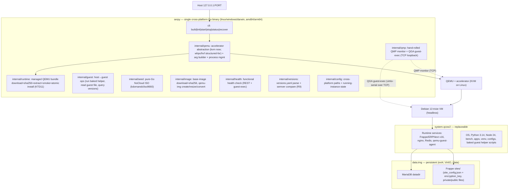
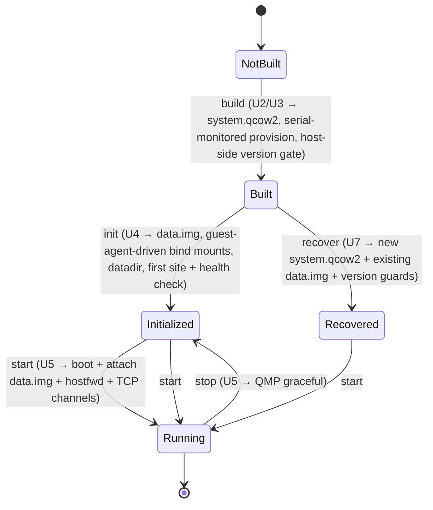
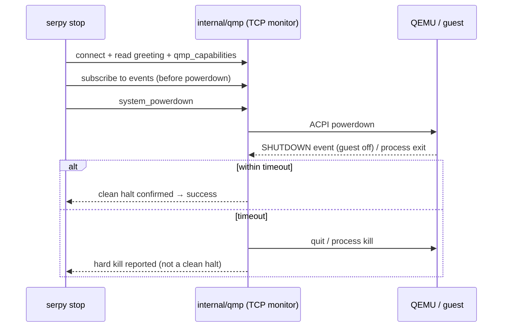
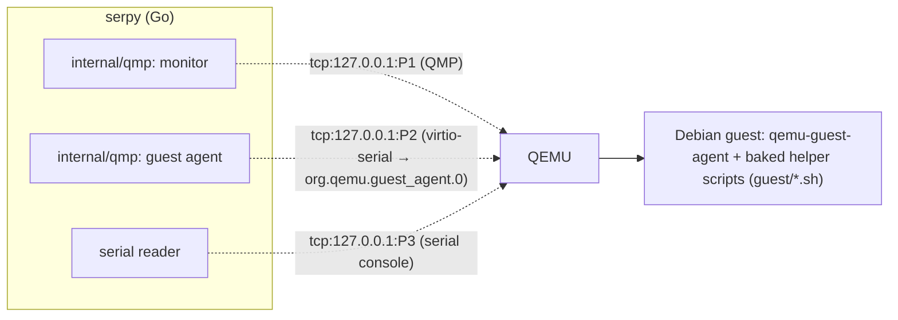

# QEMU ERPNext Appliance Prototype (Go host, cross-platform-structured) - Plan

> **Supersedes** `docs/plans/2026-08-21-001-feat-qemu-erpnext-appliance-plan.md`. That plan implemented the host layer as Linux-only Bash + Python. This revision keeps the entire Product Contract (disk separation, ERPNext v16 appliance, persistence, recovery, health check) unchanged and re-owns only the **how**: the host tooling is now a single cross-platform Go binary with no host-side shell and no Linux-native host dependencies — the Linux/KVM path is implemented and verified, Windows/WHPX and macOS/HVF are structured-for. Guest-side provisioning stays cloud-init (shell that runs only inside the Debian VM).

## Goal Capsule

- **Objective:** Prove that ERPNext v16 can run as a self-contained, headless Linux appliance under QEMU/KVM, with runtime code and persistent business data cleanly separated across two virtual disks, driven by a **cross-platform Go host CLI** that carries no Linux-native host dependencies.
- **Product authority:** This plan owns the Phase 1 prototype. In scope now: a Go host CLI whose code **compiles for** Linux, Windows, and macOS (amd64/arm64) and **runs and is verified end-to-end only on the Linux/KVM launch path**; the Windows/WHPX and macOS/HVF host runtimes are structured-for but unverified in Phase 1. Out of active scope (structured-for, not built): a desktop GUI, system tray/menu-bar, Windows Service / macOS launchd integration, installers, auto-update, and *verified* Windows/WHPX + macOS/HVF host execution (including the Windows/macOS managed-QEMU bundles — see KTD11).
- **Open blockers:** None blocking planning. One carried build-time risk (v16 runtime-version requirements are still settling upstream) is handled by a build-time verification gate, not left open.

---

## Product Contract

### Summary

A headless Debian 13 (trixie) VM, provisioned from the official Debian cloud image via cloud-init, runs the full ERPNext v16 stack under QEMU/KVM and is reachable from the host at `http://127.0.0.1:<port>`. The appliance is operated by a single cross-platform Go binary (`serpy`). Persistent business data (the MariaDB datadir and the Frappe `sites/` directory) lives on a separate `data.img`, so `system.qcow2` can be replaced without destroying customer data.

### Problem Frame

ERPNext is normally deployed as a hand-maintained Frappe Bench stack tied to one machine's OS. That couples the runtime (OS, Python, Node, app code) to the data (database, site files, encryption keys), so upgrading or rebuilding the environment risks the business data, and the environment can't be treated as portable or reproducible.

Phase 1 tests whether that coupling can be broken: package ERPNext as a reproducible QEMU appliance where the runtime disk is disposable and the data disk is durable. The specific trap this must survive is Frappe's per-site `encryption_key` — Frappe stores it in `site_config.json` and uses it to encrypt secrets held in the database. If that file rides on the runtime disk, replacing the runtime disk orphans the encrypted data even though the database itself was preserved. Getting the disk boundary right is the phase's central question.

A second, concurrent constraint shapes the *host* layer: the same appliance concept must eventually run under QEMU/WHPX on Windows and QEMU/HVF on macOS. Rather than defer all cross-platform concerns, Phase 1 writes the host in Go and keeps every host↔guest and host↔QEMU interaction free of Linux-native assumptions, so the unimplemented WHPX/HVF paths are reachable later as localized changes rather than a rewrite.

### Key Decisions

- KD1. **Build and provision via Debian 13 cloud image + cloud-init, orchestrated by the Go host** (session-settled: user-directed — chosen over Packer and debootstrap: fewest build-host dependencies and host-agnostic, so the build path ports cleanly to WHPX/HVF later). Governs R8.
- KD2. **Persist DB + `sites/` on `data.img`; keep all runtime on the replaceable system disk** (session-settled: user-directed — chosen over putting the whole `frappe-bench` on the data disk: app code and venv are runtime, not business data, and keeping them off the data disk is what makes the runtime genuinely replaceable). Governs R4, R5, R6.
- KD3. **Pin ERPNext v16 on Debian 13 trixie** (session-settled: user-directed — chosen over v15 on Debian 12: proves the go-forward target rather than an EOL-bound stack). Governs R1, R12. Conflict call-out **resolved during planning (2026-08-21, confirmed against the `version-16` branches):** Frappe v16 requires Python `>=3.14,<3.15` and Node `>=24` — both exceed trixie's defaults (Python 3.13.5, Node 20.19.2), so the build provisions them explicitly (KTD5); MariaDB 11.8 and Redis 8 in trixie satisfy the floors, so no external Redis source is needed. The R9 build-time gate still verifies rather than trusts these facts.
- KD4. **First-site creation is an init-time step against the attached data disk**, not baked into `system.qcow2`. Because the site DB and `sites/` directory live on `data.img` (KD2), `bench new-site` cannot run during image bake. Governs R14.
- KD5. **System-disk replacement recovery is a controlled command**, accepted in exchange for correct disk separation rather than making the system disk trivially interchangeable at the cost of Frappe/MariaDB correctness. The datadir on `data.img` couples to the MariaDB binary on the system disk, so recovery is bounded to same-or-newer MariaDB majors (with `mariadb-upgrade`); downgrades are unsupported. Governs R6.
- KD6. **The host tooling is a single cross-platform Go binary; the Linux/KVM path is implemented and verified, Windows/WHPX and macOS/HVF are structured-for** (session-settled: user-directed this session — chosen over Linux-only Bash + Python: the appliance must eventually run on Windows and macOS, and shell scripts do not run on Windows; a Go binary cross-compiles to one dependency-free executable per OS/arch and lets the WHPX/HVF paths be added without redesign). Governs R15, R16.

### Architecture



### Requirements

**Appliance runtime**

- R1. A headless Debian 13 trixie x86_64 VM under QEMU/KVM runs the full ERPNext v16 stack (MariaDB, Redis, Frappe/ERPNext, web frontend) with no graphics, audio, USB, or host-directory sharing.
- R2. ERPNext is reachable from the host at `http://127.0.0.1:<port>` through QEMU user-mode NAT port forwarding; the guest never requires LAN exposure or bridged networking.
- R3. One working Frappe site is provisioned and serves the ERPNext login. No company-management or multi-site UI is provided.

**Disk architecture and persistence**

- R4. The appliance uses two virtual disks: a replaceable `system.qcow2` (OS + runtime) and a persistent `data.img` (sparse RAW, ext4, attached as a VirtIO block device, mounted at `/data`). Governed by KD2.
- R5. All persistent business state lives on `data.img`: the MariaDB datadir and the Frappe `sites/` directory (including each site's `site_config.json` with its `encryption_key`, plus private and public site files). No persistent business data lives on `system.qcow2`. Governed by KD2.
- R6. Replacing `system.qcow2` while retaining the same `data.img` recovers the existing site and data through a documented recovery command (re-point the MariaDB datadir, bind `sites/`, run `mariadb-upgrade` when the MariaDB major changed, then run `bench migrate`), losing no business data. The replacement system disk must carry the same or a newer MariaDB major than the datadir was written with; MariaDB downgrades are unsupported. Governed by KD2, KD5.
- R7. A clean shutdown followed by restart preserves all data, and ERPNext and MariaDB recover to a working state. For durability under unclean termination, `data.img` is attached with a fsync-honoring QEMU cache mode (`cache=none` or `directsync`) and MariaDB runs with `innodb_flush_log_at_trx_commit=1`, so a committed transaction survives an unclean host or QEMU kill. **This committed-transaction-survives-unclean-kill guarantee is scoped to the verified Linux/KVM host in Phase 1** (mechanism `cache=none,aio=native`); on Windows/macOS the equivalent fsync-honoring parameters are specified in KTD6 but their guarantee is unverified until the WHPX/HVF path is exercised. Recovery behavior after unclean termination is exercised and documented on Linux; crash-proof operation is not otherwise guaranteed in Phase 1.

**Provisioning and version integrity**

- R8. The appliance is built reproducibly from the Go host tooling (download the Debian 13 cloud image, provision via cloud-init); large VM images are not committed to git. Governed by KD1.
- R9. The build verifies installed runtime versions (Python, Node.js, MariaDB, Redis) against explicit minimum versions kept in a checked-in config — derived from repo metadata where it exists (`requires-python` in Frappe's `pyproject.toml`, Node engines/`.nvmrc`) and hand-pinned for MariaDB and Redis, which have no machine-readable source. The build fails on any lock mismatch (installed ≠ locked version) or floor violation (lock < minimum) rather than proceeding. Governed by KD3.
- R10. The `bench` toolchain install completes successfully: `bench init`, `bench get-app erpnext`, and asset build finish without error.
- R11. A post-install functional health check proves ERPNext is actually working — not merely rendering — and gates every `init` and `recover`: `erpnext` appears in the site's installed apps, the scheduler and background workers are running, an authenticated request returns real data, and a record is created and read back through the app layer. A login page rendering is not sufficient. Because this check requires a live site, which by KD4 exists only from `init` onward, the earlier `build` stage — which produces a site-less `system.qcow2` — is instead gated by the R9 version gate plus R10 (bench and the `frappe`/`erpnext` apps at the pinned versions with built assets and production config present), the strongest proof available before any site exists.
- R12. Installed runtime and app versions are pinned and recorded in the documented output. Governed by KD3.

**Lifecycle and operations**

- R13. Host-side commands provide at least `build`, `start`, `stop`, and `status`. `stop` issues a graceful (ACPI/QMP) powerdown and blocks until the guest confirms a clean halt (QMP `SHUTDOWN` event or QEMU process exit) within a bounded timeout, reporting success only then; on timeout it escalates to a hard kill and reports that it did. It never returns success while the guest may still be flushing to `data.img`.
- R14. A distinct init step creates `data.img`, initializes the MariaDB datadir on it, and creates the first site against the attached data disk. Governed by KD4.

**Portability and implementation**

- R15. The QEMU invocation and accelerator selection are isolated behind one host module so KVM (implemented) can be swapped for WHPX/HVF (structured-for) as a localized change. That module owns an accelerator-availability preflight: on Windows it must confirm WHPX (Windows Hypervisor Platform) is enabled and fail fast with an actionable message rather than let QEMU fall back to TCG emulation (the preflight is specified now and exercised when the Windows path is; see Dependencies / Assumptions for the host prerequisite). The appliance does not depend on host bind mounts for ERP data, host-Linux filesystems, bridge networking, or `/dev/kvm` access outside the QEMU-launching module.
- R16. The host tooling is a single self-contained Go binary with **no host-side shell scripts**, **no Linux-native host dependencies**, and **no external executables required on `PATH`** (QEMU is managed by serpy itself — see KTD11): it uses only cross-platform Go, cross-platform libraries, and TCP loopback for every host↔QEMU / host↔guest channel, so the same source **compiles for** Linux, Windows, and macOS (amd64/arm64). The binary **runs and is verified end-to-end only on the Linux/KVM launch path in Phase 1**; the Windows/WHPX and macOS/HVF host runtimes are structured-for but unverified, and their managed-QEMU bundles are not built in Phase 1 (KTD11). Because hardware acceleration requires the host and guest architectures to match and the only guest shipped is x86_64 (R1), the effective host support is x86_64 hosts only: `linux/amd64` verified, `windows/amd64` and `darwin/amd64` structured-for; arm64 hosts (Apple silicon, Windows-on-ARM) require the deferred arm64 guest appliance and are out of scope (KTD7). Guest-side shell (cloud-init and baked in-guest helpers) runs only inside the Debian guest, never on the host. Governed by KD6.

### Key Flows

- F1. Build the appliance
  - **Trigger:** Operator runs `serpy build` on a clean checkout.
  - **Steps:** The Go host downloads the Debian 13 genericcloud image (checksum-verified), builds a NoCloud seed ISO in-process, boots the image headless via the QEMU module with the seed attached; cloud-init installs Python/Node/MariaDB/Redis, `qemu-guest-agent`, the bench + ERPNext v16 stack, and the baked guest helper scripts; the host watches the serial console for the provisioning-complete sentinel, then verifies installed versions against the `version-16` requirements via the guest agent (R9); the host confirms `bench init`/`bench get-app erpnext`/asset build succeeded (R10); the host issues a graceful powerdown to produce `system.qcow2`.
  - **Outcome:** A baked, replaceable `system.qcow2` containing runtime and app code but no business data. **Covers R8, R9, R10, R12.**
- F2. Initialize persistent data and first site
  - **Trigger:** Operator runs `serpy init` against a fresh `data.img`.
  - **Steps:** The host creates the sparse RAW `data.img` (`qemu-img`), boots `system.qcow2` with it attached, and drives the in-guest init helper via the guest agent: `mkfs.ext4`, mount `/data`, activate the datadir + `sites/` bind mounts, `mariadb-install-db`, `bench new-site` (DB + `sites/<site>` land on `data.img`), install erpnext, set default site, regenerate the production nginx config; then the host runs the post-install health check.
  - **Outcome:** A persistent data disk holding the working site, verified reachable. **Covers R3, R5, R11, R14.**
- F3. Start, access, stop
  - **Trigger:** Operator runs `serpy start`.
  - **Steps:** The host boots `system.qcow2` with `data.img` attached and `hostfwd` configured; services come up; the host waits until `http://127.0.0.1:<port>` answers; `serpy stop` performs a graceful QMP powerdown and blocks on the `SHUTDOWN` event.
  - **Outcome:** Running appliance reachable from the host; clean stop preserves data. **Covers R1, R2, R7, R13.**
- F4. Replace the system disk and recover
  - **Trigger:** Operator runs `serpy recover` with a new `system.qcow2` (B) against an existing `data.img`.
  - **Steps:** The host reads the datadir's MariaDB major and the site's last-migrated app versions (via the guest agent), rejects a downgrade, re-points the datadir and binds `sites/`, runs `mariadb-upgrade` if the DB major changed, runs `bench migrate`, then runs the health check.
  - **Outcome:** The existing site and data recover on the new runtime disk with no data loss. **Covers R6.**

### Acceptance Examples

- AE1. Build-time version gate. **Covers R9.** **Given** an installed component (Python, Node, MariaDB, or Redis) that does not match its locked version or falls below its floor, **when** the build runs, **then** the build fails with a message naming the component, its installed version, the locked version, and the floor, and does not produce a `system.qcow2`.
- AE2. Post-install health check. **Covers R11.** **Given** a completed init, **when** the health check runs, **then** it confirms `erpnext` is installed, the scheduler and workers are running, an authenticated API call returns data, and a record created programmatically reads back correctly — reporting failure if any check fails; a rendering login page alone does not pass.
- AE3. Persistence across clean restart. **Covers R7.** **Given** identifiable test data created in ERPNext, **when** the appliance is shut down cleanly and started again, **then** the data remains and ERPNext and MariaDB recover to a working state.
- AE4. System-disk replacement. **Covers R6.** **Given** a working appliance on `system.qcow2` (A) plus `data.img`, **when** the system disk is replaced with `system.qcow2` (B) carrying the same or newer ERPNext v16 and the same or newer MariaDB major, and `recover` runs (`mariadb-upgrade` if the DB major changed, then `bench migrate`), **then** the existing site and data recover with no business data lost. A disk carrying an older MariaDB major is rejected with a clear error.
- AE5. Unclean termination durability. **Covers R7.** **Given** a transaction committed in ERPNext and acknowledged, **when** QEMU is killed uncleanly and the appliance is restarted, **then** the committed record is present after recovery, and the observed MariaDB/ERPNext recovery behavior is documented.
- AE6. Cross-platform host build. **Covers R16.** **Given** the host module, **when** it is cross-compiled for `linux/amd64`, `linux/arm64`, `windows/amd64`, `darwin/arm64`, **then** every target builds with no build-tagged Linux-only code outside the QEMU-launch module, and a repo-tree check confirms no host-side shell script participates in any host command path.

### Scope Boundaries

**In scope now (new this revision)**

- The host CLI implemented as one cross-platform Go binary (Linux/KVM path implemented and verified).
- Cross-platform structuring of every host↔QEMU / host↔guest interaction (accelerator abstraction, TCP loopback channels, pure-Go seed/image handling) so WHPX/HVF are localized additions.

**Deferred for later (structured for, not built now)**

- Multiple companies as separate Frappe sites, and any company-management UI.
- Application-level backup and restore (MariaDB/Frappe DB, site files, site config) stored outside `data.img`.
- A full Go appliance-*manager* application (GUI/tray/service) and any QMP management layer beyond what the prototype usefully needs.
- *Verified* Windows/WHPX and macOS/HVF host execution and ARM64 guest appliances (the host code compiles for them and selects the right accelerator; it is not exercised on those hosts in Phase 1).

**Outside this prototype's identity**

- Wails, Svelte, desktop GUI, system tray/menu-bar, Windows Service, macOS launchd, installers, auto-update.
- Docker/Podman/Kubernetes or any container runtime; LAN/multi-user exposure; VM disk snapshots as the backup strategy; sophisticated monitoring.

### Dependencies / Assumptions

- Development/verification host is Linux x86_64 with KVM hardware acceleration, a Go toolchain, and network access to download the base image, packages, and the managed QEMU runtime bundle.
- The serpy project maintains a CI job that builds static, headless QEMU from the locked upstream source once per QEMU version bump and uploads per-platform archives to the project's release artifacts. The user never builds QEMU — serpy downloads the pre-built bundle. **In Phase 1 this CI job produces only the Linux/amd64 bundle; the windows/amd64 and darwin/* bundle recipes (KTD11) are structured-for but not built, so their `versions.yaml` archive entries are deferred placeholders.**
- The Go host binary is self-contained: it manages its own QEMU installation (downloaded and version-locked on first use to `~/.serpy/runtime/` or the platform equivalent — see KTD11), invoking no executables from `PATH` and reading/writing no Linux-only host paths. QEMU (`qemu-system-*`, `qemu-img`) is never assumed on `PATH`.
- Debian publishes an official trixie `genericcloud` amd64 qcow2 suitable as the cloud-init base, and `qemu-guest-agent` is installable in it via cloud-init.
- v16 runtime floors are confirmed and pinned (see KTD5): Python `>=3.14,<3.15` and Node `>=24` are provisioned explicitly because they exceed trixie's defaults; trixie's MariaDB 11.8.3 and Redis 8.0.2 both satisfy the floors, so no external Redis source is required. R9 verifies installed-vs-pinned at build time rather than assuming.
- Redis is treated as ephemeral cache/queue on the system disk; losing pending background jobs on restart is acceptable for the prototype.
- **Windows host prerequisites (for the structured-for WHPX path; not required in Phase 1, which runs on Linux):** QEMU/WHPX needs the **Windows Hypervisor Platform** feature enabled, which pulls in Hyper-V — requiring Administrator rights, a Windows-feature enablement, and a reboot, and it is mutually exclusive with some coexisting hypervisors (VirtualBox/VMware) and certain WSL2 configurations. The accelerator module (R15) preflights WHPX availability and fails fast with an actionable message rather than falling back to unusable TCG emulation. This prerequisite is recorded now and exercised when the Windows path is; the README surfaces it.

### Success Criteria

- The full acceptance workflow runs reliably from a clean checkout on the Linux host: clone → install documented host prerequisites (Go; QEMU is managed by serpy) → `build` → `init` → `start` → open `http://127.0.0.1:<port>` → log in → create accounting/test data → `stop` → `start` → data intact.
- The host binary cross-compiles cleanly for Linux, Windows, and macOS (amd64/arm64) with the accelerator selection isolated (R15/R16), making the next phase (WHPX/HVF hosts and a richer Go appliance manager) possible without redesign.
- Primary question answered with evidence: can ERPNext be packaged as a reliable, reproducible, headless QEMU appliance whose runtime and persistent business data are cleanly separated, driven by a portable host?

### Outstanding Questions

**Resolved during planning** (see Key Technical Decisions)

- QEMU runtime → managed by serpy (downloaded, version-locked, SHA-verified to `~/.serpy/runtime/`); never on `PATH`. KTD11.
- Host port / guest target → configurable host port (default `127.0.0.1:18080`) forwarded to guest nginx `:80` (production-shaped); collisions handled by single-instance detection + port pre-flight + `--port`/`SERPY_PORT` override. KTD1.
- Host CLI name/shape and `init` verb → single `serpy` Go binary; `init` is a separate explicit verb; adds `recover`. KTD2.
- Graceful-shutdown mechanism → hand-rolled Go QMP client over TCP (`system_powerdown` + wait for `SHUTDOWN`). KTD3.
- Exact pinned versions and Redis 8 sourcing → confirmed and pinned; Redis 8 + MariaDB 11.8 come from trixie, Python 3.14 + Node 24 provisioned explicitly. KTD5.
- MariaDB datadir / `sites/` placement on `/data` → in-guest bind mounts. KTD4.
- Host language and cross-platform posture → single Go binary; Linux/KVM implemented, WHPX/HVF structured-for. KTD8.
- Host↔guest control channel → QMP + qemu-guest-agent `guest-exec` over TCP; first-boot build monitored via serial-console sentinel. KTD9.
- NoCloud seed + image creation without Linux-native tools → pure-Go `kdomanski/iso9660` seed; `qemu-img` for image creation. KTD10.

**Resolve Before Planning**

- None. All product-scope decisions are resolved.

### Sources / Research

- `docs/plans/phase1.md` — the originating Phase 1 spec (objective, design goals, disk architecture, out-of-scope, acceptance criteria, portability constraints).
- `docs/plans/2026-08-21-001-feat-qemu-erpnext-appliance-plan.md` — the superseded Bash+Python plan; requirement/KD/flow/AE meanings are carried forward here.
- Frappe v16 `pyproject.toml` (`requires-python = ">=3.14,<3.15"`) and `package.json` (`engines.node = ">=24"`), `version-16` branch — machine-readable source for the R9 Python/Node floors (confirmed 2026-08-21).
- Debian 13 trixie default package versions (confirmed 2026-08-21): Python 3.13.5, Node.js 20.19.2, MariaDB 11.8.3, Redis 8.0.2.
- QEMU QMP `system_powerdown` → `POWERDOWN`/`SHUTDOWN` semantics and qcow2-vs-RAW cache-mode durability — basis for KTD3 and KTD6 (`docs/interop/qmp-spec.rst`).
- QEMU Guest Agent protocol (`qga/qapi-schema.json`): `guest-sync-delimited` (0xFF sentinel), `guest-exec` (`capture-output`), `guest-exec-status` (`exited`/`exitcode`/`out-data`) — basis for KTD9 (source-verified 2026-08-21).
- QEMU accelerator selection: `-accel kvm|hvf|whpx`, precedence lists; WHPX covers Windows x86_64 + arm64, HVF covers macOS — basis for KTD7/KTD8 (source-verified 2026-08-21).
- Go library grounding (source-verified 2026-08-21): `github.com/digitalocean/go-qemu/qmp` (monitor-only, no guest-agent, untagged, 64 KiB line cap); `github.com/kata-containers/govmm/qemu` (unix-socket-only, not Windows-buildable); `github.com/kdomanski/iso9660` v0.4.0 (pure Go, zero runtime deps, preserves `cidata` label + `user-data`/`meta-data` names); `github.com/diskfs/go-diskfs` v1.9.4 (fallback, heavier deps, needs `RockRidge:true`); cloud-init `DataSourceNoCloud.py` (accepts a `cidata`/`CIDATA`-labelled ISO9660 with root `user-data`+`meta-data`).

---

## Planning Contract

### Product Contract preservation

Changed vs the superseded plan: the **host implementation** moves from Linux-only Bash + Python to a single cross-platform Go binary, and the portability posture is promoted from "designed toward" to "implemented for Linux/KVM, structured-for WHPX/HVF, no Linux-native host deps." To make that a first-class, testable constraint, **R15 was strengthened** and **R16 + AE6 + KD6 were added**; **KTD3, KTD5, KTD7 were re-expressed for Go**, and **KTD8–KTD10 were added** for the Go architecture. Every pre-existing R/KD/F/AE ID and its meaning is preserved unchanged; no requirement was split or re-owned. The disk boundary (KD2/KD4/KTD4), version pins (KD3/KTD5), durability (R7/KTD6), and recovery bounds (KD5) are identical to the superseded plan.
Additionally, R11's *scope* is clarified (not its intent): the functional site health check gates `init` and `recover`, while the site-less `build` stage is gated by R9 + R10, because by KD4 no site exists at bake time. This aligns R11 with its own AE2 (already init-scoped) and removes an unsatisfiable build-time gate; the "functional, not a login page" intent is unchanged.

### Key Technical Decisions

- **KTD1. Serve the guest via production nginx on `:80`, host-forwarded to a configurable host port (default `127.0.0.1:18080 → :80`) over QEMU user-mode NAT.** (session-settled: user-approved — chosen over the bench dev server `:8000`: production nginx serves built assets and proxies gunicorn/socketio, which R11's real-data check and asset delivery require; uses `bench setup production` with supervisor.) The host port is overridable via `--port` / `SERPY_PORT` / config (default `18080`); on `start` the host first runs a single-instance check (a live recorded instance is reported as already-running rather than double-booted; a stale one is cleaned), then pre-flight binds the resolved port and, if a foreign process holds it, fails fast with a precise message naming the port and the override. Because the preflight is inherently TOCTOU (another process can grab the port between probe and QEMU bind), the launch path also parses QEMU stderr for a `hostfwd` bind failure, removes provisional state, and returns the same actionable `--port`/`SERPY_PORT` diagnostic — the user sees a clean error regardless of which layer catches the collision. The internal QMP/guest-agent/serial channels bind host-allocated ephemeral loopback ports (recorded in the state file), so they never collide. Governs R2, R13; instantiates F3.
- **KTD2. One host CLI `serpy` (a Go binary) with verbs `build | init | start | stop | status | recover`; `init` is a separate explicit verb.** (session-settled: user-approved — chosen over folding first-run data-disk creation into `start`: keeps the destructive datadir init deliberate and matches R14/KD4; `recover` carries R6. Implemented with the Go standard library `flag` package plus a small verb dispatcher — no third-party CLI framework — to keep dependencies minimal for a six-verb tool. Verb handlers in `internal/cli/` are library functions: each accepts a config/options struct and returns structured results/errors rather than printing to stdout or calling `os.Exit`, so a future GUI (e.g. Wails) imports the same `internal/` packages directly without forking the logic.) Governs R13, R14.
- **KTD3. Graceful shutdown over a hand-rolled Go QMP client on a TCP loopback monitor socket: issue `system_powerdown`, subscribe to events first, then block on the `SHUTDOWN` event (or QEMU process exit) within a bounded timeout, escalating to `quit`/process kill and reporting the hard kill.** (plan decision, source-verified — chosen over `github.com/digitalocean/go-qemu/qmp`: go-qemu is monitor-only and cannot drive the guest agent this plan also needs, is untagged/maintenance-only, and caps reads at 64 KiB per line; the QMP wire protocol is a stable, ~decade-old newline-delimited JSON handshake that a small owned client covers for both channels. Chosen over HMP text-scraping: the structured `SHUTDOWN` event is the parseable clean-halt confirmation R13 requires.) Governs R13.
- **KTD4. Relocate the MariaDB datadir and Frappe `sites/` onto `data.img` via in-guest bind mounts (`/data/mariadb → /var/lib/mysql`, `/data/frappe/sites → <bench>/sites`), declared in `/etc/fstab` and ordered before the mariadb/frappe services.** (session-settled: user-approved — chosen over editing MariaDB `datadir=` (drags AppArmor, socket, and systemd changes) and over symlinks (tool/AppArmor fragility): every tool keeps its canonical path, and `sites/` with its `site_config.json`/`encryption_key` rides `/data` automatically, directly satisfying R5's central trap. This is guest-side configuration and is unchanged by the Go host rewrite.) Governs R5; instantiates KD2, KD4.
- **KTD5. Provision Python 3.14 (`>=3.14,<3.15`) and Node 24 (`>=24`) explicitly during the build; use trixie's MariaDB 11.8 and Redis 8 as-is. Exact version locks and minimum floors live in a checked-in `config/versions.yaml` (two layers: locks for reproducibility, floors for safety); the R9 gate is a host-side Go comparator that queries the provisioned interpreters via the guest agent and verifies both that the installed version matches the lock and that the lock satisfies the floor.** (session-settled: user-approved for the pins; plan decision for the host-side comparator — resolves KD3's version uncertainty with confirmed upstream facts; Python is provisioned via `uv python install <locked-version>` (e.g. `uv python install 3.14.1`) (`uv` downloads a standalone CPython build — no third-party apt repo, no compile-from-source; `bench init --python python3.14` uses it as the interpreter for its own venv, so `uv` does not interfere with bench's internal pip management); Node is provisioned via `fnm install <locked-version>` (e.g. `fnm install 24.2.0`) (same rationale: standalone binary, no apt repo). Both are guest-side only (installed by cloud-init). The R9 gate enforces correctness regardless of mechanism. Running the comparator in Go host-side (rather than an in-guest shell script) makes it unit-testable and keeps the gate logic in the portable layer.) Governs R9, R12; instantiates KD3.
- **KTD6. Attach `data.img` as a VirtIO block device (RAW, ext4) with a fsync-honoring cache mode and MariaDB `innodb_flush_log_at_trx_commit=1`.** (session-settled: user-approved — gives committed-transaction durability under an unclean QEMU kill per R7; a RAW data image avoids the qcow2 metadata-flush hazard that affects the system disk, which is acceptable because the system disk carries no business data.) The concrete disk-attach parameters are selected within the accelerator/host abstraction (KTD7) by `GOOS`: **Linux** uses `cache=none,aio=native` (native AIO); **Windows/macOS** use `cache=none,aio=threads` (`aio=native` requires Linux native AIO and is invalid elsewhere). The R7 committed-transaction durability guarantee is verified only on the Linux parameters in Phase 1; whether `cache=none` on a Windows/macOS host filesystem reaches stable storage before InnoDB ack is host-filesystem-dependent and remains unverified until the WHPX/HVF path is exercised. Governs R7.
- **KTD7. Isolate the QEMU invocation and accelerator selection behind one Go package (`internal/qemu`), selecting the QEMU binary and accelerator by both host `(runtime.GOOS, runtime.GOARCH)` and guest architecture.** (session-settled: user-directed — per R15/R16 and the portability design goal.) Hardware acceleration requires host and guest architectures to match: an x86_64 guest is accelerated on an x86_64 host (`kvm` on Linux — implemented; `whpx` on Windows, `hvf` on macOS — structured-for) but **not** on an ARM host, where QEMU would fall back to TCG emulation — far too slow for a full ERPNext stack. Therefore `accel.go` selects `(qemu_binary, accelerator)` from the `(GOOS, GOARCH, guest_arch)` triple: when host and guest arch match it returns the native accelerator; when they do not (e.g. macOS/arm64 running an x86_64 guest) it **rejects with a clear error** naming the mismatch and advising that an arm64 guest image is needed (deferred — see Scope Boundaries). No `/dev/kvm`, host bind-mount, or bridge dependency exists outside this package. Governs R15, R16.
- **KTD8. The host is one cross-platform Go binary with no host-side shell and no Linux-native host dependencies; host↔QEMU and host↔guest channels all use TCP loopback (QMP monitor, guest-agent chardev, serial console).** (session-settled: user-directed this session — chosen over Linux-only shell tooling: shell does not run on Windows, and unix-domain sockets are unreliable there, whereas TCP loopback and pure-Go libraries behave identically on Linux/Windows/macOS. Only the Linux/KVM path is verified in Phase 1.) Governs R16; instantiates KD6.
- **KTD9. Host→guest orchestration uses the qemu-guest-agent: the host issues `guest-exec` (with `capture-output`) to run idempotent guest helper scripts baked into the image, and polls `guest-exec-status` for `exited`/`exitcode`/`out-data`; the guest-agent handshake uses `guest-sync-delimited` preceded by a `0xFF` flush byte. First-boot build provisioning — before the agent is installed — is monitored by reading the QEMU serial console (over TCP) for a provisioning-complete sentinel.** (plan decision, source-verified — chosen over SSH-into-guest (adds sshd, keys, and a second network path) and over baking everything into cloud-init only (no host-driven `init`/`recover`/health control): the guest agent reuses the QMP-style channel the host already speaks and needs no guest networking; large `guest-exec` output can truncate, so long operations redirect their logs to a guest file the host reads via `guest-file-*`. Guest helper scripts are POSIX sh because they run inside Debian invoking `bench`/`mariadb`; they never execute on the host, satisfying R16.) Governs R14, R6, R11 orchestration; instantiates KD6.
- **KTD10. Build the NoCloud seed as a pure-Go ISO9660 image via `github.com/kdomanski/iso9660` (volume label `cidata`, root files `user-data`/`meta-data`), and create/resize/convert disk images with `qemu-img`; `mkfs.ext4` of `data.img` runs in-guest.** (plan decision, source-verified — chosen over Linux-native `genisoimage`/`mkisofs`/`xorriso`: kdomanski/iso9660 is pure Go with zero runtime deps, preserves the `cidata` label and hyphenated lowercase filenames, and cloud-init's NoCloud datasource accepts a `cidata`-labelled ISO. `go-diskfs` (with `RockRidge:true`, or FAT32) is the fallback. `qemu-img` ships with QEMU and is cross-platform, so no host-side filesystem tooling is needed; ext4 formatting stays in the guest where it belongs.) Governs R8, R16.
- **KTD11. serpy manages its own QEMU runtime as a complete per-platform bundle — a static headless build with firmware and keymaps, built in CI, downloaded and verified on first use — so the user never installs QEMU or any build toolchain.** (session-settled: user-directed this session — chosen over requiring QEMU on `PATH`: an external dependency contradicts the self-contained product goal, breaks on machines without a package manager, and exposes the user to version drift from system updates or downgrades.) 
  **Bundle contents and build — Linux (built and used in Phase 1):** the serpy project maintains a CI job (GitHub Actions or equivalent) that builds QEMU from the locked upstream source as a **relocatable headless bundle** — either musl-static (built in an Alpine container, preferred: produces genuinely static binaries without the glibc NSS/pthread/dlopen issues that break naive `--static` builds) or glibc with bundled shared libraries and `RPATH=$ORIGIN/../lib/` (fallback). Configure disables all GUI/audio/peripheral subsystems: `--target-list=x86_64-softmmu --disable-gtk --disable-sdl --disable-vnc --disable-opengl --disable-spice --disable-usb-redir --disable-smartcard --disable-xen --disable-docs --audio-drv-list= --enable-kvm --enable-slirp`. The exact linking strategy (musl-static vs glibc+RPATH) is resolved at CI implementation; the requirement is that the resulting bundle runs on any Linux x86_64 with a kernel supporting KVM, regardless of the host's installed system libraries. The CI job runs once per QEMU version bump (not per serpy release), validates the bundle in a clean older Linux container (e.g. Debian 11 / Ubuntu 20.04 — confirming it runs without any host-installed QEMU or library dependencies), and uploads the per-platform archive to the project's release artifacts.

  **Bundle contents and build — Windows/macOS (structured-for, NOT built in Phase 1):** the Linux recipe above does not port to Windows or macOS and is not exercised in Phase 1 — a Windows QEMU is not statically linkable the musl way and uses a different accelerator, so a per-platform recipe is required before `serpy` can launch QEMU on those hosts. **windows/amd64:** cross-build (or native MSYS2 build) via MinGW-w64/UCRT with `--enable-whpx --enable-slirp` replacing `--enable-kvm`; the archive ships `bin/qemu-system-x86_64.exe` + `bin/qemu-img.exe` alongside the required MinGW/UCRT runtime DLLs (co-located next to the `.exe`, with documented MSYS2 provenance) and `share/qemu/` firmware. **darwin/arm64 + darwin/amd64:** build with `--enable-hvf --enable-slirp` and either a static-ish bundle or `@rpath`-relative dylibs co-located under `lib/`. Until these bundle recipes exist and are produced by CI, `config/versions.yaml`'s `windows/amd64` and `darwin/*` `qemu` archive entries are **explicit deferred placeholders**: `internal/runtime` on those hosts fails fast with a clear "no managed QEMU bundle for this platform in Phase 1" error rather than resolving a manifest entry CI never produced. This makes R16's "managed QEMU" claim Linux-only for Phase 1 and localizes the WHPX/HVF bundle work to KTD11 when a consumer exists.
  ```
  qemu-<version>-<os>-<arch>/
    bin/qemu-system-x86_64   # relocatable headless binary, no GUI deps
    bin/qemu-img             # relocatable
    lib/                     # bundled shared libs (glibc+RPATH build only; absent for musl-static)
    share/qemu/              # QEMU data dir: SeaBIOS (bios-256k.bin), VirtIO ROM (efi-virtio.rom), keymaps, minimal set
  ```
  serpy invokes QEMU with `-L <managed-path>/share/qemu/` so it uses the bundled firmware, never the host's `/usr/share/qemu/`.

  **Managed directory:** `~/.serpy/runtime/qemu-<version>/` on Linux/macOS, `%LOCALAPPDATA%\serpy\runtime\qemu-<version>\` on Windows — user-global, shared across projects.

  **Download and verification:** `config/versions.yaml` carries a `qemu` lock (version + per-platform archive URL + SHA-256 + upstream source URL for GPL-2 traceability). `internal/runtime` resolves the managed binary path; if absent or version-mismatched, it downloads the archive to a temp file, verifies the SHA-256, extracts to a temp directory **on the same volume as the managed directory** (so the final install is a same-volume directory rename — `os.Rename` is not atomic and does not fall back to copy across volumes on Windows, where a cross-volume rename hard-fails with ERROR_ACCESS_DENIED), rejecting any archive entry (zip on Windows, tar on Linux/macOS) whose cleaned path escapes the destination root — no `..`, no absolute paths, no symlinks pointing outside — to prevent path-traversal (zip-slip) writes into the user's home directory. It then runs a smoke check (`qemu-system-x86_64 -version` and `-machine none -display none` — confirming the binary executes and can initialize the machine model), and installs via a same-volume rename guarded by a lockfile against a concurrent installer rather than relying on rename atomicity. On any failure (download, checksum, traversal, smoke), the partial extraction is cleaned up — no corrupt runtime is left behind. serpy never searches `PATH` for QEMU.

  **GPL-2 compliance:** serpy invokes QEMU as a separate process (not linked), so serpy's own licence is unaffected. Each archive URL in the manifest is paired with the upstream source URL; `serpy status` and the README surface both. Governs R16; instantiates KD6.

---

## High-Level Technical Design

The disk/service boundary is shown in the Product Contract's Architecture diagram. Three additional shapes govern implementation: the appliance lifecycle, the graceful-shutdown protocol, and the host↔guest control channels. All are directional design guidance, not implementation specification.

**Lifecycle**



**Graceful shutdown (KTD3, R13)**



**Host↔guest control channels (KTD8, KTD9)**



---

## Output Structure

```text
go.mod                          # module + toolchain pin (Go 1.24+); deps: kdomanski/iso9660, gopkg.in/yaml.v3 (+ go-diskfs fallback)
go.sum
cmd/
  serpy/
    main.go                     # entrypoint → internal/cli dispatch (KTD2)
internal/
  cli/                          # verb handlers: build|init|start|stop|status|recover (KTD2)
    dispatch.go
    build.go init.go start.go stop.go status.go recover.go
    dispatch_test.go            # usage/unknown-verb behavior
  config/
    paths.go                    # artifacts dir (.artifacts/), state-file location, cross-platform paths
    state.go                    # running-instance state (pid, QMP/QGA/serial ports, URL)
  versions/
    versions.go                 # parse config/versions.yaml + semver compare (R9)
    versions_test.go            # comparator + parse (AE1 core)
  qemu/
    accel.go                    # accelerator selection by (runtime.GOOS, runtime.GOARCH, guest arch) — reject arch mismatch (KTD7, R15)
    launch.go                   # qemu-system-* arg builder (disks, netdev hostfwd, TCP QMP/QGA/serial, VirtIO, headless)
    process.go                  # spawn/background, pidfile, cross-platform kill, unexpected-exit detection
    accel_test.go launch_test.go
  runtime/
    runtime.go                  # managed QEMU bundle: download, SHA-verify, extract, smoke check, atomic install, resolve path (KTD11)
    runtime_test.go             # download verification, smoke check, atomic extract/rollback, version mismatch, -L share/qemu/ data path
  qmp/
    client.go                   # shared newline-JSON framing over net.Conn (TCP)
    monitor.go                  # QMP: greeting + qmp_capabilities + system_powerdown + wait SHUTDOWN (KTD3)
    agent.go                    # QGA: 0xFF + guest-sync-delimited + guest-exec + guest-exec-status (KTD9)
    qmp_test.go                 # against an in-process stub QMP/QGA server
  guest/
    ops.go                      # host→guest operations: run baked helper by name, read guest file, query versions
    ops_test.go
  seed/
    seed.go                     # pure-Go NoCloud ISO (kdomanski/iso9660): label cidata, user-data/meta-data (KTD10)
    seed_test.go                # emitted ISO has TYPE=iso9660 LABEL=cidata + both files
  image/
    image.go                    # base-image download + sha256 verify; qemu-img create/resize/convert (KTD10)
    image_test.go               # checksum verify + qemu-img arg construction
  health/
    health.go                   # functional health check: REST (create/read ToDo, installed apps, auth data) + guest-exec (scheduler/workers) (R11)
    health_test.go              # each check fails independently (AE2)
config/
  versions.yaml                 # exact version locks + minimum floors, R9 source of truth (KTD5)
build/
  cloud-init/
    user-data                   # provision locked versions of python, node, mariadb, redis, qemu-guest-agent, bench, frappe (locked tag), erpnext (locked tag), assets, production; write_files bakes guest/*.sh
    meta-data
guest/                          # POSIX-sh helpers baked into the image via cloud-init write_files; run ONLY in the guest (KTD9)
  init-data.sh                  # mkfs + mount + bind mounts + datadir + first site (U4, R14)
  recover.sh                    # mariadb-upgrade (if major changed) + bench migrate (U7, R6)
  provision-done.sh             # emits the serial completion sentinel at end of cloud-init (U2)
test/
  persistence_test.go           # AE3 (e2e, build-tagged)
  durability_test.go            # AE5 (e2e, build-tagged; kill -9 via os.Process)
docs/
  results.md                    # recorded versions + persistence/replacement/durability results (R12)
README.md
.gitignore                      # ignores .artifacts/, *.qcow2, *.img, base images, seed ISOs
.artifacts/                     # (gitignored) base image, system.qcow2, data.img, seed.iso, serial/QMP logs, state
```

The tree is a scope declaration; the per-unit **Files** lists are authoritative and the implementer may adjust the layout (idiomatic Go package boundaries take precedence over the exact file split above).

---

## Implementation Units

### U1. Go module scaffold, config, version-pin, host↔QEMU/guest channel clients, accelerator abstraction, and CLI dispatcher

- **Goal:** Establish the Go module, the checked-in version-floor config (R9's source of truth) with its parser+comparator, the accelerator-isolated QEMU-launch package, the hand-rolled QMP monitor + guest-agent client and guest-ops layer that every host↔QEMU / host↔guest interaction flows through, and the CLI verb dispatcher — the portable foundation every other unit builds on.
- **Requirements:** R9, R12, R13 (shutdown primitive), R15, R16. Instantiates KTD2, KTD3 (client mechanism), KTD5 (config + comparator), KTD7, KTD8, KTD9 (client mechanism).
- **Dependencies:** none.
- **Files:** `go.mod`, `go.sum`, `cmd/serpy/main.go`, `internal/cli/dispatch.go`, `internal/cli/dispatch_test.go`, `internal/config/paths.go`, `internal/config/state.go`, `internal/versions/versions.go`, `internal/versions/versions_test.go`, `internal/qemu/accel.go`, `internal/qemu/launch.go`, `internal/qemu/process.go`, `internal/qemu/accel_test.go`, `internal/qemu/launch_test.go`, `internal/qmp/client.go`, `internal/qmp/monitor.go`, `internal/qmp/agent.go`, `internal/qmp/qmp_test.go`, `internal/runtime/runtime.go`, `internal/runtime/runtime_test.go`, `internal/guest/ops.go`, `internal/guest/ops_test.go`, `config/versions.yaml`, `.gitignore`, `README.md` (skeleton).
- **Approach:**
  1. `config/versions.yaml` has two layers: **locks** (exact versions the build provisions — the reproducibility guarantee) and **floors** (minimum versions the R9 gate enforces as a safety net). Locks: `qemu` (version + per-platform download URL + SHA-256 — see KTD11), `debian_image` (filename + SHA-256), `python: "3.14.1"`, `node: "24.2.0"`, `mariadb: "1:11.8.3-1"` (apt pin), `redis: "1:8.0.2-1"` (apt pin), `frappe: "v16.23.0"` (git tag), `erpnext: "v16.12.0"` (git tag). Floors: `python: ">=3.14,<3.15"`, `node: ">=24"`, `mariadb: ">=10.6"`, `redis: ">=6"`, `frappe: ">=16.21.0,<17"`. The build provisions the exact locks; the gate verifies both that the installed version matches the lock and that the lock itself satisfies the floor (catches a bad pin update). Bumping a lock is a deliberate, checked-in change. **The frappe/erpnext (and every other) lock MUST be frozen to a concrete tag that is verified to exist on the `version-16` branch and checked in before U2's first build — not an `e.g.` placeholder resolved on the fly.** Because ERPNext v16 is still settling upstream, if a tag genuinely cannot be frozen at plan time, reproducibility is guaranteed only from the first-build snapshot forward, and the resolved tags are recorded into `docs/results.md` as the canonical lock so every later operator builds the identical stack. `internal/versions` parses both layers (yaml.v3) and provides lock-match + floor-compare functions.
  2. `internal/qemu/accel.go` exposes one function mapping `(runtime.GOOS, runtime.GOARCH, guest_arch)` → `(qemu_binary, accelerator, disk_aio)`: when host and guest arch match, it returns the native accelerator (`linux/amd64 → kvm`, `windows/amd64 → whpx`, `darwin/amd64 → hvf` — implemented for Linux, structured-for on Windows/macOS) plus the per-OS disk-attach parameters (`aio=native` on Linux, `aio=threads` on Windows/macOS per KTD6); when they do not match (e.g. `darwin/arm64` + x86_64 guest), it returns an error rejecting the unsupported combination rather than silently falling back to unusable TCG emulation, and on Windows it also preflights WHPX availability (R15) — a missing Windows Hypervisor Platform feature is a fail-fast error, never a TCG fallback. This is the *only* place an accelerator, QEMU binary name, or `/dev/kvm`-adjacent concern appears (R15, KTD7). `internal/runtime` resolves the managed QEMU runtime bundle (KTD11): on first use it downloads the per-platform archive, SHA-verifies, extracts to a temp directory **on the same volume as the managed dir**, rejects any zip-slip/`..`/absolute/outward-symlink archive entry, runs a smoke check (`-version` + `-machine none`), and installs via a same-volume rename under a lockfile to `~/.serpy/runtime/qemu-<version>/` (`%LOCALAPPDATA%\serpy\runtime\` on Windows); on a platform whose bundle is a Phase-1 deferred placeholder (windows/amd64, darwin/*) it fails fast with a clear "no managed QEMU bundle for this platform in Phase 1" error; on subsequent uses it resolves the cached path and confirms the version matches the lock. It returns the binary path and the `-L` firmware directory path for the launch module. `internal/qemu/launch.go` uses the resolved managed binary and firmware paths from `internal/runtime` (never `PATH`, never the host's `/usr/share/qemu/`) to assemble the QEMU argument list (including `-L <firmware-dir>`) from a parameters struct (accel, cpu, mem, disks with cache mode, `-netdev user,hostfwd`, TCP `-qmp`/guest-agent chardev/`-serial`, VirtIO, `-nographic`); `process.go` spawns/backgrounds QEMU, writes a pidfile + state, and kills cross-platform via `os.Process`.
  3. `internal/qmp` is the hand-rolled channel client over TCP `net.Conn` (KTD3, KTD9): `monitor.go` performs the QMP greeting + `qmp_capabilities` handshake and exposes the graceful-shutdown primitive (subscribe to events, then `system_powerdown`, then block on `SHUTDOWN`/process-exit within a timeout, escalating to `quit`/kill); `agent.go` performs the guest-agent handshake (`0xFF` + `guest-sync-delimited`) and `guest-exec`/`guest-exec-status`/`guest-file-*`. `internal/guest/ops.go` builds host→guest operations on top (run a baked helper by name, read a guest file, query interpreter versions).
  4. `cmd/serpy/main.go` + `internal/cli/dispatch.go` implement verb dispatch (stdlib `flag`), delegating to the unit handlers (stubs that later units fill in).
- **Patterns to follow:** none local (greenfield); idiomatic Go, `internal/` packages, table-driven tests.
- **Test scenarios:**
  - `versions.yaml` parses and every required key resolves to a non-empty constraint; a missing or empty key is a hard error (`versions_test.go`).
  - The comparator handles both lock-match and floor-compare: `3.14.1` matches lock `3.14.1` and satisfies floor `>=3.14,<3.15`; `3.14.2` does not match lock `3.14.1` (gate fails on mismatch); `3.15.0` fails floor `>=3.14,<3.15`; multi-digit versions (`20.19.2 < 24`), apt-suffixed versions (`1:11.8.3-1`), and `+dfsg`/pre-release suffixes do not break comparison (`versions_test.go`).
  - `accel.go` returns `kvm`/`whpx`/`hvf` for `linux/amd64`/`windows/amd64`/`darwin/amd64` with an x86_64 guest (table test), with `aio=native` on Linux and `aio=threads` on Windows/macOS; returns an error for `darwin/arm64` + x86_64 guest (arch mismatch — no silent TCG fallback); the arg builder emits the selected accelerator token unchanged — proving single-point accelerator isolation without launching QEMU (`accel_test.go`, `launch_test.go`).
  - `internal/runtime` resolves the managed QEMU path (including `-L` firmware path) when the locked version is present; triggers download + SHA-verify + extract + smoke check (`-version` + `-machine none`) when absent; installs via a same-volume rename on success and cleans up on any failure (no partial extraction); **rejects a crafted archive entry with a `..`/absolute/outward-symlink path (zip-slip guard) and rejects a version mismatch** with a clear message naming the installed vs locked version; a platform with a deferred-placeholder bundle (windows/amd64, darwin/*) returns the "no managed QEMU bundle for this platform in Phase 1" error (`runtime_test.go`).
  - `serpy` with no verb or an unknown verb prints usage and exits non-zero (`dispatch_test.go`).
  - A repo-tree assertion (part of R16/AE6) confirms no `.sh` file is referenced from any `internal/`/`cmd/` host code path — guest helpers live only under `guest/` and `build/`.
  - The QMP client, against an in-process stub QMP server, negotiates capabilities, subscribes to events *before* issuing `system_powerdown`, returns on the `SHUTDOWN` event, and escalates (reporting a hard kill) when it is withheld within the timeout (`qmp_test.go`) — the R13 shutdown primitive and a guard against the go-qemu event-ordering hazard.
  - The guest-agent client, against a stub, completes the `0xFF`+`guest-sync-delimited` handshake and decodes a `guest-exec-status` result (base64 `out-data`, `exitcode`); `internal/guest` surfaces a non-zero guest exit code as an error (`qmp_test.go`, `ops_test.go`).
  - **An integration test (Linux, build-tagged) exercises the QMP/QGA client against a real booted QEMU**, not only the stub: it asserts the real `SHUTDOWN` event ordering after `system_powerdown`, routes a >64 KiB `guest-exec` output through the `guest-file-*` read path, and completes the real `0xFF`+`guest-sync-delimited` handshake — falsifying the KTD3/KTD9 framing/ordering/truncation hazards against QEMU rather than against a stub that shares the client's assumptions (`qmp_integration_test.go`).
- **Verification:** `go build ./...` and `GOOS=windows/darwin go build ./...` succeed; `serpy status` runs and reports "not built"; the config/comparator/accel/arg-builder tests pass.
- **Execution note:** foundational + feature-bearing (the comparator is AE1's core logic; the QMP/QGA client carries the R13/KTD9 mechanism) — unit-test the comparator, accel mapping, arg builder, and the channel client against stubs; these are fast and deterministic.

### U2. Cloud-init build pipeline → baked `system.qcow2` (no business data)

- **Goal:** Reproducibly download the Debian 13 genericcloud image and provision it via cloud-init — driven by the Go host — into a baked `system.qcow2` carrying the full v16 runtime, app code, `qemu-guest-agent`, and baked guest helpers, but zero business data.
- **Requirements:** R1, R8, R10, R16. Instantiates KD1, KTD5, KTD9, KTD10. Covers F1.
- **Dependencies:** U1.
- **Files:** `internal/cli/build.go`, `internal/image/image.go`, `internal/image/image_test.go`, `internal/seed/seed.go`, `internal/seed/seed_test.go`, `build/cloud-init/user-data`, `build/cloud-init/meta-data`, `guest/provision-done.sh`. Consumes `internal/qemu`, `internal/qmp` (serial reader + guest agent), and `internal/versions` from U1.
- **Approach:**
  1. `internal/image` downloads the pinned trixie genericcloud amd64 qcow2 over HTTP into `.artifacts/` and verifies its SHA-256 against a checked-in pin (aborting before provisioning on mismatch); `qemu-img resize`s a working copy to leave room for the runtimes.
  2. `internal/seed` builds the NoCloud seed ISO in-process with `kdomanski/iso9660` (label `cidata`, root `user-data`/`meta-data`) — no external ISO tool (KTD10).
  3. `build.go` boots the working image headless via `internal/qemu` with the seed attached and the serial console on a TCP chardev; cloud-init `user-data` provisions base packages, MariaDB + Redis at locked apt-pinned versions from trixie, **Python 3.14** and **Node 24** via the standalone mechanism (KTD5), `qemu-guest-agent`, `bench init` on `frappe` at the frozen locked git tag from `config/versions.yaml`, `bench get-app erpnext` at its frozen locked git tag (both frozen to concrete existing `version-16` tags before this first build — U1 approach 1), `bench build`, `bench setup production` (which configures supervisor with `autorestart=true` for gunicorn/socketio/workers); cloud-init also installs explicit systemd drop-in overrides (`/etc/systemd/system/<unit>.service.d/restart.conf` with `Restart=on-failure` and `RestartSec=5s`) for MariaDB, Redis, and nginx — systemd's default is `Restart=no`, so the drop-ins are required rather than assumed. The build asserts the policies are active via `systemctl show -p Restart <unit>` (guest-agent) before finalizing `system.qcow2`, and `write_files` the `guest/*.sh` helpers into the image; the final cloud-init step runs `guest/provision-done.sh` to emit a unique sentinel + return code on the serial console.
  4. The host reads the serial stream until the sentinel (KTD9), then runs the U3 version gate via the now-installed guest agent; on pass it issues a graceful powerdown (KTD3) and finalizes `.artifacts/system.qcow2`. No `bench new-site` here (KD4 — the site DB lives on `data.img`, absent at bake time).
- **Patterns to follow:** Debian NoCloud cloud-init; the Frappe manual bench install for v16.
- **Test scenarios:**
  - `internal/image` rejects a base image whose SHA-256 does not match the pin and never proceeds to provisioning; a matching checksum proceeds (`image_test.go`, with a stubbed download).
  - `internal/seed` emits an ISO that reports `TYPE=iso9660 LABEL=cidata` and contains root files `user-data` and `meta-data` (assert by reading the produced ISO back; `seed_test.go`).
  - A build from a clean checkout produces `.artifacts/system.qcow2`; the provisioned image contains bench and the `frappe`/`erpnext` apps at the exact locked tags with built assets (asserted inside the booted guest via guest-agent `bench version`, not a login page).
  - Re-running the build reuses the downloaded base image and does not re-download or duplicate app installs (idempotent).
- **Verification:** `system.qcow2` exists and boots headless with services starting; guest-agent `bench version` reports the exact locked frappe/erpnext versions; the sentinel is observed on the serial stream.
- **Execution note:** heavy and slow (image download + full provision — expect 30–60 min on first run); unit-test `image`/`seed` deterministically, then verify the rest by runtime smoke inside the booted guest.

### U3. Build-time version verification gate (host-side Go comparator)

- **Goal:** Fail the build with a precise message when any installed runtime is below its pinned floor, before a `system.qcow2` is produced.
- **Requirements:** R9, R12. **Covers AE1.**
- **Dependencies:** U1 (comparator + config), U2 (runs within the build flow after provisioning).
- **Files:** `internal/cli/build.go` (gate step), `internal/versions/versions.go` (reused), `internal/guest/ops.go` (version queries via guest-agent), `internal/versions/versions_test.go` (extended).
- **Approach:** after the provisioning sentinel, the host uses the guest agent to query the *provisioned* interpreters (`python3.14 --version`, `node --version`, `mariadbd --version`, `redis-server --version` — not the system `python3`); `internal/versions` verifies each against both the lock (exact match) and the floor (minimum); on any mismatch (installed ≠ lock, or lock < floor) the host prints `component / installed / locked / floor` and aborts `build`, removing the partial image; on success it records the resolved installed versions into `docs/results.md` (R12).
- **Test scenarios:**
  - Covers AE1. Given a stubbed below-floor version string for each component in turn, the gate reports failure naming that component, its installed version, and the required minimum (`versions_test.go`, driving the comparator + message formatter with fixtures — no guest needed).
  - Given all components at or above floor, the gate passes and the resolved versions are recorded.
  - The comparator edge cases from U1 (multi-digit, suffixed, pre-release) are asserted against the exact floors in `config/versions.yaml`.
- **Verification:** run the gate against below-floor fixtures → failure + correct message; run within a real build → pass + recorded versions; a forced below-floor provision leaves no `system.qcow2`.
- **Execution note:** feature-bearing — the comparator/message is AE1's proof and is fully unit-testable with fixtures; the guest-query wiring is exercised by U2's real build.

### U4. Data disk and first-site init (`init` verb) with the bind-mount boundary

- **Goal:** Create the persistent data disk, establish the bind-mount boundary, initialize the MariaDB datadir on it, and create the first Frappe site so its DB and `sites/` land on `data.img` — all driven from the Go host via the guest agent.
- **Requirements:** R3, R4, R5, R14, R16. Instantiates KD2, KD4, KTD4, KTD9. Covers F2.
- **Dependencies:** U1 (channel client + qemu launch), U2 (`system.qcow2`), U6 (health check). Drives the in-guest helper via `internal/guest`/`internal/qmp` from U1; does not depend on the U5 `start` verb.
- **Files:** `internal/cli/init.go`, `internal/image/image.go` (raw image create, reused), `internal/guest/ops.go` (invoke baked helper), `guest/init-data.sh` (baked in the image by U2), `internal/cli/init_test.go`.
- **Approach:**
  1. The host creates a sparse RAW `data.img` with `qemu-img create -f raw` (KTD10), boots `system.qcow2` with it attached as VirtIO, and waits for the guest agent.
  2. The host invokes the baked `guest/init-data.sh` via `guest-exec` (KTD9). The helper (running in the guest): `mkfs.ext4` on the data device (guarded — refuses if an ext4 filesystem with the appliance marker already exists), mounts `/data`, creates `/data/mariadb` + `/data/frappe/sites`, activates the `/etc/fstab` bind mounts (`/data/mariadb → /var/lib/mysql`, `/data/frappe/sites → <bench>/sites`) with `x-systemd.requires` ordering, runs `mariadb-install-db` (datadir now physically on `/data`), starts MariaDB, runs `bench new-site` (DB + `sites/<site>` incl. `site_config.json`+`encryption_key` land on `data.img`), installs the erpnext app (R3), sets the default site, regenerates the production nginx config (`bench setup nginx`), and reloads nginx/supervisor. Long output is redirected to a guest log file the host reads via `guest-file-*`.
  3. The host runs the U6 health check.
- **Approach note:** the bind mounts MUST precede `mariadb-install-db` and `bench new-site` — initializing onto the canonical path before the bind is active strands data on the system disk. The bake-time `bench setup production` (U2) ran before any site existed, so its nginx config must be regenerated once the first site exists.
- **Patterns to follow:** standard MariaDB datadir relocation via bind mount; Frappe `bench new-site`.
- **Test scenarios:**
  - After init, `SELECT @@datadir` resolves under the bind target and the bytes live on `data.img`: unmounting `/data` leaves `/var/lib/mysql` empty (R5), asserted via guest-agent.
  - `sites/<site>/site_config.json` containing `encryption_key` resides on `data.img` (same unmount check) — the R5 central-trap assertion.
  - `init` against an already-initialized `data.img` refuses to reinitialize (the marker guard) and the host reports a clear message and non-zero exit (`init_test.go` covers the host-side guard/decision; the on-disk guard is exercised in the real run).
  - On a boot with `/data` absent, the mariadb/frappe services do not start against empty canonical paths (fail safe rather than create a divergent datadir).
- **Verification:** init completes, the U6 health check passes, and the unmount check confirms both the datadir and `sites/` are on `data.img`.
- **Execution note:** feature-bearing correctness core of the phase — verify the *physical* on-disk location explicitly, not merely that services run.

### U5. Lifecycle commands with QMP graceful shutdown

- **Goal:** Provide the host CLI lifecycle: `start` boots the appliance with the data disk attached and port-forwarded, `stop` performs a confirmed graceful shutdown, `status` reports state, and `build`/`init`/`recover` delegate to their units.
- **Requirements:** R2, R7 (attach + cache mode), R13, R16. Instantiates KTD1, KTD2, KTD3, KTD6, KTD8. Covers F3.
- **Dependencies:** U1; consumes U2 (`system.qcow2`) and U4 (`data.img`).
- **Files:** `internal/cli/start.go`, `internal/cli/stop.go`, `internal/cli/stop_test.go`, `internal/cli/status.go`, `internal/cli/status_test.go`, `internal/config/state.go` (reused) — consuming `internal/qmp` (monitor + graceful-shutdown primitive) and `internal/qemu` (launch/process) from U1.
- **Approach:**
  1. `start`: first run the single-instance + port pre-flight checks (KTD1) — if a recorded instance is alive, report its URL and exit without booting; if the resolved host port (`--port`/`SERPY_PORT`/config, default `18080`) is held by a foreign process, fail with a clear message. Then boot `system.qcow2` and attach `data.img` (VirtIO, RAW, with the per-OS fsync-honoring cache/aio parameters from KTD6 — `cache=none,aio=native` on Linux, `cache=none,aio=threads` on Windows/macOS — selected via `internal/qemu/accel.go`); user-mode NAT with `hostfwd=tcp:127.0.0.1:<port>-:80` (KTD1); TCP QMP monitor + guest-agent chardev + serial console on host-allocated ephemeral loopback ports (bind `:0` → read the assigned port → pass to QEMU, retry on the rare race), recorded in the state file; background the process; watch both the QEMU process and the HTTP port in parallel — if the process exits before the port answers, immediately report the exit code, stderr, and serial log path rather than waiting for the full timeout. If QEMU itself fails to bind the `hostfwd` port (TOCTOU race past the preflight), parse the stderr, remove provisional state, and return the same actionable `--port`/`SERPY_PORT` diagnostic as the preflight path.
  2. `stop`: `internal/qmp/monitor.go` connects to the TCP QMP socket, reads the greeting, sends `qmp_capabilities`, subscribes to events *before* issuing `system_powerdown`, then blocks on the `SHUTDOWN` event (or QEMU process exit) within a bounded timeout; on timeout it issues `quit`/process kill and reports the hard kill — never reporting success while the guest may still be flushing (KTD3, R13).
  3. `status`: report not-built / stopped / running (+ URL) / **crashed** / **running (unhealthy)** by probing the pidfile/process, the QMP socket, and the forwarded port. If the QEMU process is alive but the forwarded port does not respond, report `running (unhealthy)` — the VM is up but in-guest services may have crashed. If the process is dead but the state file exists, report `crashed` (not just `stopped`) and point to the serial log for diagnosis; clean up the stale state.
- **Patterns to follow:** QEMU `-netdev user,hostfwd=...`; QMP over TCP per `docs/interop/qmp-spec.rst`.
- **Test scenarios:**
  - Covers R13. `stop` reports graceful success only after U1's shutdown primitive observes the `SHUTDOWN` event (`stop_test.go`, reusing U1's in-process stub QMP server).
  - Covers R13. When `SHUTDOWN` is withheld, `stop` escalates to a hard kill after the timeout and reports it did — and still does not report a clean halt (`stop_test.go`).
  - The subscribe-before-`system_powerdown` ordering is guaranteed by the U1 primitive (`qmp_test.go`), so `stop` cannot miss the event.
  - Covers R2 (runtime). After a real `start`, a host-side HTTP GET to `http://127.0.0.1:18080` returns the ERPNext login (200) with no LAN/bridged networking configured.
  - `status` reflects not-built → stopped → running → stopped correctly across the lifecycle.
  - `status` reports `crashed` (not `stopped`) when the QEMU process has died unexpectedly (state file present, process dead), and points to the serial log.
  - `status` reports `running (unhealthy)` when the QEMU process is alive but the forwarded port is unreachable.
  - Covers R13/KTD1. `start` when an instance is already running reports the running URL and does not boot a second QEMU; a stale state file (dead pid) is cleaned and `start` proceeds.
  - Covers KTD1. `start` with the resolved host port held by a foreign process fails with a message naming the port and the `--port`/`SERPY_PORT` override, and launches no QEMU; `--port <free>` then starts and `status` reports the overridden URL.
- **Verification:** full `build → init → start →` open URL `→ stop` cycle; `stop` blocks and reports graceful; the forced-timeout path reports a hard kill; the QMP stub tests pass.
- **Execution note:** feature-bearing on the shutdown contract — test the QMP wait/escalate/ordering logic against the stub; verify the real path by the lifecycle smoke.

### U6. Post-install functional health check (host-side Go)

- **Goal:** Prove ERPNext is actually functional (not merely rendering) before any `init` or `recover` is deemed successful.
- **Requirements:** R11, R16. Covers AE2, F2.
- **Dependencies:** U1 (channel client + REST helpers). Runtime prerequisite: a running, initialized site — satisfied when U4 (`init`) and U7 (`recover`) invoke it; not a build-order dependency on U4/U5.
- **Files:** `internal/health/health.go`, `internal/health/health_test.go`, `internal/guest/ops.go` (scheduler/worker probes).
- **Approach:** against the running site — assert `erpnext` is in the site's installed apps (guest-agent `bench --site <site> list-apps`); assert the scheduler is enabled and background workers are running (guest-agent `bench --site <site> doctor` / `scheduler status` + supervisor status); make an authenticated REST request over `127.0.0.1:18080` that returns real data (not the login HTML); create a record programmatically (a throwaway ToDo/Note via `POST /api/resource/...`) and read it back, then delete it; return a non-zero result with a per-check message on any failure.
- **Test scenarios:**
  - Covers AE2. Each check fails independently, driven against a stub HTTP server and stubbed guest-exec results: `erpnext` absent → fail naming it; scheduler/workers down → fail; unauthenticated/HTML response → fail (a rendering login page alone does not pass); create-then-read mismatch → fail (`health_test.go`).
  - On an all-healthy stub, all checks pass and the result is success.
  - The probe record is deleted after the check (assert the DELETE is issued).
- **Verification:** run against the initialized appliance → pass; run against a deliberately broken state (workers stopped) → fail with the correct message.
- **Execution note:** feature-bearing — this is AE2's proof and the gate reused by U4 and U7; the per-check logic is unit-testable with an HTTP stub + stubbed guest ops.

### U7. System-disk replacement recovery (`recover` verb) and version guards

- **Goal:** Recover an existing `data.img` onto a replacement `system.qcow2` with no business-data loss, rejecting an unsupported MariaDB or app downgrade.
- **Requirements:** R6, R16. Instantiates KD5, KTD9. Covers F4, AE4.
- **Dependencies:** U1 (channel client + qemu launch), U2 (a replacement `system.qcow2`), U4 (an initialized `data.img` to recover), U6 (health check). Boots its own QEMU instance via `internal/qemu`/`internal/qmp` from U1; does not depend on the U5 `start` verb.
- **Files:** `internal/cli/recover.go`, `internal/guest/ops.go` (read markers), `internal/versions/versions.go` (major/app compare, reused), `guest/recover.sh` (baked), `internal/cli/recover_test.go`.
- **Approach:**
  1. Boot the replacement `system.qcow2` with the existing `data.img` attached; via the guest agent, read the MariaDB major the datadir was written with (e.g. `/data/mariadb/mysql_upgrade_info`) and the frappe/erpnext app versions the site was last migrated with, plus the replacement disk's MariaDB and app versions. The Go host compares (reusing `internal/versions`) and aborts with a clear error if the replacement carries an older MariaDB major (KD5 — downgrades unsupported) **or** an older frappe/erpnext app version than the data (a schema downgrade `bench migrate` cannot perform safely).
  2. Otherwise the host activates the datadir + `sites/` bind mounts and invokes the baked `guest/recover.sh` via `guest-exec`: run `mariadb-upgrade` if the major increased, then `bench migrate`; then the host runs the U6 health check.
- **Patterns to follow:** `mariadb-upgrade`; `bench migrate`.
- **Test scenarios:**
  - Covers AE4/KD5. The host guard rejects a replacement with an older MariaDB major, with an error naming both majors, before any migration is attempted (`recover_test.go`, driving the compare with fixtures).
  - An app-version downgrade (replacement frappe/erpnext older than the data) is rejected with a clear error before `bench migrate` runs (`recover_test.go`).
  - When the MariaDB major increased, `mariadb-upgrade` runs before `bench migrate`; when unchanged, it is skipped (asserted via the recorded guest-exec sequence).
  - Covers AE4 (runtime). Replacing system A with system B (same-or-newer v16, same-or-newer MariaDB major) and running `recover` leaves the pre-existing site and its test data present, with U6 passing and no data loss.
  - An `encryption_key`-protected secret remains decryptable after recovery (read back an encrypted field value) — proving `sites/` and the key rode `data.img`, not the system disk.
- **Verification:** end-to-end replace-and-recover with retained data; the downgrade-rejection paths; the encrypted-secret read-back.
- **Execution note:** feature-bearing — the version-guard decisions are unit-testable with fixtures; the encryption-key survival check is the disk-boundary proof and must be run end-to-end.

### U8. Persistence and durability verification, and documentation

- **Goal:** Exercise and document clean-restart persistence and unclean-termination durability, and deliver the README and recorded test results.
- **Requirements:** R7, R16. Covers AE3, AE5. Delivers the README deliverable and Success Criteria workflow.
- **Dependencies:** U4, U5, U6.
- **Files:** `test/persistence_test.go`, `test/durability_test.go`, `README.md`, `docs/results.md`.
- **Approach:**
  1. `persistence_test.go` (AE3): create identifiable data via REST, `stop` cleanly, `start`, assert the data is present and MariaDB/ERPNext are healthy (U6). Build-tagged e2e (requires a built+initialized appliance).
  2. `durability_test.go` (AE5): commit and acknowledge a transaction via REST, kill the QEMU process uncleanly (`os.Process.Kill` — cross-platform), restart, assert the committed record is present after InnoDB recovery, and record the observed recovery behavior; relies on KTD6 (`cache=none` + `innodb_flush_log_at_trx_commit=1`).
  3. README: host prerequisites (Go; QEMU is managed by serpy), build/init/start/stop instructions, ERPNext URL, disk architecture, cross-platform posture (Linux verified; WHPX/HVF structured-for), and troubleshooting/log locations (serial console log, nginx, supervisor, MariaDB). `docs/results.md`: recorded runtime versions (R12) plus persistence, replacement, and durability results, and the cross-compilation matrix result (AE6).
- **Test scenarios:**
  - Covers AE3. Identifiable data created before shutdown is present and correct after a clean stop/start cycle, and the scheduler/workers resume.
  - Covers AE5. A committed and acknowledged transaction survives an unclean QEMU kill followed by restart; the recovery behavior (InnoDB crash recovery and any service remediation) is captured in `results.md`.
  - Covers AE6. `GOOS=linux/windows/darwin GOARCH=amd64/arm64 go build ./...` all succeed and the result is recorded; the no-host-shell repo assertion (U1) passes.
  - The documented clone → build → init → start → login → create → stop → start → data-intact workflow runs end-to-end from a clean checkout (Success Criteria).
- **Verification:** both e2e tests pass; the cross-compile matrix builds; `results.md` is populated; the README workflow is reproducible.
- **Execution note:** feature-bearing durability proof — AE5 is behavioral and cannot be mocked; run the real unclean-kill cycle.

---

## Verification Contract

- **Build gate (R9 / AE1):** U3 blocks production of `system.qcow2` on any installed runtime that does not match its lock or whose lock falls below its floor, naming component/installed/locked/floor; the comparator is unit-tested with fixtures.
- **Functional gate (R11 / AE2):** U6 must pass after every `init` and every `recover`; a rendering login page is insufficient.
- **Persistence (R7 / AE3):** U8 clean stop/start retains all data and recovers services.
- **Replacement (R6 / AE4):** U7 replace-and-recover retains data, rejects a MariaDB (or app) downgrade, and preserves `encryption_key`-protected secrets.
- **Durability (R7 / AE5):** U8 unclean kill + restart retains a committed transaction; recovery behavior documented.
- **Portability (R15 / R16 / AE6):** accelerator isolation holds — no `/dev/kvm`, host bind-mount, or bridge dependency outside `internal/qemu`; the host binary cross-compiles for Linux/Windows/macOS (amd64/arm64); no host-side shell script participates in any host command path (guest helpers live only under `guest/` and `build/`).
- **Shutdown contract (R13):** U5's QMP wait/escalate/ordering logic passes against the stub QMP server.
- **Success Criteria:** the U8 README workflow reproduces end-to-end from a clean checkout on the Linux host.

---

## Risks & Mitigation

- **Runtimes exceed the distro (Python 3.14 and Node 24 are not in trixie).** Provisioning newer-than-distro interpreters pulls against the boring/reproducible design goal and can break on upstream churn. *Mitigation:* pin exact builds in `config/versions.yaml`, prefer self-contained standalone builds (`uv`/`fnm`) over third-party apt repos, and let the R9 gate (U3) fail the build on any drift below floor.
- **ERPNext v16 is very new (`>=16.21`, stable since Dec 2025).** Install steps, `bench build`, and `bench setup production` may hit undocumented breakage on trixie with these runtimes. *Mitigation:* the build is gated by the R9 version gate plus R10 (bench and the `frappe`/`erpnext` apps at pinned versions with built assets/production config), and the first live site is gated by the U6 functional health check at `init`, so runtime breakage surfaces at build or init, not in operation.
- **Hand-rolled QMP/QGA client (KTD3, KTD9).** Owning the protocol client risks subtle framing/handshake bugs (event-listener ordering, the QGA `0xFF`+`guest-sync-delimited` handshake, base64 output decoding, large-output truncation). *Mitigation:* the wire protocol is stable and small; the QMP stub-server tests (U1 primitive, U5 verb) exercise the ordering and escalation paths; long guest operations redirect output to a guest file read via `guest-file-*` rather than relying on `guest-exec` output capture; go-qemu remains a reference implementation.
- **First-boot bootstrap gap (KTD9).** The guest agent is not present at power-on; cloud-init installs and starts it during the first boot. *Mitigation:* first-boot provisioning is monitored via the serial-console sentinel (`guest/provision-done.sh`), which cloud-init emits only after installing the agent; the host therefore connects the agent (with a short connect-retry) only *after* the sentinel — using it for the build's version gate — and every later verb (`init`/`start`/`recover`/health) relies on the agent already baked into `system.qcow2`.
- **Cross-platform paths not verified on Windows/macOS in Phase 1 (R16).** The host compiles for those targets but is only run on Linux, so a latent Windows/macOS runtime bug could hide. *Mitigation:* keep all channels on TCP loopback and all image/seed handling in pure Go or `qemu-img`; enforce the cross-compile matrix (AE6) and the no-host-shell assertion in CI-style checks; treat WHPX/HVF execution as an explicit later phase.
- **Cross-major MariaDB recovery (KD5, U7).** `mariadb-upgrade` + `bench migrate` across majors can fail or partially migrate, endangering the durable datadir. *Mitigation:* downgrades are hard-rejected by the major guard; recovery gates on the U6 health check; the README instructs operators to copy `data.img` before a major upgrade (Phase 1 does not automate that copy).
- **qcow2 metadata durability on the system disk (KTD6 caveat).** An unclean kill can leave `system.qcow2` metadata inconsistent. *Mitigation:* the system disk carries no business data (KD2), so it is simply replaced via `recover`; only `data.img` (RAW + fsync-honoring cache + `innodb_flush_log_at_trx_commit=1`) must survive, which AE5 exercises.
- **Redis treated as ephemeral.** Pending background jobs are lost on restart. *Accepted* for Phase 1 (see Dependencies / Assumptions); the behavior is documented rather than mitigated.
- **Managed QEMU runtime and GPL-2 (KTD11).** The project builds and hosts static QEMU binaries, which triggers GPL-2 source-availability obligations. serpy itself invokes QEMU as a separate process (not linked), so serpy's own licence is unaffected, but each hosted binary must be paired with its corresponding source. *Mitigation:* the CI job builds from the locked upstream QEMU source (verifiable); `config/versions.yaml` carries both the binary archive URL and the upstream source URL per platform; `serpy status` and the README surface both.

---

## Definition of Done

- All eight units complete and dependency-ordered.
- AE1–AE6 demonstrably pass; the clean-checkout workflow (clone → build → init → start → login → create → stop → start → data intact) reproduces on the Linux host.
- The host is a single Go binary that cross-compiles for Linux/Windows/macOS (amd64/arm64); the accelerator selection is isolated in `internal/qemu`; no host-side shell participates in any host command path (guest helpers live only under `guest/` and `build/`).
- `system.qcow2` is replaceable while retaining `data.img`, recovered via `serpy recover`; MariaDB (and app) downgrade is rejected.
- No business data lives on `system.qcow2` (verified by the unmount check); the datadir, `sites/`, and `encryption_key` reside on `data.img`.
- Installed runtime and app versions are recorded in `docs/results.md` (R12), along with the cross-compile matrix result.
- README and `docs/results.md` delivered; large VM images and seed ISOs are gitignored, never committed.

---

## Deferred / Open Questions

### From 2026-08-22 review (ce-doc-review)

These are decisions the review surfaced that require your judgment; they were not auto-applied. Resolve before or during implementation.

- **Loopback trust boundary for guest-exec (security, P1).** The QMP/QGA/serial channels bind TCP loopback (KTD8) with no auth, and `guest-exec` (KTD9) is effectively unauthenticated remote code execution into the VM (typically as root) reachable by *any* local user session on the host — identically on Linux and Windows. The VM holds the live DB, `site_config.json`, and `encryption_key`. Decide one of: (a) document an explicit single-user-host trust assumption accepted for Phase 1 (add a Security Assumptions section); (b) replace loopback TCP with a Unix-domain socket (Linux/macOS) / **Windows named pipe** carrying per-user ACLs; (c) require a QMP/QGA connection secret. Option (b) touches the KTD8 channel design and is the natural per-user boundary on Windows — worth deciding before the channel layer is built.
- **Site admin / health-check credential provenance & storage (security, P1).** `bench new-site` (U4) needs an admin password and the U6 health check makes an authenticated REST request, but no source, storage, or handling is specified — the default failure is a hardcoded/default password or a credential written to the serial log / state file / `docs/results.md`. Recommended: generate a random admin password at `init`, store it only in the state file with owner-only permissions (0600 / per-user `%LOCALAPPDATA%` ACL), never emit it to serial/`out-data`/`results.md`, and pass the health-check credential in-memory. Confirm the approach and add it as an explicit U4/U6 sub-decision.
- **Download trust anchor beyond the self-referential manifest (security, P2).** `config/versions.yaml` pairs each archive URL with its SHA-256, so a single-file swap (malicious PR, compromised repo, MITM) substitutes a trojaned QEMU bundle or Debian image and verification still passes. Decide whether to: require HTTPS (reject non-TLS URLs) for both fetches; verify the Debian image against Debian's signed `SHA512SUMS`/GPG; and sign the serpy QEMU manifest (or pin its checksum in the binary) so URL+SHA cannot be swapped together. This is a trust-model choice with real effort tradeoffs for a prototype.
- **Windows-runtime smoke slice vs. validate-Windows-last (architecture/sequencing, decision).** The plan now honestly scopes Windows to compile-only in Phase 1, but Windows is the stated reason for the Go rewrite, and the highest-uncertainty claim (Windows runtime works) is validated *last*, after `internal/qemu`/`internal/qmp` boundaries freeze against Linux-only behavior. Option A: pull a thin Windows-runtime vertical slice into Phase 1 — resolve a windows/amd64 managed bundle (requires the KTD11 Windows recipe), spawn `qemu-system-x86_64.exe -version`, and one TCP QMP round-trip against a trivially-booted guest — so the abstraction is validated against real Windows behavior before it is frozen. Option B: explicitly accept validating Windows last and the concentrated late reversal risk. Choose A only if you're willing to add a Windows CI runner + the Windows QEMU bundle to Phase 1.
