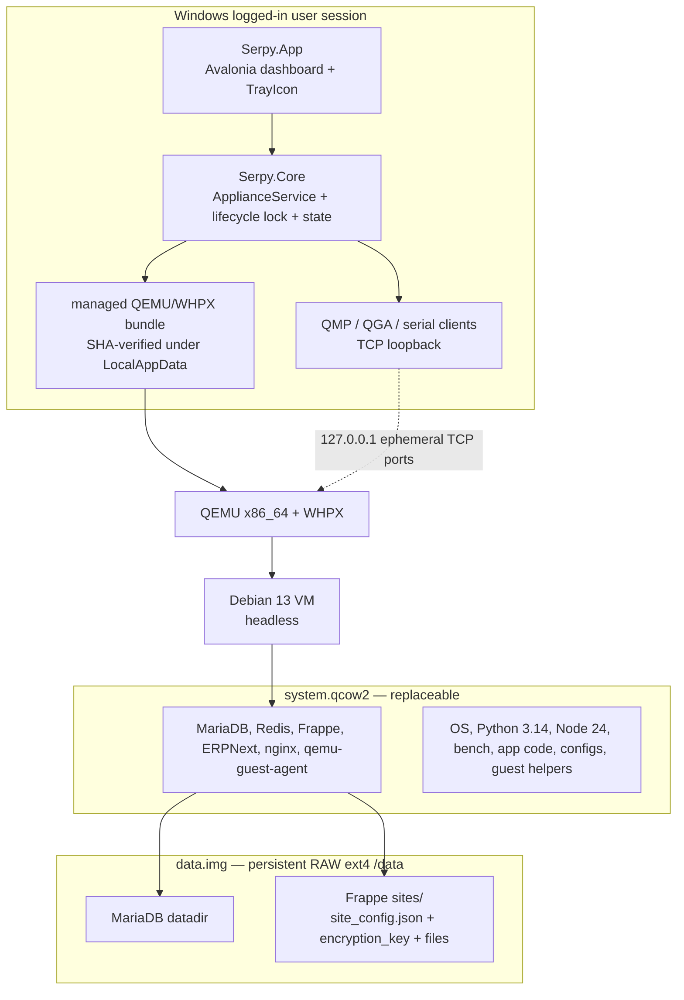
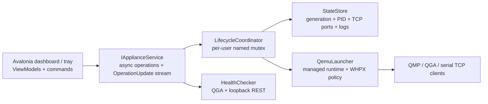
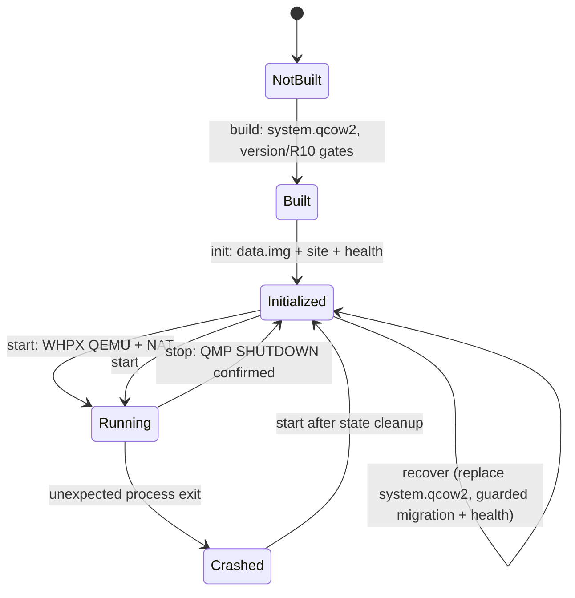
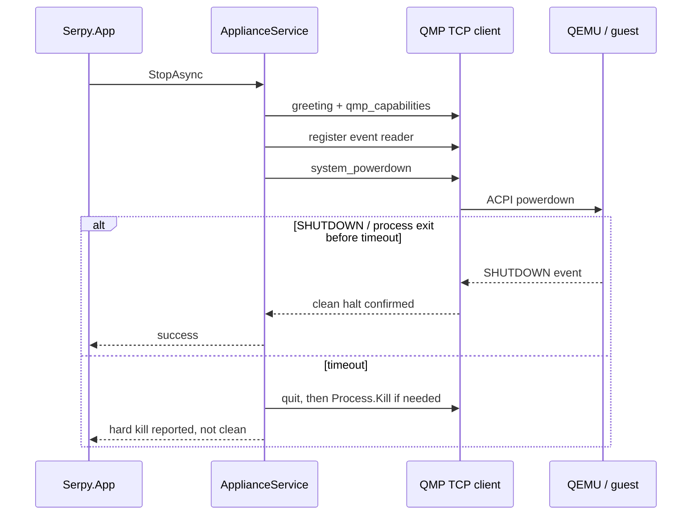
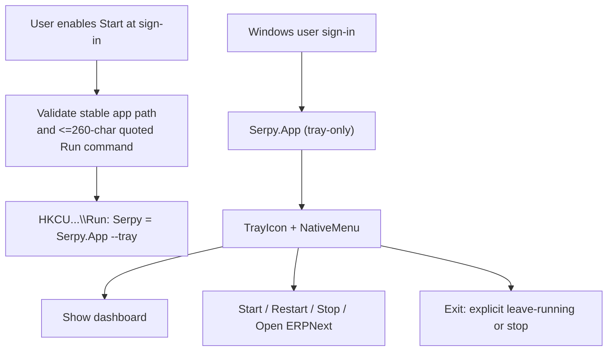
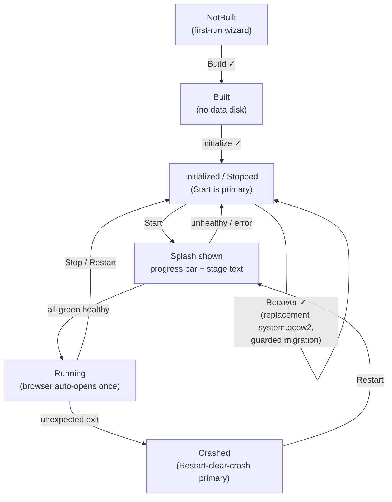

# QEMU ERPNext Appliance Prototype (.NET + Avalonia, Windows-first host) - Plan

> **Supersedes** `docs/plans/2026-08-21-002-feat-qemu-erpnext-appliance-go-host-plan.md`. The appliance Product Contract — ERPNext v16, two-disk data separation, cloud-init build, version/health gates, persistence, recovery, and durability — is retained. This revision re-owns the host: .NET 10, an Avalonia desktop/tray **GUI application with no command-line surface**, and a **Windows x64 / QEMU-WHPX delivery target**. macOS/HVF and Linux/KVM remain explicit, compile-tested extension targets; they are not delivered or runtime-verified in this phase.

## Goal Capsule

- **Objective:** Prove a self-contained, headless Debian 13 / ERPNext v16 QEMU appliance whose runtime disk is disposable and whose business data survives on a separate disk, operated on Windows by a stable, per-user .NET desktop GUI application with a notification-area icon.
- **Product authority:** Windows x64 is the phase's delivery and end-to-end verification platform. `Serpy.App` is the single Avalonia GUI/tray process over one .NET application layer; there is no separate CLI. It runs in the logged-in user's session and invokes a managed QEMU/WHPX bundle. There is no Windows Service, LaunchDaemon, privileged helper, installer, auto-update mechanism, or background system process in this phase.
- **Portability posture:** All host-to-QEMU and host-to-guest protocols use TCP loopback and managed .NET libraries. macOS x64/arm64 and Linux x64 project targets compile in CI; their accelerator, paths, and packaging seams are specified. An x86_64 guest on Windows ARM or Apple Silicon is rejected rather than silently run under TCG emulation.
- **Open blockers:** None for planning. WHPX must be enabled and the machine rebooted before Windows runtime verification; the product detects failure without attempting to enable a Windows feature or elevate itself.

---

## Product Contract

### Summary

A headless Debian 13 (trixie) x86_64 VM runs the full ERPNext v16 stack under QEMU. On the delivered host, QEMU uses WHPX and exposes ERPNext only at `http://127.0.0.1:<port>`. The host product is `Serpy.App` — an Avalonia dashboard and tray application backed by `Serpy.Core` — with no command-line surface. Persistent business state lives on `data.img`; `system.qcow2` contains only the OS and runtime and can be replaced through a controlled recovery operation.

### Problem Frame

A conventional ERPNext/Frappe deployment couples Debian, interpreters, app code, configuration, the MariaDB datadir, and site files to one host. Rebuilding or upgrading runtime infrastructure can therefore destroy or orphan business data. The critical case is Frappe's site `encryption_key`: its encrypted values in MariaDB become unreadable if `site_config.json` does not follow the preserved site and database.

This phase preserves the appliance experiment and makes the Windows host experience usable: a person can see status, start or stop the appliance, follow build/init/recovery progress, open ERPNext, and leave a notification-area controller running after sign-in. It deliberately does not turn the application into an operating-system service or a general VM manager.

### Key Decisions

- KD1. **Build and provision from the Debian 13 cloud image through cloud-init, orchestrated by the .NET host.** The build path has no host-Linux dependency and is portable to WHPX/HVF. Governs R8.
- KD2. **Persist the MariaDB datadir and Frappe `sites/` on `data.img`; keep all runtime on replaceable `system.qcow2`.** This keeps application code and virtual environments disposable while preserving `site_config.json`, its `encryption_key`, and site files. Governs R4–R6.
- KD3. **Pin ERPNext v16 on Debian 13.** Frappe v16 requires Python `>=3.14,<3.15` and Node `>=24`, both above trixie's defaults; the build provisions them explicitly. Debian's MariaDB 11.8 and Redis 8 satisfy the selected floors. R9 verifies installed versions rather than trusting pins. Governs R1 and R9–R12.
- KD4. **Create the first site during explicit `init` against the attached data disk, never during image bake.** A site and its database must be born after the bind mounts to `data.img` are active. Governs R14.
- KD5. **Make system-disk replacement a guarded `recover` operation.** Recovery accepts only equal-or-newer MariaDB and Frappe/ERPNext versions; it runs `mariadb-upgrade` when necessary, then `bench migrate`. Downgrades are rejected. Governs R6.
- KD6. **Use .NET 10 + Avalonia as one per-user GUI host product with a shared core.** (session-settled: user-directed — chosen over retaining a headless Go/CLI host because the product is a native Windows-first dashboard and tray controller with no command-line surface.) `Serpy.App` is the whole product: dashboard, tray, and lifecycle. It calls one operation service and state store; the UI never embeds a shell or owns lifecycle semantics. Governs R15–R16.
- KD7. **Deliver and verify Windows x64 with QEMU/WHPX first.** (session-settled: user-directed — chosen over treating Linux/KVM as the phase's primary runtime because this delivery must focus on Windows.) macOS/HVF and Linux/KVM remain designed and compile-tested rather than claimed as runtime-delivered. An x86_64 guest requires an x86_64 host for hardware acceleration; no TCG fallback is accepted. Governs R1, R7, R15, and R16.

### Architecture



### Requirements

**Appliance runtime**

- R1. A headless Debian 13 trixie x86_64 VM under QEMU runs the full ERPNext v16 stack: MariaDB, Redis, Frappe/ERPNext, and web frontend. The delivered Windows x64 path uses WHPX. It has no graphics, audio, USB, or host-directory sharing.
- R2. ERPNext is reachable only through QEMU user-mode NAT at `http://127.0.0.1:<port>`; the guest needs neither LAN exposure nor bridged networking.
- R3. One working Frappe site is provisioned and serves the ERPNext login. No company-management or multi-site UI is provided.

**Disk architecture and persistence**

- R4. The appliance uses `system.qcow2` for replaceable OS/runtime and a sparse RAW ext4 `data.img`, attached as VirtIO and mounted at `/data`, for persistent state.
- R5. The MariaDB datadir and Frappe `sites/` tree — including each site's `site_config.json`, `encryption_key`, private files, and public files — live physically on `data.img`. No persistent business data lives on `system.qcow2`.
- R6. Replacing `system.qcow2` while retaining the same `data.img` recovers the site through `recover`: activate the data mounts, run `mariadb-upgrade` when the MariaDB major increased, then `bench migrate`. A lower MariaDB major or lower Frappe/ERPNext version is rejected before mutation. A durable recovery journal records the target and each completed phase before mutation and blocks a normal `start` until a compatible `recover` completes the health gate, so an interrupted migration cannot boot as a healthy site.
- R7. A clean shutdown and restart preserve data and restore ERPNext/MariaDB. The data disk is attached using the Windows-valid fsync-honoring QEMU mode selected by the accelerator policy (`cache=none,aio=threads`), and MariaDB uses `innodb_flush_log_at_trx_commit=1`. The committed-transaction-after-unclean-termination guarantee is verified on the delivered Windows/WHPX path; macOS/Linux require their own runtime verification before making that guarantee.

**Provisioning and version integrity**

- R8. The appliance builds reproducibly from the .NET host: checksum-verified Debian cloud image plus cloud-init provisioning. Large VM images and seed ISOs are never committed.
- R9. Build verifies Python, Node.js, MariaDB, and Redis against checked-in exact locks and minimum floors. A lock mismatch or floor violation aborts the build and removes its partial system image, naming component, installed version, locked version, and floor.
- R10. `bench init`, `bench get-app erpnext`, and asset build complete successfully.
- R11. After `init` and after `recover`, a functional health check proves that ERPNext is working: the app is installed, scheduler and workers run, an authenticated request returns data, and a record is created then read through the application layer. Login HTML alone never passes. The site-less `build` stage is gated by R9/R10 instead.
- R12. Installed runtime and app versions are pinned and recorded in documented results.

**Lifecycle and host product**

- R13. The shared operation service exposes `build`, `init`, `start`, `stop`, `restart`, `status`, and `recover`, surfaced to the user only through the GUI. `stop` sends a graceful QMP/ACPI powerdown, waits for a QMP `SHUTDOWN` event or process exit, and reports clean success only after that confirmation. On timeout it hard-kills QEMU and states that it did.
- R14. `init` distinctly creates `data.img`, initializes the data-bound MariaDB datadir, and creates the first site. It commits the final disk name/marker only after the health gate passes and the guest halts; it refuses to reinitialize a marked disk and never overwrites a committed one, and an interrupted pending disk is not startable.
- R15. Exactly one host module owns QEMU argument construction, managed-runtime resolution, and accelerator policy. Windows x64 selects WHPX and verifies it by launching the managed QEMU bundle with `-accel whpx`; failure produces an actionable prerequisite message and never falls back to TCG. Linux/KVM and macOS/HVF policies are present but unverified. No host bind mount, Linux filesystem convention, bridge networking, or `/dev/kvm` dependency leaks outside this module.
- R16. The product is a single self-contained .NET GUI executable, `Serpy.App`, with no host-side shell involved in appliance operation and no QEMU dependency on `PATH`. It uses managed .NET facilities and TCP loopback for all host↔QEMU/guest channels. Windows x64 is Native-AOT published and exercised; macOS and Linux targets remain compile/publish checked only. It is a user-session GUI application, not a Windows Service or a privileged helper, and exposes no command-line operation surface.
- R17. The Windows GUI presents a plain-language experience by default: progress is shown as a determinate-where-possible progress bar with short stage text, and technical logs/protocol detail are hidden behind an off-by-default **Show details** toggle rather than shown inline. Starting the appliance shows a small "Serpy — powered by ERPNext" splash while it boots; when the appliance reaches an all-green healthy state the host opens the default browser to the ERPNext loopback URL exactly once per start. Failed or unhealthy starts surface a plain error and do not open the browser. Lifecycle rules stay in the service, never the UI.

### Key Flows

- F1. **Build the appliance.** The user clicks **Build** in the dashboard. The host downloads and checks the Debian image, creates a NoCloud ISO in-process, boots QEMU headlessly, watches the serial provisioning sentinel, queries versions through QGA, executes R9/R10 checks, then gracefully powers down to retain a site-less `system.qcow2`.
- F2. **Initialize persistent data and first site.** The user clicks **Initialize**. The host creates `data.img`, boots `system.qcow2` with the disk attached, runs the baked in-guest helper, and gates completion on the functional health check.
- F3. **Start, access, stop.** The user clicks Start / Restart / Stop in the dashboard or the tray right-click menu. On start a small "Serpy — powered by ERPNext" splash shows a progress bar and plain stage text (details hidden by default); the host preflights the lifecycle lease, port, runtime, and WHPX, records state, and exposes the loopback URL. When the appliance reaches healthy the splash dismisses and the default browser opens to ERPNext once. Stop observes a confirmed graceful halt before reporting success. The dashboard and tray show running, unhealthy, crashed, stopped, or not-built state.
- F4. **Replace system disk and recover.** The user clicks **Recover**, picks a replacement system image, and acknowledges the non-reversible migration warning. The host rejects downgrades, activates persistent mounts, performs required migration, and passes the same functional health check before declaring recovery successful.
- F5. **Run in the notification area.** Launching `Serpy.App` normally opens the dashboard. Closing the window hides it while the tray icon remains. A tray-only launch mode, used only by user-enabled Windows sign-in startup, starts directly to tray. The tray icon's right-click menu exposes Show Dashboard, current state, **Start / Restart / Stop** where valid, Open ERPNext when healthy, and Exit. Exit never reports a running VM as cleanly stopped; it requires an explicit stop or clearly leaves it running.

### Acceptance Examples

- AE1. **Build-time version gate (R9).** Given a provisioned Python, Node, MariaDB, or Redis version that differs from the lock or falls below its floor, when build evaluates it, then the build fails with component/installed/locked/floor and no completed `system.qcow2`.
- AE2. **Functional health check (R11).** Given a completed init or recovery, when health runs, then it verifies ERPNext installation, scheduler/workers, authenticated data, and create/read/delete behavior; a rendered login page alone fails.
- AE3. **Persistence across clean restart (R7).** Given identifiable data created through ERPNext, when Windows host operations stop the VM cleanly and start it again, then the data remains and services become healthy.
- AE4. **System-disk replacement (R6).** Given a working `system.qcow2` A and `data.img`, when an equal-or-newer system B replaces A and `recover` runs, then existing data and encrypted values remain usable. A lower MariaDB or application version is rejected before migration.
- AE5. **Unclean-termination durability (R7).** Given an acknowledged committed ERPNext transaction, when the managed QEMU process is terminated uncleanly and the appliance restarts, then the record is present and observed recovery behavior is documented on Windows/WHPX.
- AE6. **Windows host delivery (R15/R16).** Given a clean supported Windows x64 machine with WHPX enabled, when the signed/hash-verified Windows product bundle is launched, then `Serpy.App` displays its dashboard and tray, managed QEMU is fetched and checksum-verified without a PATH QEMU, `-accel whpx` succeeds, and the full appliance workflow completes from the GUI. macOS and Linux target builds remain compile/publish checks, not equivalent runtime acceptance.
- AE7. **Tray and autostart behavior (R16).** Given an initialized appliance, when the user enables **Start Serpy at sign-in**, then a correctly quoted per-user `HKCU\Software\Microsoft\Windows\CurrentVersion\Run` entry launches `Serpy.App` in tray-only mode after the next sign-in. Disabling it removes only Serpy's value. Closing the dashboard does not quit the tray application or imply a VM shutdown.
- AE8. **Plain-by-default start experience (R17).** Given an initialized appliance, when the user starts it from the dashboard or the tray, then a small "Serpy — powered by ERPNext" splash appears with a progress bar and plain stage text while technical logs stay hidden behind a **Show details** toggle, and when every check reaches healthy (all-green) the default browser opens to the ERPNext loopback URL exactly once; a start that ends unhealthy or failed shows the plain error and does not open the browser.

### Scope Boundaries

**In scope now**

- Windows x64 .NET 10 Native-AOT/self-contained `Serpy.App` GUI distribution over one lifecycle core, with no command-line surface.
- Avalonia dashboard, notification-area icon with native menu, background-at-sign-in mode, and user-enabled per-user Windows Run-key registration.
- Managed QEMU/WHPX Windows bundle, including download integrity, contained extraction, WHPX fail-fast check, QMP/QGA/serial TCP loopback channels, and Windows end-to-end appliance verification.
- Cross-platform path and accelerator seams, plus macOS/Linux target compile/publish checks.

**Deferred for later (structured for, not delivered or runtime-verified now)**

- macOS/HVF and Linux/KVM runtime execution, support matrix, release packaging, durability claim, and platform-specific QEMU bundle publication.
- A macOS LaunchAgent packaging descriptor. It uses a user `~/Library/LaunchAgents` plist with a full executable path; installing it, signing/notarizing a macOS app bundle, and testing it are deferred with macOS delivery.
- A Windows Service, macOS LaunchDaemon, elevated helper, authenticated privilege-boundary IPC, automatic WHPX installation, installer, auto-update, multi-company management, backup/restore, disk snapshots, remote control, or LAN access.
- Full keyboard-navigation audit, screen-reader accessibility (UIA automation peers), and minimum-window-size policy — deferred as out of prototype scope.

**Outside this prototype's identity**

- Docker, Podman, Kubernetes, or another container runtime; a full virtual-machine manager; LAN/multi-user exposure; or sophisticated monitoring.

### Dependencies and Assumptions

- Windows 11 x64 validation machines expose hardware virtualization and have the **Windows Hypervisor Platform** feature enabled, followed by a reboot. The application does not call DISM, mutate Windows features, or request elevation; it probes the managed QEMU runtime with an explicit WHPX accelerator and explains the failed prerequisite.
- QEMU is supplied as a Serpy-managed Windows archive containing `qemu-system-x86_64.exe`, `qemu-img.exe`, the required MinGW/UCRT and **GnuTLS** runtime DLLs, and `share/qemu/` firmware. The archive has a lock, SHA-256, source URL, and license notice in the manifest. QEMU remains a separate process; Serpy does not link it.
- The host needs network access for the Debian image, package sources, and first QEMU runtime download. After artifacts exist, routine start/stop needs no LAN-facing guest networking.
- A portable ZIP is the phase distribution, not MSI/MSIX. It is extracted once to a stable path before enabling sign-in startup. The autostart command is refused if its fully quoted command line would exceed the documented 260-character Run-key limit.
- Redis remains ephemeral on the system disk. Losing queued background work on a restart is accepted for this prototype and documented.

### Success Criteria

- On a clean supported Windows x64 host, the complete workflow succeeds: unpack product → enable WHPX if necessary → launch app → build → init → start → open loopback ERPNext → create data → clean stop → restart → data intact.
- `system.qcow2` is replaceable while `data.img` remains intact; recovery rejects unsafe downgrade and preserves an encryption-key-protected value.
- A built Windows distribution uses a managed QEMU/WHPX runtime, does not depend on QEMU on PATH, and provides a functional GUI dashboard plus tray without a Windows Service.
- macOS and Linux code paths remain deliberate extension points rather than hidden Windows assumptions, confirmed by target compile/publish checks.

---

## Planning Contract

### Product Contract preservation

`docs/plans/2026-08-21-002-feat-qemu-erpnext-appliance-go-host-plan.md` is the preserved product source. R1–R14, KD1–KD5, F1–F4, and AE1–AE5 retain their appliance meaning. Their host terms have only been updated where a Go/Linux/KVM phase assertion would conflict with the user-settled Windows-first .NET decision.

This plan changes the prior host contract deliberately:

- KD6 replaces the Go binary with .NET 10 `Serpy.Core` and the `Serpy.App` GUI; it adds a dashboard, tray, and per-user sign-in startup, drops the command-line surface, and does not add a service.
- KD7 promotes Windows x64/WHPX from structured-for to the executed platform and demotes Linux/macOS to structured/compile-tested targets.
- R15/R16 and AE6 are tightened around managed Windows QEMU, WHPX verification, Avalonia/tray behavior, Native-AOT publishing, and the no-service boundary.
- AE7 is added for the explicit GUI/tray/autostart observable contract.

The guest-side disk boundary, cloud-init, version floor, recovery guard, and health semantics do not depend on host language and remain unchanged.

### Key Technical Decisions

- KTD1. **Serve production nginx on guest `:80`, forwarded by QEMU user NAT to a configurable `127.0.0.1:<port>` (default `18080`).** The port resolves from persisted settings (editable in the dashboard). The core takes a lifecycle lease and probes the port before launch; a foreign owner fails before QEMU starts. Chosen over the Bench development server because production nginx serves assets and proxies the full runtime.
- KTD2. **Expose one operation surface through a single .NET application layer that the GUI calls directly.** `IApplianceService` has asynchronous `BuildAsync`, `InitializeAsync`, `StartAsync`, `StopAsync`, `RestartAsync`, `GetStatusAsync`, and `RecoverAsync` operations returning typed results and streaming `OperationUpdate` progress. Avalonia view models map commands and progress to that service; no separate command-line front end exists. Chosen so the whole product is one GUI process over one lifecycle core, with lifecycle rules living in the service, never the UI.
- KTD3. **Implement QMP over its TCP chardev and QGA over the guest-agent `virtio-serial` chardev, both on a per-install TLS-authenticated loopback transport, using `System.Net.Sockets`, `System.IO.Pipelines`, and source-generated `System.Text.Json` DTOs.** The QMP client consumes greeting/capabilities, installs its event read before `system_powerdown`, and waits for `SHUTDOWN` or process exit. The QGA client speaks to the QEMU-side chardev socket (not a guest TCP listener), sends the `0xFF` flush byte then `guest-sync-delimited`, drives `guest-exec`/status/file APIs, and treats nonzero guest exit as failure. Because loopback is a host-wide, not per-user, boundary, QEMU terminates each chardev socket as a mutual-TLS server (`verify-peer=yes`) and rejects any local client lacking the per-install client certificate held in the protected per-user store. Chosen over `qmp-shell`, SSH, HMP parsing, or a library that cannot cover both protocols.
- KTD4. **Use in-guest bind mounts for the MariaDB datadir and `sites/`.** `/data/mariadb` binds to `/var/lib/mysql`; `/data/frappe/sites` binds to the Bench `sites/` path. Systemd ordering keeps services down if `/data` is unavailable. Chosen over changing MariaDB paths or symlinks because canonical paths remain valid and the encryption key moves with the data.
- KTD5. **Keep exact locks and minimum floors in `config/versions.yaml`; parse and compare them in `Serpy.Core`.** Python 3.14 and Node 24 are provisioned explicitly. The version evaluator supports numeric, Debian epoch/apt suffix, and prerelease forms, and reports lock versus floor failures separately. Chosen over an unvalidated hand-maintained install script.
- KTD6. **Attach RAW `data.img` with a Windows-valid fsync-honoring policy, `cache=none,aio=threads`, and set `innodb_flush_log_at_trx_commit=1`.** The QEMU argument policy owns platform selection; the Windows durability experiment proves the actual delivered behavior. `system.qcow2` is allowed to be disposable.
- KTD7. **Resolve accelerator from `(host OS, host architecture, guest architecture)` in a single policy.** Windows x64 + x86_64 guest returns `whpx`; Linux x64 returns `kvm`; macOS x64 returns `hvf`. Mismatches fail with a concrete unsupported-architecture error. On Windows, a separate no-fallback managed-QEMU probe uses `-accel whpx -machine none`; it never accepts a TCG success path.
- KTD8. **Run the UI, tray icon, QEMU process, and lifecycle operations as one logged-in-user GUI product, not a service.** The state store records a schema version, generation, owner process identity, ports/endpoints, launch command, and logs; a named per-user mutex serializes mutations only for the duration of a lifecycle operation. A durable `Starting` record is written before QEMU is spawned and the generation is passed as the QEMU VM name, so a crash of the app process leaves a child a later app launch can reconcile and stop rather than an unexplained port owner. The user may cancel an in-flight operation from the UI, but the service owns the operation's lifetime: cancellation before lease admission has no side effects; after an in-progress record exists, the service drives abort-at-safe-boundary plus graceful-then-hard cleanup and holds the lease until it records the terminal result. A relaunched app reconciles state and performs the next operation after acquiring the mutex. Chosen over a service because QEMU needs no elevated capability after WHPX is enabled and a service would add Session 0, authentication, install, and recovery complexity.
- KTD9. **Use the authenticated serial-console channel before QGA exists, then QGA for all later guest work.** Cloud-init emits a unique provision-complete sentinel on the TLS-authenticated serial-console socket (KTD3, step 6) only after the guest agent is installed; the host reads that socket, then switches to the QGA `virtio-serial` chardev for every later guest operation. Both channels share the same per-install TLS trust material, so there is no unauthenticated bootstrap window and no SSH, guest keys, or second guest network path.
- KTD10. **Generate the NoCloud ISO in-process with a decided Native-AOT-compatible managed ISO9660 writer, label `cidata`, root `user-data`/`meta-data`.** The writer choice is settled before build functionality lands: a candidate (e.g. DiscUtils.Iso9660) is accepted only after it passes `PublishAot=true` producing the correct `cidata` label and hyphenated root filenames under a round-trip read-back test; a candidate that fails AOT analysis is replaced with another managed writer, never an external ISO executable and never a suppressed AOT warning. Image create/resize/convert calls managed `qemu-img`; ext4 format runs in the guest.
- KTD11. **Manage QEMU as a complete, version-locked Windows runtime bundle behind a signed descriptor.** A Windows CI job builds QEMU from a locked upstream source using MSYS2/UCRT/MinGW with `x86_64-softmmu`, `--enable-whpx`, `--enable-slirp`, and `--enable-gnutls` — GnuTLS is required because the authenticated `tls-creds-x509` chardev transport (KTD3) does not exist in a QEMU built without it — removes GUI/audio/peripheral subsystems, archives executables plus the MinGW/UCRT and GnuTLS runtime DLLs and firmware, emits SHA-256 and source-notice metadata, and publishes an immutable release asset. Before any download, Core verifies a publisher-signed runtime descriptor (or a descriptor hash pinned in the signed Serpy executable) over HTTPS, so an altered `versions.yaml` URI/SHA cannot select an attacker's archive. Core then extracts only to a same-volume temporary directory, rejects traversal and outward links, runs `-version`, `-machine none`, and a `query-tls-creds`/`tls-creds-x509` availability check as smoke checks, and atomically renames into `%LOCALAPPDATA%\Serpy\runtime\qemu-<version>`. It passes `-L <bundle>/share/qemu` on every run.
- KTD12. **Use Avalonia's `TrayIcon` plus `NativeMenu`, a plain-by-default dashboard, and a start splash, all built with MVVM source generators.** The application starts with a normal dashboard window; a launch flag starts tray-only for sign-in autostart. Closing hides rather than exits. The dashboard shows plain status plus a progress bar and keeps technical logs behind an off-by-default Show-details toggle; starting raises a small "Serpy — powered by ERPNext" splash and, on all-green healthy, opens the browser once via a host-abstracted launcher. Tray and dashboard state come from one `ApplianceStatus` view model, so no UI-only lifecycle state is invented. The Windows icon is an embedded `.ico` Avalonia resource.
- KTD13. **Implement only explicit per-user Windows sign-in startup, and only from a trusted install location.** Enabling it stores a validated/quoted `Serpy.App.exe --tray` command in `HKCU\Software\Microsoft\Windows\CurrentVersion\Run`; disabling removes the named value. Registration is refused when the target path is a reparse point or its executable/launch directory is writable by another local principal, so a shared-directory install cannot let another user plant a payload that runs at sign-in. The user can still disable it from Windows startup controls. macOS uses a future LaunchAgent descriptor, not `SMAppService` or a system daemon, when macOS delivery is funded.
- KTD14. **Publish per OS; never claim cross-OS Native-AOT compilation.** Windows x64 uses a Windows runner and `PublishAot=true`. macOS targets use macOS runners and Linux targets use Linux runners when their release path is enabled; target compilation/publish checks run independently. This follows .NET Native AOT's OS-native linker/SDK requirement and avoids a brittle Windows-to-macOS build fiction.

---

## High-Level Technical Design

The diagrams are directional design guidance. They communicate boundaries and ordering; exact namespaces and internal file splits remain implementation work.

**Operation ownership and presentation**



The mutex is held only while a mutating operation validates, writes state, starts/stops/recovers, or clears stale state. It is not held merely because the VM is running, so a relaunched app can stop or inspect a healthy recorded appliance. Every mutation re-reads the state generation after lock acquisition; stale PID/ports are cleaned only after process identity verification.

**Lifecycle**



**Graceful shutdown**



**Windows sign-in and tray behavior**



**Dashboard surface by ApplianceStatus**



---

## Output Structure

```text
Serpy.sln
Directory.Build.props                 # .NET 10, nullable, analyzers, AOT compatibility
Directory.Packages.props              # centrally pinned managed dependencies
config/
  versions.yaml                       # QEMU/image/runtime/app exact locks + floors
src/
  Serpy.Core/
    Contracts/                        # IApplianceService, results, progress, status
    Configuration/                    # validated settings, cross-platform known paths
    Coordination/                     # named mutation lock, state generation/ownership
    Qemu/                              # accelerator policy, args, process, runtime resolver
    Protocols/                         # framed QMP/QGA/serial TCP clients and JSON context
    Guest/                             # typed baked-helper operations and version queries
    Images/                            # download hash, qemu-img, NoCloud ISO writer
    Versions/                          # manifest parse and version comparisons
    Health/                            # QGA/REST functional checks
    Operations/                        # build/init/start/stop/status/recover orchestration
  Serpy.App/
    App.axaml                          # TrayIcon, NativeMenu, app resources
    Program.cs                         # entrypoint; --tray flag for autostart
    Views/                             # Dashboard, Splash, recovery confirmation views
    ViewModels/                        # Dashboard, settings, splash, operation progress
    Platform/                          # BrowserLauncher; Windows/ Run-key autostart adapter
    Assets/serpy.ico
build/
  cloud-init/user-data
  cloud-init/meta-data
guest/
  init-data.sh
  recover.sh
  provision-done.sh
eng/
  qemu/build-windows.ps1              # CI-only QEMU bundle build, never host operation
  package-windows.ps1                 # CI-only ZIP/manifest staging
.github/workflows/
  qemu-windows.yml
  build-test-publish.yml
tests/
  Serpy.Core.Tests/
  Serpy.App.Tests/                     # Avalonia.Headless UI behavior
  Serpy.Windows.IntegrationTests/      # opt-in Windows/WHPX appliance tests
docs/
  results.md
README.md
.gitignore
```

The tree is a scope declaration. Per-unit file lists are authoritative; implementation may consolidate code where the same public contract stays intact.

---

## Implementation Units

### U1. .NET solution, shared host contracts, state model, and GUI foundations

- **Goal:** Establish the .NET 10 solution and the shared service contract the GUI calls, so lifecycle rules live in one core the presentation layer cannot duplicate.
- **Requirements:** R13, R15, R16. Instantiates KD6, KTD2, KTD8, KTD12, and KTD14.
- **Dependencies:** none.
- **Files:** `Serpy.sln`, `Directory.Build.props`, `Directory.Packages.props`, `src/Serpy.Core/Contracts/*`, `src/Serpy.Core/Configuration/*`, `src/Serpy.Core/Coordination/*`, `src/Serpy.App/Program.cs`, `src/Serpy.App/App.axaml`, `src/Serpy.App/App.axaml.cs`, `src/Serpy.App/ViewModels/DashboardViewModel.cs`, `src/Serpy.App/Views/DashboardView.axaml`, `tests/Serpy.Core.Tests/Coordination/*`, `tests/Serpy.App.Tests/*`, `.gitignore`, and the README skeleton.
- **Approach:**
  1. Pin .NET 10 and managed dependencies centrally. Enable nullable references, analyzers as errors for source, deterministic builds, trimming/AOT warnings, and a source-generated JSON context for all persisted/wire DTOs.
  2. Define an `IApplianceService` that owns all seven operations and returns typed `OperationResult` rather than console text or UI messages. Accept cancellation and report ordered `OperationUpdate` instances with stable operation IDs, stage, severity, human message, and optional log path. The GUI binds those messages and progress; no other front end consumes the service.
  3. Use a platform path provider: `%LOCALAPPDATA%\Serpy` on Windows; `~/Library/Application Support/Serpy` and XDG paths are compile-supported. Persist settings, runtime bundle, logs, and an appliance workspace independently so user data does not move when the product bundle updates.
  4. Add a per-user named mutex/lock and atomic JSON state store. State includes schema version, generation, QEMU PID plus process start identity, QMP/QGA/serial endpoints, host URL, system/data paths, current operation, and log path. Validate state against a live matching process before acting; orphaned state is marked crashed and safely cleared, not trusted.
  5. Create the Avalonia app shell, dashboard state summary, and a `TrayIcon`/`NativeMenu` in `App.axaml`, plus the `--tray` launch flag. The initial UI must run in an Avalonia.Headless test host. It may use placeholder status data only in U1; it must not yet offer operational buttons until U5/U6 wire real service calls.
- **Test scenarios:**
  - A second mutating operation waits or fails with a clear busy result while the first holds the lifecycle lease; status reads do not acquire it.
  - A live state record with mismatched process identity is treated as stale, while a matching process is retained; corrupt/unknown-schema state produces a recoverable diagnostic rather than starting a second VM.
  - The Avalonia dashboard, driven by a fake service, dispatches each operation through the shared service contract and renders its typed result, never reaching into lifecycle logic directly.
  - Avalonia.Headless constructs the app, exposes the tray icon/native menu, and closing the dashboard hides it rather than disposing the application.
  - `PublishAot=true` for Windows x64 produces no unsupported reflection path in Core or the app; any AOT incompatibility from a dependency is a failing build signal.
- **Verification:** Publish and launch `Serpy.App` on Windows so it renders the dashboard against real product paths; run Core and Avalonia.Headless tests; inspect state transition behavior with fake processes.
- **Execution note:** Keep all lifecycle business logic below the presentation layer. A ViewModel must never spawn QEMU, write state, or parse QMP.

### U2. Managed Windows QEMU/WHPX runtime, accelerator policy, and TCP protocol foundation

- **Goal:** Validate the highest-risk host claim early: a Windows user can obtain and run the exact managed QEMU/WHPX runtime before cloud-init or ERPNext complexity obscures failures.
- **Requirements:** R13, R15, R16, AE6. Instantiates KD7 and KTD3, KTD6, KTD7, KTD11, and KTD14.
- **Dependencies:** U1.
- **Files:** `src/Serpy.Core/Qemu/AcceleratorPolicy.cs`, `QemuArguments.cs`, `QemuLauncher.cs`, `ManagedRuntimeResolver.cs`, `ArchiveExtractor.cs`, `QemuProcess.cs`; `src/Serpy.Core/Protocols/QmpClient.cs`, `QgaClient.cs`, `SerialClient.cs`, `Json/ProtocolJsonContext.cs`; `config/versions.yaml`; `eng/qemu/build-windows.ps1`; `.github/workflows/qemu-windows.yml`; `tests/Serpy.Core.Tests/Qemu/*`; `tests/Serpy.Core.Tests/Protocols/*`; `tests/Serpy.Windows.IntegrationTests/QemuSmokeTests.cs`.
- **Approach:**
  1. Define the manifest with QEMU version, Windows archive URI, SHA-256, upstream source URI, license notice URI, Debian cloud image URI/SHA, runtime locks, and floors. The resolver obtains the exact archive only when its complete final directory is absent or fails version verification.
  2. Download to a same-volume temporary location, calculate SHA-256 before extraction, reject absolute/traversal/outward-link archive entries, require expected exe/DLL/firmware paths, execute `-version` and `-machine none` with the bundled `-L` directory, then directory-rename atomically. Any failed step removes only its temporary directory.
  3. Make `AcceleratorPolicy` pure and table-driven. Windows x64/x86_64 maps to WHPX and `cache=none,aio=threads`; Linux x64/x86_64 maps to KVM; macOS x64/x86_64 maps to HVF. Mismatched host/guest architecture is a specific rejection. `WHPX` availability is proven by a short managed-QEMU `-accel whpx -machine none` probe, never by assuming Hyper-V or calling an elevated feature command.
  4. Build the QMP monitor client over its TCP chardev and the QGA client over the guest-agent `virtio-serial` chardev, both on the authenticated transport from step 6: QMP does a newline-delimited JSON read loop with request correlation, capability handshake, and event subscription before powerdown; QGA sends `0xFF`, negotiates `guest-sync-delimited`, exposes bounded guest-exec polling and guest-file reads, and decodes base64 output without assuming a 64 KiB line limit. The QGA endpoint is the QEMU-side chardev socket, not a guest TCP listener.
  5. Build Windows QEMU in CI from the locked source under MSYS2/UCRT/MinGW, with `x86_64-softmmu`, WHPX, slirp, **GnuTLS** (so `tls-creds-x509` is available for step 6), firmware, and the required MinGW/UCRT and GnuTLS runtime DLLs. Publish immutable zip, SHA, third-party notice, and corresponding source reference. CI PowerShell is packaging infrastructure only; no application operation path invokes it.
  6. Terminate all three host-side chardev sockets (QMP monitor, the QGA `virtio-serial` backing socket, and the serial-console socket) as **TLS servers inside QEMU** via `-object tls-creds-x509,endpoint=server,verify-peer=yes`, with a per-install local CA and signed client certificate generated by Core into the protected per-user store; QEMU rejects any local client that does not present the client certificate, closing the host-wide-loopback gap. The serial-console bootstrap channel (KTD9), used before the guest agent exists, runs over the same TLS-authenticated socket, and the client trust material is written into the managed runtime configuration at bundle-install time, not into the guest. Verify a publisher-signed runtime descriptor (or a descriptor hash pinned in the signed Serpy executable) and require HTTPS before any archive download, so an altered `versions.yaml` URI/SHA cannot fetch and execute an attacker-chosen archive during the smoke check.
- **Test scenarios:**
  - Archive SHA mismatch, incomplete archive, version mismatch, `..` entry, absolute path, and outward-link entry all fail without a partial installed runtime.
  - An already complete runtime is reused; an interrupted installation cannot be mistaken for a valid runtime.
  - Accelerator policy returns WHPX/KVM/HVF for matching x64 hosts and rejects Windows ARM/Apple Silicon with the x86_64 guest; arguments preserve selected accelerator and cache values unchanged.
  - Windows integration smoke resolves the managed bundle, executes `qemu-system-x86_64.exe -version`, confirms the build reports `tls` support and can construct a `tls-creds-x509` object, passes the explicit WHPX probe, starts a paused minimal VM with a mutual-TLS-authenticated QMP transport on an ephemeral loopback port, receives `query-status`, and quits; it fails with the documented WHPX prerequisite message when WHPX cannot initialize.
  - A foreign local process that scans the QMP/QGA ports and completes the wire framing without the per-install client credential is rejected while Serpy retains control (Windows two-user scenario).
  - Publisher-signed descriptor verification rejects a manifest whose archive URI and SHA-256 were both altered, before any download or QEMU execution.
- **Verification:** Run unit tests and the Windows QEMU smoke on a clean WHPX-enabled machine. Retain CI artifact provenance and lock checksum in the release manifest.
- **Execution note:** Do not postpone the actual Windows QEMU/WHPX smoke. This unit is the architecture falsifier; no ERPNext work should hide a failure here.

### U3. Cloud-init build pipeline, site-less system image, and version gate

- **Goal:** Produce a reproducible `system.qcow2` containing the runtime but no site/business data, driven exclusively by the .NET host and Windows managed QEMU.
- **Requirements:** R1, R8–R10, R12, R16, AE1. Instantiates KD1/KD3 and KTD5, KTD9, and KTD10.
- **Dependencies:** U1 and U2.
- **Files:** `src/Serpy.Core/Images/BaseImageDownloader.cs`, `QemuImageTool.cs`, `NoCloudSeedWriter.cs`; `src/Serpy.Core/Versions/VersionManifest.cs`, `VersionEvaluator.cs`, `VersionGate.cs`; `src/Serpy.Core/Operations/BuildOperation.cs`; `build/cloud-init/user-data`, `build/cloud-init/meta-data`, `guest/provision-done.sh`; `tests/Serpy.Core.Tests/Images/*`, `tests/Serpy.Core.Tests/Versions/*`, `tests/Serpy.Windows.IntegrationTests/BuildTests.cs`.
- **Approach:**
  1. Resolve the pinned Debian genericcloud x86_64 image URI and SHA-256 from the **publisher-signed runtime descriptor** (the same signed source that pins the QEMU archive in KTD11), so an altered `config/versions.yaml` cannot redirect the base OS download; download over HTTPS, validate the SHA before use, and make reuse explicit. Invoke only the managed `qemu-img.exe` to create a working copy, resize it, and write final output.
  2. Generate a `cidata` ISO in process with the decided AOT-compatible ISO9660 writer (KTD10), root `user-data`/`meta-data`; read it back in a test to verify label and filenames. No external ISO tool participates.
  3. Cloud-init installs pinned MariaDB/Redis, explicit locked Python 3.14 and Node 24, QGA, Bench, locked Frappe and ERPNext tags, builds assets, configures production services, and bakes idempotent guest helpers. It cannot create a site or initialize MariaDB data at bake time.
  4. Monitor the serial completion sentinel; only then establish QGA and query exactly the interpreters/services in the version manifest. Require installed=lock and lock>=floor; report component/installed/lock/floor and remove incomplete `system.qcow2` on failure. Record passed resolved versions for `docs/results.md`.
  5. Before the slow provisioning boot, run a cheap **package-closure preflight**: resolve every locked artifact — the apt-pinned MariaDB/Redis packages against the recorded Debian repository snapshot, and the Python/Node/Frappe/ERPNext locks against their pinned sources — and fail fast, distinguishing a host-side resolution failure from a guest provisioning failure, so a missing upstream artifact is caught before a 30–60 minute build rather than after it.
- **Test scenarios:**
  - Hash mismatch aborts before seed/QEMU provisioning; a matching stub download reaches the image command builder.
  - Produced seed has ISO9660 label `cidata` and root `user-data`/`meta-data`.
  - Version evaluator accepts `3.14.1` against `>=3.14,<3.15`, rejects `3.14.2` against an exact lock and `3.15.0` against its floor, and correctly orders multi-digit, Debian epoch/apt suffix, and prerelease input.
  - Each below-floor/mismatched component yields a message with all four required values and deletes its partial system image.
  - Windows integration build produces a site-less image; QGA confirms Bench plus locked Frappe/ERPNext versions and built assets. Repeated build reuses verified base input rather than duplicating work.
- **Verification:** Complete a real Windows build and retain the guest version report. Inspect the image through QGA to prove it has no initialized site/data disk state.
- **Interruption safety:** the build writes a uniquely named same-volume staging image plus an acceptance manifest, and atomically publishes `system.qcow2` only after the serial/QGA/version gates pass and QEMU confirms a graceful powerdown. Lifecycle preflight (`init`/`start`) rejects a staging or unattested image, so a build killed before acceptance can never be consumed as a finished one.
- **Execution note:** The full build is intentionally slow. Keep deterministic download/seed/version tests separate from the opt-in real provisioning test.

### U4. Persistent data initialization, bind-mount boundary, and functional health gate

- **Goal:** Create a guarded RAW data disk, place MariaDB and `sites/` physically on it, initialize one ERPNext site, and prove real application behavior.
- **Requirements:** R3–R5, R11, R14, AE2. Instantiates KD2/KD4 and KTD4/KTD9.
- **Dependencies:** U1–U3.
- **Files:** `src/Serpy.Core/Operations/InitializeOperation.cs`, `src/Serpy.Core/Guest/GuestOperations.cs`, `src/Serpy.Core/Health/HealthChecker.cs`, `HealthCredentials.cs`; `guest/init-data.sh`; `tests/Serpy.Core.Tests/Operations/InitializeOperationTests.cs`, `tests/Serpy.Core.Tests/Health/*`, `tests/Serpy.Windows.IntegrationTests/InitializeAndHealthTests.cs`.
- **Approach:**
  1. Create `data.img` under a same-volume **pending** name using managed `qemu-img`, boot with the system disk, wait for QGA, and run only the baked `init-data.sh` through QGA. Commit the final marker and final name only after the health gate passes and the guest halts cleanly; retain an interrupted pending disk for diagnosis and require explicit confirmation before discarding it. Do not transfer arbitrary host commands into the guest.
  2. The helper refuses an existing appliance filesystem marker, formats/mounts fresh data, creates `/data/mariadb` and `/data/frappe/sites`, activates fstab/systemd bind mounts before `mariadb-install-db`, then creates the first site, installs ERPNext, sets default site, and regenerates production nginx configuration.
  3. Health checks `bench --site ... list-apps`, scheduler/workers, authenticated REST data, create/read/delete of a disposable record, and reports the first failed condition with enough evidence. The ERP credential is held only in a current-user Windows Credential Manager/DPAPI store keyed by workspace, transferred to the guest without appearing in a command-line argument, and never rendered into settings, lifecycle state, `OperationUpdate`s, guest-command capture, or logs.
  4. Add service ordering so missing `/data` prevents MariaDB/Frappe from initializing canonical empty directories. The resulting state is failure, not a divergent new database on the system disk.
- **Test scenarios:**
  - An existing marker refuses reinitialization before format; a fresh disk issues the expected QGA helper sequence.
  - Each health sub-check independently fails under stub QGA/HTTP input; login HTML is rejected, and a healthy run deletes its probe record.
  - Real init shows `@@datadir` backed by `data.img`; unmounting `/data` leaves canonical MariaDB and Bench sites paths empty, including the persisted `site_config.json` encryption key.
  - After each persistent init stage, an injected interruption leaves a recognizable pending disk that `start`/`recover` reject, and a later explicit `init` cannot silently overwrite a committed final disk.
  - A sentinel ERP credential is retrievable through the Windows secret store but absent from persisted state, logs, `OperationUpdate`s, and captured guest command arguments.
  - A boot with `/data` unavailable fails safe rather than starts MariaDB or Frappe against system-disk locations.
- **Verification:** Execute `build → init` on Windows, pass functional health, and run the physical unmount assertion through QGA.
- **Execution note:** The physical-location assertion is the core disk-boundary proof. A running ERPNext site alone is insufficient.

### U5. Lifecycle operations, recovery guards, and Windows status model

- **Goal:** Implement every operation against the shared lifecycle service — start, confirmed graceful stop, status, and system-disk recovery — with all access serialized through the one GUI process.
- **Requirements:** R2, R6–R7, R11, R13, R15–R16, AE3–AE5. Instantiates KD5 and KTD1/KTD3/KTD6/KTD8/KTD9.
- **Dependencies:** U1–U4.
- **Files:** `src/Serpy.Core/Operations/StartOperation.cs`, `StopOperation.cs`, `StatusOperation.cs`, `RecoverOperation.cs`, `ApplianceService.cs`; `src/Serpy.Core/Qemu/QemuArguments.cs`, `QemuProcess.cs`; `guest/recover.sh`; `tests/Serpy.Core.Tests/Operations/*`, `tests/Serpy.Windows.IntegrationTests/LifecycleTests.cs`, `RecoveryTests.cs`.
- **Approach:**
  1. Start acquires the mutation lock, validates readiness, resolves host port, preflights a foreign listener, resolves/validates QEMU and WHPX, then allocates each QMP/QGA/serial endpoint via `127.0.0.1:0`, releasing each probe immediately before spawn. It writes a durable `Starting` record (generation, selected endpoints) and passes the generation as the QEMU VM name **before** spawning, persists PID/start identity immediately after spawn, validates QMP at the selected endpoint, and promotes to `Running` only after that confirmation — retrying a bounded fresh endpoint tuple under the same lock on a bind/start race. A live matching instance returns its known URL rather than launching a second QEMU; every entry point reconciles a retained `Starting` record before treating the appliance as stopped, and failure cleanup targets only the identity-verified child.
  2. Stop opens QMP, begins event consumption before `system_powerdown`, waits for `SHUTDOWN`/verified process exit, and clears state only after observing the result. Timeout sends QMP `quit`, then kills the recorded process if necessary, and returns a hard-kill result.
  3. Status distinguishes runtime health (`Stopped`, `Running`, `RunningUnhealthy`, `Crashed`) from a persistent readiness dimension (`NotBuilt`, `Built`, `Initialized`) derived in the shared service/state store, so the GUI maps valid actions from one typed result and a site-less built workspace never collapses to an initialized-stopped appliance. It reports action-safe diagnostics/log links but never leaks credentials or raw command secrets.
  4. Recover receives an explicit replacement system path and, before boot, validates it as an attested Serpy image (U3 acceptance manifest) and asserts its qcow2 header carries no `backing_file` (via managed `qemu-img info`), rejecting an image that would attach an arbitrary host path into the guest. It then reads old data/version markers and replacement runtime versions through QGA, rejects a MariaDB/Frappe/ERPNext downgrade before invoking guest recovery, and runs `mariadb-upgrade` only when needed, `bench migrate`, and U4's health check.
  5. Write a data-resident recovery journal naming the preflighted target image/version and each completed phase **before** any `mariadb-upgrade`/`bench migrate` mutation; block a normal `start` while the journal exists and clear it only after the health gate. A subsequent `recover` reads the journal and continues only a compatible target; an incompatible or absent continuation surfaces a `recovery-required` diagnostic. This is a guard-and-continue protocol, not an automatic backup.
- **Test scenarios:**
  - Occupied foreign port fails before QEMU launch; an already-running matching state returns URL; stale state is cleaned only after identity mismatch validation.
  - QMP stub confirms event-listener ordering, clean `SHUTDOWN` reporting, timeout hard-kill reporting, and no false clean success.
  - Status reports the readiness dimension and the runtime-health dimension independently: a built-but-uninitialized workspace reads `Built`/`Stopped`, an initialized appliance moves `Stopped → Running → Stopped` across a start/stop cycle, and an unexpected process exit reads `Crashed` distinct from `Running`/`RunningUnhealthy`.
  - Recovery rejects lower MariaDB and app versions before migration; unchanged MariaDB skips `mariadb-upgrade`, while an increased major runs it before `bench migrate`.
  - Windows end-to-end recovery retains test data and verifies an encryption-key-protected value remains decryptable.
- **Verification:** Exercise the complete lifecycle from the dashboard and the tray against one workspace without duplicate QEMU. Run stop-timeout and downgrade fixtures plus real replacement recovery on Windows.
- **Execution note:** The shared state/lock is a safety boundary, not an optimization. Do not create out-of-band lifecycle shortcuts that bypass the shared service.

### U6. Avalonia dashboard, tray, splash, and Windows sign-in startup

- **Goal:** Turn the completed host core into the Windows-first user experience without moving product rules into the UI.
- **Requirements:** R13, R16, R17, AE6–AE8. Instantiates KD6 and KTD2/KTD12/KTD13.
- **Dependencies:** U1 and U5.
- **Files:** `src/Serpy.App/Program.cs`, `src/Serpy.App/Views/DashboardView.axaml`, `SplashView.axaml`, `OperationProgressView.axaml`, `RecoveryConfirmationView.axaml`, `SettingsView.axaml`; `src/Serpy.App/ViewModels/*`; `src/Serpy.App/Platform/BrowserLauncher.cs`; `src/Serpy.App/Platform/Windows/RunKeyAutostart.cs`; `src/Serpy.App/Assets/serpy.ico`; `tests/Serpy.App.Tests/*`; `tests/Serpy.Core.Tests/Platform/Windows/RunKeyAutostartTests.cs`.
- **Approach:**
  1. Render a state-driven dashboard where the **primary content hierarchy** is: (1) badge showing the current state in plain language, (2) loopback URL or reason the appliance is not reachable, (3) a single primary action button matching the next valid step, (4) a progress bar / health check list during operations, and (5) Show-details disclosure. The `NotBuilt` state renders as a first-run wizard (steps: Build → Initialize → Start); `Built` (no data) renders Initialize as the primary; `Initialized/Stopped` renders Start. Build/Initialize/Start/Stop/Restart/Recover controls are all present but only the contextually valid one is primary and enabled; the others render as secondary ghost buttons or are disabled. Technical logs/protocol detail live in a collapsible panel gated by an off-by-default **Show details** toggle, never inline. Disable invalid actions from typed `ApplianceStatus`; never infer status from button history.
  2. On start, show a small always-on-top **splash** ("Serpy — powered by ERPNext", app icon, progress bar, one-line stage text) bound to the same `OperationUpdate` stream; dismiss it on the terminal result. When the start reaches all-green healthy, open the default browser to the loopback URL exactly once through a host-abstracted launcher (idempotent per start); on unhealthy/failed, dismiss the splash to the dashboard's plain error and do not open the browser.
  3. Give destructive/recovery operations a specific confirmation that states which `system.qcow2` will be replaced and that downgrade is rejected. Cancellation means no new mutation starts; it never declares an already-started guest operation rolled back.
  4. Implement tray behavior with `TrayIcon` + `NativeMenu`: a right-click menu with Show Dashboard, current state, **Start / Restart / Stop** (each enabled only when valid), Open ERPNext when healthy, and Exit. Restart is a confirmed stop then start through the shared service. Dashboard close hides; explicit Exit while the VM is running makes the user choose clean stop or leave it running, preserving readable state for a later app launch.
  5. Implement the `--tray` launch flag, used by Windows autostart, to initialize no main window but retain the tray and control lifecycle. Register a Run-key entry only for a user-selected, correctly quoted command whose target is a canonical path free of reparse points and whose executable and launch directory exclude writes by non-owner, non-administrative principals; otherwise refuse. Unregister only Serpy's named entry. Refuse creation if executable resolution or command length is unsafe.
- **Test scenarios:**
  - Avalonia.Headless verifies status-driven enablement, progress/error rendering, dashboard close-to-tray behavior, and operation dispatch via a fake service.
  - Tray native menu contains the required commands; the `--tray` launch flag does not create a main window while preserving the tray controller.
  - Run-key adapter writes an exact quoted HKCU value for a valid stable path, rejects an overlong/invalid command, leaves unrelated Run values untouched, and removes only its own value.
  - Run-key registration is refused when the target executable/launch directory sits on a reparse point or a path whose DACL permits writes by non-owner, non-administrative principals; only a secure per-user location creates the HKCU value.
  - A relaunched app instance reads the same shared state and reports the same status category the prior instance wrote; there is no separate front end to diverge from.
  - The start splash shows progress/stage text and dismisses on terminal state; on all-green healthy the default browser opens to the loopback URL exactly once (asserted via a fake browser launcher), and an unhealthy/failed start neither opens the browser nor leaves the splash up.
  - The tray right-click menu exposes Start/Restart/Stop enabled only for valid states and Open ERPNext only when healthy; Restart performs a confirmed stop followed by start against the shared service.
  - The `Crashed` tray and dashboard state shows "Restart (clear crash)" as the primary action rather than "Start", verified against a fake crashed state.
  - After a successful `recover` operation the dashboard shows `Initialized / Stopped` with Start as the primary action; recover does not auto-start.
  - Exit while the VM is running prompts the user to Stop first or leave it running; choosing "Leave running" dismisses the app without changing VM state or reporting clean success.
- **Verification:** On Windows, launch the packaged app normally and in `--tray` mode, enable/disable sign-in launch, close/reopen the dashboard, operate Start/Restart/Stop from the tray and the dashboard, and inspect the resulting Run-key value.
- **Execution note:** No Windows Service, UAC prompt, local control server, or installation step is an acceptable substitute for the logged-in-user product specified here.

### U7. Windows appliance endurance verification, packaging, CI, and operator documentation

- **Goal:** Prove the delivered Windows path preserves data under clean restart, recovery, and unclean termination; package the product and capture auditable results.
- **Requirements:** R6–R7, R12, R16, AE3–AE7. Delivers Success Criteria.
- **Dependencies:** U1–U6.
- **Files:** `tests/Serpy.Windows.IntegrationTests/PersistenceTests.cs`, `DurabilityTests.cs`, `EndToEndWorkflowTests.cs`; `.github/workflows/build-test-publish.yml`; `eng/package-windows.ps1`; `README.md`; `docs/results.md`; `docs/third-party/qemu-source-notice.md`.
- **Approach:**
  1. Create opt-in Windows/WHPX integration tests that run only on an explicitly provisioned runner/machine with enough disk/RAM and a clean appliance workspace. Test data enters through authenticated ERPNext REST, not by touching database files.
  2. Persistence test creates an identifiable record, invokes the real shared graceful stop, starts again, verifies health and record identity. Durability test creates and acknowledges a record, kills managed QEMU through the recorded Windows process identity, restarts, and records actual InnoDB/ERPNext recovery observations before asserting the record remains.
  3. Package a portable Windows x64 directory/ZIP with the Native-AOT `Serpy.App` GUI executable, assets, README, version manifest, QEMU source notice, and SHA-256 manifest. QEMU itself continues to install into the per-user managed runtime location on first use. Do not add MSI/MSIX, an updater, or a service installer.
  4. CI separates deterministic unit/AOT/publish checks from privileged, long-running Windows appliance integration. It publishes QEMU artifacts before product validation and preserves test logs/results as build artifacts. macOS/Linux jobs prove target compile/publish only and explicitly label their runtime test coverage as absent.
  5. Document Windows feature prerequisite/reboot, workspace sizing, operation sequence, tray/autostart behavior, no-PATH QEMU stance, loopback-only networking, data/system disk semantics, log locations, recovery downgrade rules, QEMU GPL source provenance, and deferred macOS/Linux status.
- **Test scenarios:**
  - AE3: a clean Windows stop/start retains an identifiable record and returns healthy services.
  - AE5: a committed acknowledged record survives the unclean QEMU kill/restart sequence; observed recovery output is captured in `docs/results.md`.
  - AE4: a replacement equal-or-newer system disk preserves site data and encrypted data; downgrade fixtures are rejected.
  - AE6: an unpacked Windows x64 product on a clean WHPX-enabled host bootstraps managed QEMU and completes `build → init → start → open → stop`; PATH QEMU is absent or ignored.
  - AE7: package launch, normal dashboard, tray-only autostart, enable/disable, and explicit Exit behavior work against a real initialized appliance.
  - macOS/Linux compile/publish jobs complete with no runtime-verified claim in the generated results.
- **Verification:** Run the Windows clean-workspace workflow and all three real persistence/recovery/durability experiments. Populate `docs/results.md` with exact tool/runtime versions, host environment, QEMU artifact hash/source URL, and observed outcomes.
- **Execution note:** These are behavioral proofs, not mocks. A failed durability/recovery result is product evidence to fix or document; it must not be converted into a skipped assertion.

---

## Verification Contract

- **Managed host runtime (R15/R16/AE6):** U2 proves archive integrity, contained extraction, no-PATH resolution, explicit WHPX preflight, and a real Windows QEMU/QMP smoke before appliance provisioning begins.
- **Build integrity (R8–R10/AE1):** U3 rejects image checksum/version failures, creates a conforming seed, proves installed lock/floor values through QGA, and publishes only an attested image; a build interrupted before acceptance is never consumed by later lifecycle preflight.
- **Data boundary (R4–R5/R14):** U4 performs the physical unmount assertion for both MariaDB and `sites/`, including `encryption_key`; a `data.img` is committed to its final name only after health and confirmed halt, and an interrupted pending disk is never started; service health cannot substitute for the physical proof.
- **Credential protection (R11):** U4 stores the ERP health credential in a current-user Windows secret store keyed by workspace and transfers it to the guest without a command-line argument; a sentinel-secret test proves it is absent from persisted state, logs, `OperationUpdate`s, and captured guest command arguments.
- **Functional application (R11/AE2):** U4 and U5 gate `init`/`recover` on installed app, scheduler/workers, authenticated data, and record create/read/delete.
- **Lifecycle safety (R2/R13):** U5 validates port/lifecycle ownership and exercises QMP event ordering, graceful confirmation, escalation, status taxonomy, and loopback-only URL.
- **Recovery and durability (R6–R7/AE3–AE5):** U5/U7 run actual Windows clean restart, replacement recovery, downgrade rejection, unclean termination, and encrypted-value continuity experiments.
- **User host behavior (R16/R17/AE7/AE8):** U6 uses Avalonia.Headless for deterministic UI state and real Windows checks for tray Start/Restart/Stop, Run-key, the `--tray` autostart mode, explicit exit semantics, the start splash, the Show-details default-off toggle, and the exactly-once auto-open of ERPNext on a healthy start.
- **Portability honesty:** U7 records Windows runtime proof separately from macOS/Linux compile/publish checks. No documentation or CI badge may state macOS/HVF or Linux/KVM runtime support until the corresponding QEMU bundle and real acceptance suite exist.

---

## Risks and Mitigation

- **WHPX unavailable, disabled, or blocked by firmware/host policy.** This is the delivery host's first hard prerequisite. *Mitigation:* U2 uses an explicit managed-QEMU WHPX probe and documents the Windows feature/reboot remediation; it rejects rather than falling back to TCG.
- **Windows QEMU bundle complexity and GPL obligations.** DLL/firmware discovery, MinGW runtime dependencies, and source correspondence are load-bearing. *Mitigation:* CI builds the exact locked source, tests archive contents and `-L` use, publishes immutable hash/source metadata, and retains third-party notice.
- **Native-AOT incompatibility in GUI/ISO dependencies.** Reflection or dynamic loading can surface only during publish. *Mitigation:* U1/U3 make Windows AOT publish a required check from the start; replace an incompatible managed dependency rather than suppressing warnings or reverting to external tooling.
- **ERPNext v16 runtime churn.** Python/Node floors exceed Debian defaults and upstream Bench install behavior may change. *Mitigation:* exact manifest locks plus R9 gate, site-less build proof, then real health gate at init isolate failures to the correct stage.
- **QMP/QGA framing or ordering defects.** A hand-owned protocol implementation can mishandle long output, event timing, or guest agent sync. *Mitigation:* protocol unit stubs plus U2 real QMP smoke and U3/U4 real QGA operations; large output uses guest-file APIs rather than unbounded exec capture.
- **Concurrent app launches competing for a VM.** A second `Serpy.App` launch could create stale state or duplicate launches. *Mitigation:* state generation/process identity plus a per-user mutation lock; every launch calls one service and status is calculated from actual state/process/probes.
- **Run-key startup is user-visible and path-sensitive.** A moved portable bundle leaves a stale command. *Mitigation:* autostart is opt-in, validates the full quoted command, offers removal, and is documented as requiring a stable extracted location. No service is hidden behind it.
- **Windows durability semantics differ from Linux.** `cache=none,aio=threads` must be proven under the actual QEMU/WHPX build. *Mitigation:* AE5 runs on Windows and documentation reports observed recovery; no cross-platform durability guarantee is inferred.
- **System-disk recovery across versions is destructive if allowed to downgrade.** *Mitigation:* compare both MariaDB and app versions before guest mutation; test ordering of `mariadb-upgrade` then `bench migrate`; recommend a user copy of `data.img` before major upgrades without adding automatic backup scope.

---

## Sources / Research

- `docs/plans/2026-08-21-002-feat-qemu-erpnext-appliance-go-host-plan.md` — preserved appliance Product Contract, disk/recovery invariants, protocol and QEMU research, and its prior implementation plan.
- `docs/plans/phase1.md` — originating appliance goal, two-disk model, networking, lifecycle, persistence, and replaceable-system experiment.
- [Microsoft: Native AOT cross-compilation](https://learn.microsoft.com/en-us/dotnet/core/deploying/native-aot/cross-compile) — Native AOT requires target OS native linkers/SDKs; it does not support ordinary cross-OS compilation. Basis for KTD14's per-OS publishing policy.
- [Microsoft: Run and RunOnce Registry Keys](https://learn.microsoft.com/en-us/windows/win32/setupapi/run-and-runonce-registry-keys) — per-user Run-key semantics and command-line length constraint. Basis for KTD13 and AE7.
- [Avalonia: TrayIcon](https://docs.avaloniaui.net/controls/navigation/trayicon) — Avalonia tray icon/native menu support and Windows icon guidance. Basis for KTD12.
- [Apple: Creating Launch Daemons and Agents](https://developer.apple.com/library/archive/documentation/MacOSX/Conceptual/BPSystemStartup/Chapters/CreatingLaunchdJobs.html) — user-agent placement and per-user launch behavior. Basis for the explicitly deferred macOS LaunchAgent seam.
- QEMU QMP and QGA protocol specifications, accelerator documentation, and Debian/Frappe source evidence cited in `docs/plans/2026-08-21-002-feat-qemu-erpnext-appliance-go-host-plan.md` — retained basis for QMP/QGA handshakes, NoCloud boot, version floors, and accelerator semantics.

---

## Definition of Done

- U1–U7 are complete in dependency order; Windows x64 is the only host platform described as runtime-delivered.
- The Windows Native-AOT GUI dashboard/tray application is the whole product over `Serpy.Core`; no host-side shell, command-line surface, QEMU-on-PATH dependency, service, or privileged helper participates in appliance operation.
- Managed QEMU/WHPX resolves with archive/source integrity, explicitly validates WHPX, and passes real QMP/QGA/serial usage on a Windows validation host.
- The Windows workflow passes: build → init → start → real ERPNext data → graceful stop → restart → data intact; unclean-kill and replace-and-recover experiments are recorded with outcomes.
- Physical tests prove the datadir, `sites/`, and `encryption_key` reside on `data.img`; system-disk replacement preserves them and unsafe downgrade is rejected.
- GUI dashboard, tray, `--tray` autostart mode, opt-in Run-key autostart, and exit semantics meet AE7; the plain-by-default dashboard, start splash, tray Start/Restart/Stop menu, and auto-open-on-healthy meet AE8 — all without concealing a service or changing system settings.
- `README.md` and `docs/results.md` contain exact Windows prerequisites, runtime/app versions, QEMU hash/source notice, verification outcomes, and honest macOS/Linux structured-only status.

---

## GSTACK REVIEW REPORT

| Pass | Section | Rating (before → after) | Status |
|---|---|---|---|
| 1 | Information Architecture | 5 → 9 | Fixed — content hierarchy named in U6 approach 1; first-run wizard / state-to-action mapping |
| 2 | Interaction State Coverage | 6 → 8 | Fixed — Crashed / Recovering / post-recover / Exit-while-running named in U6 tests |
| 3 | User Flow Completeness | 7 → 9 | Fixed — dashboard ApplianceStatus diagram added; `Recovered` removed (invalid readiness state); recover is a self-transition on `Initialized`, the only valid origin; `Built → Recover` path removed |
| 4 | Responsive / Accessibility | 3 → 5 | Deferred — keyboard nav / UIA peers added to Scope Boundaries deferred list |
| 5 | Unresolved Design Decisions | 4 → 8 | Fixed — NotBuilt/Built/Initialized primary-action mapping explicit; recover→Stopped (no auto-start); Restart = stop+start |
| 6 | Semantic Correctness | 8 → 9 | Fixed — Crashed state shows "Restart (clear crash)" label |
| 7 | AI Slop / Generic Patterns | 9 → 9 | Clean — single-context utility surface, native Windows tray, no card-grid SaaS patterns |

**Wireframes:** `docs/plans/mockups/2026-08-22-serpy-app/serpy-app-mockups.html` — 7 annotated states (idle, building, running, blocked, first-run, splash, tray menu).

**VERDICT:** Plan passes. Accessibility is the only material gap; it is explicitly deferred and scoped as a prototype prototype boundary.

NO UNRESOLVED DECISIONS
