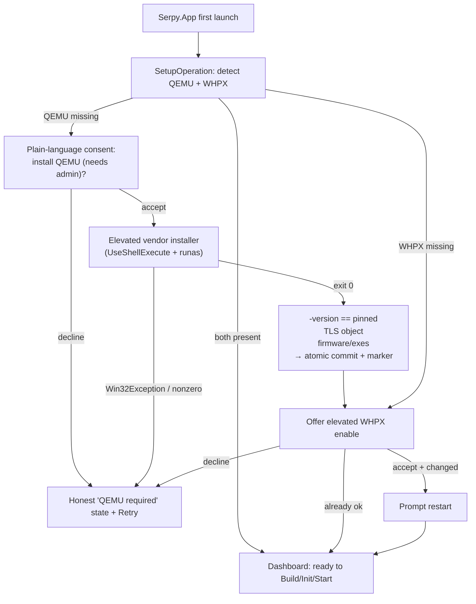
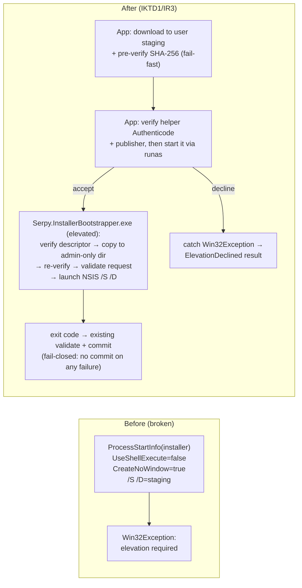

# QEMU + Dependency Installer with UAC Elevation (Windows host) - Plan

> **Amends** `docs/plans/2026-08-22-0040-feat-qemu-erpnext-appliance-dotnet-avalonia-windows-host-plan.md` on **one axis only: host-side dependency delivery**. The appliance Product Contract (ERPNext v16, two-disk data separation, cloud-init build, version/health gates, persistence, recovery, durability, GUI/tray) and every guest-side invariant are retained unchanged. This plan replaces the prior "archive-only, no-installer, no-elevation" host-delivery stance with a **UAC-elevated installer** stance for QEMU, WHPX feature enablement, and the `Serpy.App` product itself.

## Goal Capsule

- **Objective:** Deliver the QEMU/WHPX runtime and the `Serpy.App` product onto a clean Windows x64 host through a **UAC-elevated installer path**, so a first-run user goes from "unpacked download" to "QEMU installed, WHPX enabled, appliance operable" via standard Windows install/consent prompts instead of an unattended archive extraction that silently fails on machines where the vendor installer requires elevation.
- **Product authority:** Windows x64 remains the delivered, runtime-verified platform. The change is scoped to **how host dependencies arrive**, not to the appliance's runtime behavior. Elevation happens only during one-time setup actions (QEMU install, WHPX feature enablement, product install); the appliance's routine `build`/`init`/`start`/`stop`/`recover` operations still run **non-elevated** in the logged-in user's session.
- **Why now:** The current `ManagedRuntimeResolver.InstallFromNsisAsync` launches the Weil `qemu-w64-setup-*.exe` with `UseShellExecute=false` and `/S` (unattended, non-elevated). On machines whose NSIS install target requires administrative rights, Windows returns `Win32Exception: The requested operation requires elevation`, and the install fails after a full download + SHA verification. The proven fix — already used by `WhpxEnabler.EnableAndRequestRestart()` — is `UseShellExecute=true, Verb="runas"`, which raises the UAC consent prompt. This plan makes that the deliberate, tested delivery contract rather than an ad-hoc patch.
- **Open blockers:** None for planning. The installer path needs a Windows host with a real UAC prompt to verify the accept/decline branches; those are the U-level integration checks.

---

## Gap Analysis — What Exists vs. What This Plan Adds

This section is the requested "check what exists / gap analysis." Evidence is from the current tree on branch `development`.

### What already exists (reuse, do not rebuild)

| Area | Current state | Evidence |
|---|---|---|
| Installer download + SHA verification | `ManagedRuntimeResolver.InstallFromNsisAsync` downloads `installerUrl`, verifies `installerSha256`, then runs the NSIS installer with `/S /D=<staging>`. Selection is driven by `EnsureInstalledAsync`: a populated `installerUrl` chooses the NSIS path, else the archive path. | `src/Serpy.Core/Qemu/ManagedRuntimeResolver.cs:56-70, 139-186` |
| Installer manifest fields | `RuntimeManifest.WindowsBundle` already carries `InstallerUrl` / `InstallerSha256` (and legacy `ArchiveUrl`/`ArchiveSha256`). `versions.yaml` pins the Weil `qemu-w64-setup-20260811.exe` + its SHA-256; archive fields are empty. `DeliveryFingerprint` already prefers the installer SHA. | `src/Serpy.Core/Qemu/ManagedRuntimeResolver.cs:38-40, 381-389`; `config/versions.yaml:5-17` |
| Post-install validation | After install, the resolver validates required exes/firmware, probes `-version` against the pinned version, probes TLS (`tls-creds-x509`), then commits atomically with a two-line validation marker (`version`, `fingerprint`) and a backup/rollback swap. Firmware resolver already handles **both** archive layout (`share/qemu`) and installer layout (`share`). | `src/Serpy.Core/Qemu/ManagedRuntimeResolver.cs:172-186, 262-325` |
| UAC elevation idiom | `WhpxEnabler.EnableAndRequestRestart()` launches elevated PowerShell with `UseShellExecute=true, Verb="runas"` and treats a `Win32Exception` as "user declined UAC" (returns `false`). This is the exact pattern the installer must adopt. WHPX presence probe (`IsLikelyEnabled`) already exists. | `src/Serpy.Core/Qemu/WhpxEnabler.cs:18-52` |
| Portable packaging | `eng/package-windows.ps1` stages the Native-AOT publish output + README + QEMU source notice, emits `SHA256SUMS.txt`, and zips a `Serpy-<ver>-win-x64` portable directory. No MSI/MSIX, no shortcut, no uninstall entry. | `eng/package-windows.ps1:1-57` |
| Dev install helper | `eng/install-qemu-local.ps1` runs `Start-Process ... /S /D=$dest` **non-elevated** — same latent elevation failure as the resolver, and it bypasses any trusted-helper path. | `eng/install-qemu-local.ps1:1-23` |

### The gaps this plan closes

1. **The NSIS install is non-elevated and fails on elevation-required hosts.** `InstallFromNsisAsync` uses `UseShellExecute=false`; the Weil silent install can require admin, producing `Win32Exception`. There is no UAC path, no accept/decline handling, and no user-facing consent flow for QEMU install. **This is the core defect the user reported.**
2. **The elevated install cannot redirect its output into a captured pipe.** Elevation via `Verb="runas"` forces `UseShellExecute=true`, which forbids `RedirectStandardOutput`/`CreateNoWindow=false` semantics the current code assumes. The install-progress and exit-code handling must be reworked around a shell-executed elevated process (exit code is still available; stdout is not).
3. **The prior Product Contract forbids exactly this.** `KTD8`, `KTD11`, `R16`, `AE6`, `U6` execution note, and the Dependencies/Assumptions section all assert "no installer, no elevation, no UAC prompt." Those assertions must be amended (not deleted wholesale — only the delivery-axis clauses).
4. **WHPX enablement is implemented but not wired into a first-run setup flow.** `WhpxEnabler` exists but the dashboard/first-run path does not orchestrate "detect → offer to enable (UAC) → prompt restart" as a coherent guided step alongside QEMU install.
5. **No product installer.** The distribution is a portable ZIP with no shortcut/uninstall entry and no elevated-install path. The user chose to add a real Windows installer (a WiX MSI — see IKD3) for `Serpy.App`: install directory, Start-menu shortcut, uninstall entry, the signed elevated bootstrapper, and first-run-triggered QEMU + WHPX setup.
6. **The dev script `install-qemu-local.ps1` carries the same non-elevated bug** and must be brought in line so local verification matches product behavior.

---

## Product Contract (delta only)

Everything in the amended plan's Product Contract is retained **except** the clauses below, which this plan changes. Requirement, decision, and acceptance IDs are namespaced with an `I` prefix (Installer) to avoid collision with the base plan's R/KD/KTD/AE IDs.

### Amended assertions (supersede the base plan on the delivery axis)

- **Base KTD11 → materially amended by IKD1/IKTD1 (a documented, settled change to a base invariant — not pure retention).** Base KTD11 required Serpy CI to **build QEMU from locked upstream source** and publish an immutable Serpy-signed archive. The user has directed delivery via the **third-party pre-built Weil NSIS installer** (`session-settled: user-directed`), which supersedes KTD11's build-from-locked-source clause. This is resolved as a **deliberate provenance change, documented not silent**: (1) `config/versions.yaml` pins the exact Weil installer version + SHA-256 (already present); (2) `docs/third-party/qemu-source-notice.md` records the Weil build's GPL source correspondence and license notice; (3) KTD11's provenance is updated to name Weil as the QEMU source of record; (4) the signed **descriptor** (IR3) pins that Weil SHA so the elevated helper's integrity check is authoritative; (5) post-install validation asserts the Weil payload actually provides **WHPX, GnuTLS/`tls-creds-x509`, and required firmware**. `-version`/TLS probing confirms features; the descriptor + pinned SHA + recorded source-notice carry provenance. This is the single settled path — no Serpy-built-archive fallback remains.
- **Base KTD8 / R16 / U6 execution note → amended by IR4.** "No UAC prompt / no installation step" is narrowed to **routine appliance operation**. One-time setup (QEMU install, WHPX enablement, product install) MAY elevate through standard Windows consent. The running appliance and all lifecycle operations remain non-elevated.
- **Base "portable ZIP is the phase distribution" → amended by IKD3/IR5.** The delivered distribution is a **per-machine WiX MSI** for `Serpy.App`, which registers an install location, a Start-menu entry, an uninstall entry, and the signed elevated bootstrapper, and drives first-run QEMU + WHPX setup. The portable ZIP is demoted to a **CI/build artifact only** — it is not a supported user install path, because it carries no elevated bootstrapper and cannot perform the TOCTOU-safe QEMU install (IR3).
- **Base AE6 → amended by IAE1.** The clean-host acceptance now begins with running the product installer and completing (or explicitly declining) the elevated QEMU + WHPX setup, then the full appliance workflow.

### Installer Requirements

- **IR1. UAC-elevated QEMU install.** When the QEMU runtime is absent, Serpy downloads the checksum-pinned vendor installer, verifies its SHA-256, and runs it **elevated** (UAC consent). On acceptance, the installer writes QEMU into the per-user managed runtime directory (`%LOCALAPPDATA%\Serpy\runtime\qemu-<version>`), and Serpy performs its existing `-version`/TLS/firmware validation and atomic commit. On UAC decline or non-zero exit, Serpy reports an actionable, non-fatal-to-the-app failure and leaves no partial runtime.
- **IR2. WHPX feature enablement as a guided setup step, with a typed elevation result.** First-run setup detects WHPX (`WinHvPlatform.dll` + the definitive `WhpxProbe`), and when absent offers a **UAC-elevated** enablement of `HypervisorPlatform` + `VirtualMachinePlatform`, followed by an explicit restart prompt. The enablement returns a **typed result** distinguishing UAC decline, a killed/null process, and a non-zero exit from success. **Success before reboot is judged by the Windows feature state** (`Enabled` / `EnablePending` via `Get-WindowsOptionalFeature` / `DISM`), **not** by `WhpxProbe` — a live `-accel whpx` probe cannot succeed until the machine reboots, so it is never the pre-reboot gate. `RestartRequired` is emitted only when the feature state confirms an actual enable/enable-pending change; the **definitive `WhpxProbe` runs only after the reboot**. Declining leaves the app usable but surfaces the prerequisite. Serpy never silently mutates Windows features without consent.
- **IR3. Integrity is preserved across the elevated boundary, TOCTOU-safe.** Verifying the installer's SHA-256 in the non-elevated app and then launching it under UAC is **not** sufficient, because the download lands in a user-writable location and a non-admin process could swap the verified binary during the UAC-consent delay to gain code execution as Administrator. The verify-and-execute step therefore happens **inside a single elevated context** run by a **separate signed executable, `Serpy.InstallerBootstrapper.exe`**, installed by the MSI under an admin-only Program Files location: the non-elevated app downloads the pinned installer to user staging and pre-verifies it (fail-fast on a bad download), then starts the bootstrapper under UAC, which (1) copies the installer into an admin-only directory the unprivileged user cannot write, (2) **re-verifies** it there against a **signed runtime descriptor the bootstrapper trusts** (the publisher-signed descriptor from base KTD11, shipped with / pinned by the signed bootstrapper — not a hash read from the user-writable `versions.yaml`), and (3) launches it — all as Administrator, so the check-to-use window never leaves elevated context. The authoritative integrity value is the signed descriptor the elevated helper trusts; the app cannot supply or weaken it. Post-install, the runtime is validated (`-version` == pinned, TLS object constructible, required exes/firmware present) before the atomic commit and validation marker are written. A declined/failed/killed elevated install can never be mistaken for a complete runtime (the existing `IsInstalled()` marker check enforces this).
- **IR4. Elevation is confined to one-time setup, enforced by an API split.** No routine lifecycle operation (`build`/`init`/`start`/`stop`/`restart`/`status`/`recover`) elevates. This is guaranteed structurally, not by convention: `ManagedRuntimeResolver`'s **resolution/detection surface** (`QemuSystemExe`, `QemuImgExe`, `ShareDir`, `IsInstalled()`) is side-effect-free and non-elevating, while its **installing surface** (the elevating `InstallAsync`, renamed from `EnsureInstalledAsync`) is reachable **only** through the consented `SetupOperation` (IR6/IU2). Every lifecycle operation depends solely on the resolution surface and treats an absent/invalid runtime as a preflight failure that routes the user to setup — it never triggers an install. The state store, mutex, QEMU process, QMP/QGA/serial channels, and browser launch all run in the logged-in user's non-elevated session, exactly as the base plan specifies.
- **IR5. Product installer package, installed per-machine to Program Files.** A signed-capable WiX MSI installs `Serpy.App` (Native-AOT output + assets + config + guest scripts + QEMU source notice) **and the signed `Serpy.InstallerBootstrapper.exe`** into a **per-machine `%ProgramFiles%\Serpy` location** (required so the elevated bootstrapper lives where a non-admin user cannot rewrite it, per IR3), creates a Start-menu shortcut, and registers an uninstall entry (Apps & Features). First-run QEMU + WHPX setup is triggered from the app, not the MSI (IKTD2). Uninstall removes the app, bootstrapper, shortcut, and ARP entry but does not delete the user's appliance workspace/data by default.
- **IR6. Consent is explicit and legible.** Before any elevation, the user sees a plain-language explanation of what will be installed/changed and why admin rights are needed. Elevation is never triggered as an invisible side effect of opening the app.
- **IR7. The signed-helper trust model is implemented and verified, with no bypass in production.** IR3's guarantees hold only if the bootstrapper is genuinely trusted: (a) release CI **Authenticode-signs** `Serpy.InstallerBootstrapper.exe` (and the MSI) using a signing input provided to CI (certificate/HSM reference via secret), and signs (or pins the public key of) the runtime descriptor the helper trusts; (b) before the app starts the helper under `runas`, it **verifies the helper's Authenticode signature and expected publisher** at its Program Files path, and the helper **verifies the descriptor signature** against a provisioned public key before trusting it; (c) an **unsigned or wrong-publisher** helper/descriptor **fails closed** — the elevated install is refused with an actionable message. **Production projects contain no verification-bypass branch of any kind** (no `#if DEBUG`, runtime flag, or environment variable): verification is always enforced regardless of build configuration. Tests exercise the failure/success paths by **injecting fake signature/descriptor verifiers** through a seam, and unsigned local end-to-end runs use a **separate test-only helper binary**, never the shipped `Serpy.InstallerBootstrapper.exe`. A CI check asserts the release artifact enforces verification (e.g. no bypass symbol/branch present); (d) real-host acceptance confirms the shipped helper is signed and that tampering with it or the descriptor is rejected. Governs IR3, IR5.

### Installer Acceptance Examples

- **IAE1. Clean-host first run (amends AE6).** Given a clean Windows x64 host with the product installer, when the user installs `Serpy.App`, accepts the QEMU UAC prompt, and (if needed) accepts WHPX enablement + restart, then QEMU is installed and validated into the per-user runtime, WHPX is enabled, and the full `build → init → start → open → stop` appliance workflow completes from the GUI.
- **IAE2. UAC decline is graceful.** Given the QEMU-absent state, when the user declines the UAC prompt for the installer, then Serpy reports "QEMU installation was cancelled — administrator approval is required" with a retry affordance, leaves no partial runtime, and the app remains open and honest about the missing prerequisite. The same holds for a declined WHPX enablement.
- **IAE3. Integrity gate before elevation.** Given a tampered/short/mismatched installer download, when SHA-256 verification runs, then the elevated launch never happens and the failure names expected vs. actual hash.
- **IAE4. Setup-only elevation boundary.** Given an installed, WHPX-enabled host, when the user runs `start`/`stop`/`recover`, then no UAC prompt appears and the appliance operates entirely non-elevated (verified by process token / absence of an elevation request).
- **IAE5. Product install/uninstall lifecycle.** Given the per-machine MSI, when the user installs then uninstalls `Serpy.App`, then a Start-menu shortcut and Apps & Features entry appear on install and are removed on uninstall; the appliance data workspace is retained unless the user opts to remove it.

### Scope Boundaries (delta)

**In scope now**

- UAC-elevated QEMU install via the pinned vendor installer, replacing the non-elevated silent-install launch.
- First-run setup orchestration: detect QEMU/WHPX, offer elevated install/enable, handle accept/decline/restart.
- A per-machine WiX MSI for `Serpy.App`, with shortcut, uninstall entry, and the signed elevated bootstrapper (MSIX is explicitly deferred — see IKD3).
- Routing `eng/install-qemu-local.ps1` through the elevated bootstrapper so the dev path matches product elevation and does not bypass the TOCTOU-safe install.

**Out of scope / unchanged**

- Guest dependency installation (Python 3.14, Node 24, MariaDB, Redis, Frappe/ERPNext) — these are installed **inside the VM** by cloud-init and are untouched by this plan.
- Auto-update / background updater.
- macOS/Linux install packaging (remains deferred as in the base plan).
- Any change to disk boundary, recovery guards, health gates, or protocol transports.

---

## Key Technical Decisions

- **IKD1. Deliver QEMU through a one-time UAC-elevated vendor installer, into the per-user runtime dir.** (session-settled: user-directed — chosen over archive-only delivery because the pinned Weil installer requires elevation on the delivered hosts and silently failed otherwise; chosen over a machine-wide Program Files target to preserve the disposable per-user runtime model.) The installer's `/D=` target stays `%LOCALAPPDATA%\Serpy\runtime\qemu-<version>` staging, and the existing validate-then-atomic-commit path is unchanged. Governs IR1, IR3, IR4.
- **IKTD1. The elevated step is a separate signed executable, `Serpy.InstallerBootstrapper.exe`, launched with the `WhpxEnabler` elevation idiom (`UseShellExecute=true, Verb="runas"`, `Win32Exception`=decline).** It is its own project (not a `Serpy.Core` class, which Native AOT would link into `Serpy.App.exe` and could not be independently `runas`-launched as a trusted binary), MSI-installed under an admin-only Program Files location. The elevated bootstrapper — not the non-elevated app — copies the installer into an admin-only path, re-verifies it there against the **signed runtime descriptor the bootstrapper trusts** (IR3/IKTD3), and launches it, closing the TOCTOU window. Because `runas` forbids stdout redirection, install progress is coarse stage text ("Waiting for administrator approval…", "Copying + verifying…", "Installing QEMU…", "Validating…"); the bootstrapper **exit code** plus the post-install `-version`/TLS validation are the success gate. Governs IR1, IR2, IR3, IR6.
- **IKD2. First-run setup is a guided, cancellable flow owned by `Serpy.Core`, surfaced by the GUI.** A `SetupOperation` (or extension of the existing operation surface) sequences: QEMU present? → WHPX present? → offer elevated remediation with plain-language consent → validate → prompt restart if WHPX changed. Lifecycle rules stay in the core; the UI only renders state and dispatches. Governs IR2, IR4, IR6.
- **IKD3. Ship `Serpy.App` as a per-machine MSI built with WiX v5, not MSIX.** (Decision with rationale: MSIX per-user/AppContainer packaging complicates the app's need to spawn an external process, write to `%LOCALAPPDATA%\Serpy`, and trigger a second elevated installer; a classic MSI installs cleanly, registers Start-menu + uninstall entries, and imposes no container restrictions on the QEMU child process or the runtime directory. **Scope is per-machine `%ProgramFiles%\Serpy`, not per-user** — the signed elevated bootstrapper (IR3/IKTD1) must live in an admin-only location a non-admin user cannot rewrite, which a per-user install under a user-writable path cannot provide. **If** signing/store distribution later requires MSIX, that is a follow-on, not this plan.) Governs IR5, IAE5.
- **IKTD2. The MSI carries the Native-AOT payload and triggers first-run setup on first launch, rather than elevating twice during MSI install.** The MSI install itself elevates once (standard Windows installer behavior) to place files + shortcut + uninstall entry; QEMU install and WHPX enablement happen on **first app launch** through IKD2's guided flow, so a user who installs but never runs the app is not forced through QEMU/WHPX elevation, and the QEMU installer's own UAC prompt is not nested inside the MSI's. Governs IR5, IKD2.
- **IKTD3. `versions.yaml` supplies the installer URL; the publisher-signed descriptor is the integrity authority, verified by the elevated helper.** `versions.yaml` names the HTTPS installer URL (or `file://` for CI self-test) and the human-auditable pinned SHA, but because `versions.yaml` is user-writable it is **not** the trust root: the base plan's publisher-signed runtime descriptor (KTD11) is, and the elevated `Serpy.InstallerBootstrapper.exe` re-verifies against the descriptor it trusts (IR3) so an altered `versions.yaml` cannot redirect or weaken the elevated install. No new trust surface is introduced by switching archive→installer. Governs IR3.

---

## High-Level Technical Design

The design changes are localized to the runtime resolver's NSIS path, a new first-run setup orchestration, and packaging. Nothing below the operation service changes.

**First-run setup and elevation flow**



**Runtime resolver NSIS path (before → after)**



The new control-flow is the app→signed-bootstrapper→protected-copy→re-verify→NSIS chain; the elevated helper, not the app, launches the vendor installer. The download, SHA gate, content validation, `-version`/TLS probes, atomic commit, validation marker, and rollback are reused unchanged.

---

## Output Structure (delta)

```text
config/
  versions.yaml                       # unchanged: installerUrl + installerSha256 already pinned
src/
  Serpy.Core/
    Qemu/
      ManagedRuntimeResolver.cs       # MODIFY: EnsureInstalledAsync → InstallAsync; starts the elevated bootstrapper seam; typed decline result
      WhpxEnabler.cs                  # MODIFY: typed enable result — null/non-zero/decline/success
    Operations/
      SetupOperation.cs               # NEW: first-run detect/consent/elevate/validate/restart orchestration
    Contracts/
      IApplianceService.cs            # MODIFY: add EnsureSetupAsync (or SetupAsync) + typed setup result
  Serpy.InstallerBootstrapper/        # NEW (IKTD1): separate signed elevated executable, MSI-installed to admin-only Program Files
    Program.cs                        # restricted entry: verify descriptor → copy → re-verify → validate request → launch vendor installer, all elevated
  Serpy.App/
    ViewModels/
      SetupViewModel.cs               # NEW: first-run guided setup surface (consent + progress + decline/retry)
    Views/
      SetupView.axaml                 # NEW
eng/
  install-qemu-local.ps1              # MODIFY: invoke the test-only bootstrapper under -Verb RunAs (unsigned local E2E; no direct vendor-installer launch)
  installer/                          # NEW (IKD3): WiX v5 project
    Serpy.wxs                         # product, install dir, shortcut, uninstall entry, payload harvest
    build-msi.ps1                     # CI-only MSI build
.github/workflows/
  build-test-publish.yml              # MODIFY: sign + publish the MSI as the release artifact (ZIP stays a CI-only build artifact)
  sign-and-check.yml                  # NEW/MODIFY: Authenticode-sign helper+MSI; assert release enforces verification (IR7)
tests/
  Serpy.Core.Tests/
    Qemu/ManagedRuntimeResolverTests.cs   # MODIFY: bootstrapper-seam start + decline/exit handling; caller-audit + TOCTOU tests
    Operations/SetupOperationTests.cs     # NEW: detect/consent/validate/decline state machine
  Serpy.InstallerBootstrapper.Tests/
    BootstrapperTests.cs                  # NEW: protected copy → re-hash → vendor launch; source-replacement rejection
  Serpy.InstallerBootstrapper.TestHelper/
    Program.cs                            # NEW: test-only unsigned helper for local E2E (never shipped; IR7)
  Serpy.App.Tests/
    SetupViewModelTests.cs                # NEW: Avalonia.Headless consent/progress/decline/retry
  Serpy.Windows.IntegrationTests/
    InstallerElevationTests.cs            # NEW opt-in: real UAC accept/decline on a Windows host
docs/
  results.md                          # MODIFY: record installer + WHPX setup + Weil provenance outcomes
  third-party/qemu-source-notice.md   # MODIFY: Weil QEMU provenance + GPL source/license (KTD11 amendment)
  README.md                           # MODIFY: install-via-MSI + UAC expectations
```

---

## Implementation Units

### IU1. Elevated QEMU installer path in the runtime resolver

- **Goal:** Fix the reported defect — make the NSIS install path elevate through UAC and handle accept/decline/failure cleanly, with integrity preserved across the elevation boundary.
- **Requirements:** IR1, IR3, IR4, IKD1, IKTD1, IKTD3. Amends base KTD11.
- **Dependencies:** none (modifies existing code).
- **Files:** `src/Serpy.Core/Qemu/ManagedRuntimeResolver.cs`; `src/Serpy.Core/Qemu/ElevatedInstallChannel.cs` (NEW — the app-side named-pipe **client** + nonce handshake with the elevated helper, step 7); `src/Serpy.InstallerBootstrapper/` (NEW **separate executable project** — the trusted, signed, MSI-installed helper that creates the ACL-restricted pipe **server**, authenticates the connecting client SID, copies→re-verifies→launches the vendor installer under elevation; own `Program.cs`, restricted entry point, not linked into `Serpy.App.exe`); `config/versions.yaml` (audit-only — pinned `installerUrl`/`installerSha256`; unchanged); `src/Serpy.Core/Operations/BuildOperation.cs`, `InitializeOperation.cs`, `StartOperation.cs`, `RecoverOperation.cs` (caller audit only); `tests/Serpy.Core.Tests/Qemu/ManagedRuntimeResolverTests.cs`, `tests/Serpy.InstallerBootstrapper.Tests/`.
- **Approach:**
  1. **Split the resolver surface (IR4).** Rename the installing method `EnsureInstalledAsync` → `InstallAsync` and keep it the **only** elevating entry point. Leave the resolution/detection accessors (`QemuSystemExe`, `QemuImgExe`, `ShareDir`, `IsInstalled()`) exactly as they are — side-effect-free and non-elevating. Audit the four lifecycle operations (`BuildOperation`, `InitializeOperation`, `StartOperation`, `RecoverOperation`): today they consume only `runtimeResolver.QemuSystemExe`/`ShareDir` (verified — none call the installing method), so no migration edit is needed beyond confirming that invariant and adding a test that locks it. `InstallAsync` is invoked **only** by `SetupOperation` (IU2), never by a lifecycle operation.
  2. Extract the **helper launch** into a small seam so tests can substitute it (e.g. a `Func<BootstrapRequest, CancellationToken, Task<int>>` that starts the elevated bootstrapper over the authenticated pipe of step 7, defaulting to the real `runas` launch). The request references the pre-downloaded installer path only; it carries **no caller-supplied expected hash and no caller-supplied destination** — integrity comes from the signed descriptor the helper trusts (IR3/IKTD3) and the destination is derived from the pipe-authenticated client SID (step 7), so a caller can weaken neither. This makes the elevation policy testable without a real UAC prompt.
  3. Default seam: **before** launching, verify the helper's Authenticode signature and expected publisher at its Program Files path (IR7); a release build with an unsigned/wrong-publisher helper **fails closed** with an actionable message. Then start the **`Serpy.InstallerBootstrapper.exe`** with `ProcessStartInfo(bootstrapperExePath) { UseShellExecute = true, Verb = "runas" }`, `WaitForExitAsync`, return exit code. Wrap `Process.Start` in `try/catch (Win32Exception)` and translate a decline into a typed `ElevationDeclined` outcome (mirror `WhpxEnabler.EnableAndRequestRestart`). The bootstrapper — running elevated — verifies the descriptor signature, then constructs the vendor installer's `/S /D=<staging>` arguments and launches it; the non-elevated app never launches the vendor installer directly.
  4. **Elevated install → staging ACL hardening (helper) → validate (resolver) → atomic commit (resolver) — in that order (IR3).** The elevated helper does not commit. It: (a) stands up the authenticated pipe server and resolves the original-user SID (step 7); (b) creates a **fresh, known staging directory** (never pre-existing); (c) copies the installer to an admin-only intermediate the unprivileged user cannot write; (d) **re-verifies** it against the signed descriptor (IR3/IKTD3); (e) launches the vendor installer with `/S /D=<fresh staging dir>`; (f) once the installer exits zero, validates the staging tree has no reparse points, then sets owner = original-user SID, full-control with inheritance, preserving SYSTEM/Administrators — does **not** recursively ACL any pre-existing path; (g) communicates the staging path back over the pipe and exits. The **non-elevated resolver** receives the staging path, runs `ValidateContents` → `-version` → `ProbeHasTlsAsync` in sequence; only after all three pass does it call `CommitValidatedBundle` (the atomic rename into the final location). On any failure at any stage — helper or resolver — delete only the staging + admin-intermediate directory; the committed path stays clean and no partial runtime is left behind.
  5. The bootstrapper runs headless; the app reports coarse stage text through the existing `IProgress<string>` and maps the helper's exit code to typed outcomes. Inside the helper, the vendor `/D` NSIS argument (the SID-derived staging path) must remain **unquoted and last** (NSIS requirement) — the final `ArgumentList` entry the helper passes to the vendor installer.
  6. Surface the decline/failure as a non-fatal, retryable result to the caller (`SetupOperation`), not an app crash.
  7. **Authenticate the request over a helper-hosted pipe (privilege-safety).** The helper runs elevated, so it must not be an arbitrary privileged copy/launch primitive and must **not** trust its parent token (`runas` routes through the `AppInfo`/consent service — the helper's parent is not reliably the app, and parent-PID/token checks race and spoof). Correct role assignment: the app launches the helper passing, as bootstrap arguments, a **pipe name**, a **high-entropy single-use nonce**, and the **claimed original-user SID**. The **elevated helper creates the named-pipe *server*** with a DACL restricted to that claimed SID, the **non-elevated app connects as *client***, and the helper calls `ImpersonateNamedPipeClient` + `GetTokenInformation` to read the *connected client's* real token SID and validates it **matches the claimed SID** and that the nonce matches — the bootstrap arguments are only ever *validated against the connected client token*, never trusted on their own. The verified client SID is the "requesting user" whose `%LOCALAPPDATA%\Serpy\runtime` bounds the destination; the **source** installer must be a regular non-reparse file and the destination must canonicalize strictly under that SID's runtime dir (reject `..`, reparse points, UNC/`\\?\`). Any auth/validation/nonce failure aborts before copy or launch; the helper only ever launches the descriptor-verified vendor installer.
- **Test scenarios:**
  - With a stub launcher returning exit 0 over a fixture "installed" staging dir, `InstallAsync` validates and commits; `IsInstalled()` is then true.
  - A stub launcher that throws `Win32Exception` yields a typed `ElevationDeclined` outcome, leaves no bundle dir, and does not throw out of `InstallAsync`.
  - A stub launcher returning a non-zero exit yields a typed failure naming the exit code and leaves no partial runtime.
  - SHA mismatch aborts before the launcher is ever invoked (assert the launcher stub records zero calls).
  - The default seam starts the **bootstrapper** (not the vendor installer) with `UseShellExecute=true, Verb="runas"` and passes a request bearing the installer path + `/D` target but no expected-hash field (assert on the constructed `ProcessStartInfo` and request, no process spawned in unit scope).
  - **Bootstrapper unit test:** given a protected-copy fixture, the helper copies the installer to the admin-only path, re-verifies it against the signed descriptor it trusts, launches the vendor installer with `/S` then `/D=<staging>` last, and propagates the vendor exit code / a decline back to the caller.
  - **TOCTOU test (IR3):** given a fixture where the user-staged installer is replaced with a different binary after the app's pre-verification but before the bootstrapper runs, the elevated re-verification at the protected path rejects the swap (hash mismatch) and never launches the substituted binary.
  - **Helper request-validation test (privilege-safety):** the bootstrapper rejects a request whose source is a reparse point/symlink, and rejects a `/D` destination that escapes the requesting user's `%LOCALAPPDATA%\Serpy\runtime` (`..` traversal, a reparse point, or a UNC/`\\?\` path) — aborting before any copy or launch, so the elevated helper cannot be turned into an arbitrary privileged copy/launch primitive.
  - **Caller-audit test (IR4):** the four lifecycle operations reach the resolver only through `QemuSystemExe`/`QemuImgExe`/`ShareDir`/`IsInstalled()` and never call `InstallAsync` — asserted so a future edit that wires install into a lifecycle op fails the test rather than silently introducing a mid-operation UAC prompt.
  - **Channel-auth test (privilege-safety):** the bootstrapper rejects a pipe client whose authenticated SID does not match the target runtime owner, rejects a replayed/absent nonce, and derives the destination from the authenticated SID rather than any request field — a request naming a foreign `/D` cannot redirect the install.
  - **Ownership test (over-the-shoulder admin):** when the elevated install runs under a different admin credential, the placed runtime tree ends up **owned by and writable to the original signed-in user SID** (assert owner + effective update/delete access), not the admin — so a later re-install/uninstall by the non-admin user is not blocked.
- **Verification:** Unit tests with the launcher seam; then the opt-in Windows integration check in IU4.
- **Execution note:** Do not reintroduce archive-only delivery. The archive path (`InstallFromZipAsync`) stays as a fallback selectable only when `installerUrl` is empty, but the delivered `versions.yaml` uses the installer. `InstallAsync` remains the single elevating entry point.

### IU2. First-run setup orchestration (QEMU + WHPX) in the core and GUI

- **Goal:** Turn the isolated resolver + `WhpxEnabler` capabilities into one guided, cancellable, consent-first first-run flow owned by the core and rendered by the GUI.
- **Requirements:** IR2, IR4, IR6, IKD2, IKTD2. Amends base KTD8 / R16 elevation clause.
- **Dependencies:** IU1.
- **Files:** `src/Serpy.Core/Operations/SetupOperation.cs`, `src/Serpy.Core/Contracts/IApplianceService.cs`, `src/Serpy.Core/Operations/ApplianceService.cs` (MODIFY: add `EnsureSetupAsync`), `src/Serpy.Core/Qemu/WhpxEnabler.cs` (MODIFY: typed enable result), `src/Serpy.Core/Configuration/SetupStateStore.cs` (NEW: durable host **setup** state under per-user config — restart-required marker; **separate from the HIGH-blast-radius appliance `StateStore`**); `src/Serpy.App/ViewModels/SetupViewModel.cs` (NEW), `src/Serpy.App/Views/SetupView.axaml` (NEW), `src/Serpy.App/ViewModels/DashboardViewModel.cs` (MODIFY: route to setup when QEMU/WHPX/restart-required), `src/Serpy.App/Views/DashboardWindow.axaml` (+`.axaml.cs`) (MODIFY: host the setup surface), `src/Serpy.App/App.axaml.cs` (MODIFY: first-launch setup gate); `tests/Serpy.Core.Tests/Operations/SetupOperationTests.cs`, `tests/Serpy.Core.Tests/Qemu/WhpxEnablerTests.cs`, `tests/Serpy.Core.Tests/Configuration/SetupStateStoreTests.cs`, `tests/Serpy.App.Tests/SetupViewModelTests.cs`.
- **Approach:**
  1. Add a `SetupOperation` that reports a typed setup status: `QemuInstalled`/`QemuMissing`/`QemuInstallDeclined`, `WhpxEnabled`/`WhpxMissing`/`WhpxEnableDeclined`/`RestartRequired`. It is the **sole** caller of `ManagedRuntimeResolver.InstallAsync` (IU1) and of `WhpxEnabler`. Detection is non-elevated and side-effect-free. Modify `WhpxEnabler.EnableAndRequestRestart` to return a **typed result** — it currently returns `true` on a null process or non-zero exit; change it to distinguish `Process.Start` returning null, a non-zero exit code, and `Win32Exception` (decline), and to judge **enable success by the post-enable Windows feature state (`Enabled`/`EnablePending`)**, not by `WhpxProbe` (which cannot pass pre-reboot). `RestartRequired` is emitted only on a confirmed feature-state change.
  2. Expose it through `IApplianceService` as `EnsureSetupAsync(SetupRequest request, IProgress<OperationUpdate> progress, CancellationToken ct)` where `SetupRequest` carries the explicit per-component consent (`InstallQemu: bool`, `EnableWhpx: bool`) the UI collected — the core elevates a component **only** when its consent flag is set, so the "no elevation without explicit consent" test (IR6) binds to a real parameter rather than an implicit side channel. It returns the typed status and streams `OperationUpdate`s.
  3. `SetupViewModel` renders: plain-language explanation, "Install QEMU (requires administrator approval)" and "Enable virtualization feature (requires administrator approval, then restart)" actions, live coarse progress, and decline → honest blocked state + Retry. On a successful WHPX change, persist a durable `restart-required` marker in the **new `SetupStateStore`** (per-user config file, e.g. under `%LOCALAPPDATA%\Serpy`), **not** the appliance `StateStore` — GitNexus impact rates `StateStore` HIGH (25 impacted, 15 direct across `Operations`), so setup state is kept in its own small store to avoid that blast radius. Offer an explicit **Restart now / Restart later** choice; the marker survives app exit and reboot.
  4. On next launch, `SetupOperation` reads the `restart-required` marker from `SetupStateStore`, **re-probes WHPX** (`WhpxProbe`), and clears the marker only when the probe confirms the feature is live — so acknowledging the prompt without rebooting leaves setup in `RestartRequired`, not a false `Ready`, and a completed reboot resumes to the normal ready flow.
  5. Wire the dashboard so a QEMU/WHPX-missing or `restart-required` state routes to the setup surface before `Build`/`Init`/`Start` are offered; a fully-provisioned, WHPX-live host skips straight to the normal dashboard.
- **Test scenarios:**
  - `SetupOperation` reports `QemuMissing` then, after a stub resolver "install", `QemuInstalled`; a declined resolver install yields `QemuInstallDeclined` and does not proceed to Build.
  - WHPX-missing → declined yields `WhpxEnableDeclined`; WHPX-missing → accepted with a stub reporting the feature state now `Enabled`/`EnablePending` yields `RestartRequired` (asserted against the **feature-state** signal, not a `WhpxProbe` result); an accepted enable whose feature state does not change yields a failure, not `RestartRequired`; already-enabled yields `WhpxEnabled` with no elevation attempted.
  - A persisted `restart-required` marker set after a successful WHPX change survives an app restart; a relaunch that re-probes WHPX as still-inactive stays `RestartRequired`, while a relaunch that probes WHPX live clears the marker and proceeds.
  - `SetupViewModel` (Avalonia.Headless) renders consent, dispatches through a fake service, shows progress, and on decline shows the blocked state with a working Retry — never reaching into resolver/enabler directly.
  - The core never invokes an elevated action unless the fake UI supplied an explicit consent flag (assert the stub elevation launcher is not called on the no-consent path).
- **Verification:** Core state-machine tests + Avalonia.Headless UI tests; real behavior in IU4.
- **Execution note:** Lifecycle operations must not call `EnsureSetupAsync` implicitly in a way that elevates mid-operation. Setup is a distinct, up-front, consented step.

### IU3. `Serpy.App` MSI installer package (WiX v5)

- **Goal:** Replace the portable-ZIP-only distribution with a real Windows installer that installs the app and the signed elevated bootstrapper, a Start-menu shortcut, and an uninstall entry, and defers QEMU/WHPX setup to first run.
- **Dependencies:** IU1 (harvests the `Serpy.InstallerBootstrapper.exe` and installs it to an admin-only location per IR3/IKTD1) and IU2 (first-run setup must exist so the MSI can rely on it rather than elevating twice at install time).
- **Requirements:** IR5, IR7, IKD3, IKTD2, IAE5. Amends base "portable ZIP is the distribution."
- **Files:** `eng/installer/Serpy.wxs`, `eng/installer/build-msi.ps1`; `.github/workflows/build-test-publish.yml`; `eng/package-windows.ps1` (audit-only — its required-payload list is the MSI harvest source of truth; unchanged unless the MSI supersedes the ZIP); `eng/install-qemu-local.ps1`; `README.md`.
- **Approach:**
  1. WiX v5 project harvesting the Native-AOT publish output (`Serpy.App.exe` + the separate `Serpy.InstallerBootstrapper.exe` from IU1 + assets + `config/versions.yaml` + `cloud-init/*` + `guest/*` + QEMU source notice — the same payload `eng/package-windows.ps1` asserts as required, plus the elevated helper executable). Install **per-machine to `%ProgramFiles%\Serpy`** (`INSTALLFOLDER` fixed to Program Files, not per-user); add a Start-menu shortcut and an ARP/Apps-&-Features uninstall entry with product name, version, publisher. The MSI installs `Serpy.InstallerBootstrapper.exe` into that admin-only Program Files location a non-admin user cannot rewrite (IR3/IKTD1) — the reason per-machine scope is required.
  2. Do **not** run the QEMU installer or WHPX enablement from the MSI itself (IKTD2). First launch runs `SetupOperation` (IU2). This keeps the MSI's single elevation clean and avoids nested UAC.
  3. Uninstall removes installed files, shortcut, and ARP entry; it does **not** delete `%LOCALAPPDATA%\Serpy` appliance data unless the user opts in (offer a checkbox or leave data by default and document how to remove it).
  4. `build-msi.ps1` builds the MSI in CI from a publish dir + version; `build-test-publish.yml` publishes the MSI as the release artifact. The portable ZIP remains a **CI/build artifact only** (smoke-test / debugging convenience), explicitly not offered as a user install path since it lacks the elevated bootstrapper.
  5. Rework `eng/install-qemu-local.ps1` to invoke the **test-only** bootstrapper build under `-Verb RunAs` (copy→re-verify→launch) for unsigned local E2E — it exercises the same TOCTOU-safe copy/verify/launch logic as the shipped helper but is a distinct binary, so local dev needs no production code signature (IR7). It never calls a direct `Start-Process` of the vendor installer and cannot bypass the helper flow. Keep its post-install `-version`/WHPX probe.
  6. **Signing pipeline (IR7).** In release CI, **Authenticode-sign** `Serpy.InstallerBootstrapper.exe` and the MSI using a signing input passed via CI secret (certificate/HSM reference); sign or pin the public key of the runtime descriptor the helper trusts, and provision that public key into the signed bootstrapper. Production code always enforces signature/descriptor verification — there is **no bypass branch**; tests inject fake verifiers through a seam and unsigned local E2E uses a **separate test-only helper binary** (never the shipped one). Add a CI check that inspects the release artifact to assert verification is enforced and no bypass symbol/branch is present in the release binary.
- **Test scenarios:**
  - `build-msi.ps1` produces an MSI from a minimal fixture publish dir; the MSI's file table includes every payload `package-windows.ps1` marks required (assert via `msiinfo`/WiX validation or a manifest diff).
  - Install then uninstall on a Windows host creates and removes the Start-menu shortcut and the Apps & Features entry; appliance data under `%LOCALAPPDATA%\Serpy` survives an uninstall that did not opt into data removal.
  - The MSI install performs no QEMU download and no WHPX change (assert the runtime dir is untouched immediately after MSI install; setup happens only on first launch).
  - **Signing CI check (IR7):** the release build of `Serpy.InstallerBootstrapper.exe`/`Serpy.App` enforces signature/descriptor verification with **no bypass branch** present in the release artifact (assert via artifact/build inspection), and the produced release artifacts are Authenticode-signed with the expected publisher.
- **Verification:** MSI build in CI; install/uninstall lifecycle on a Windows host (part of IU4's manual acceptance).
- **Execution note:** MSI authoring (WiX) is packaging infrastructure, like the existing `eng/qemu/build-windows.ps1`; no application operation path invokes it.

### IU4. Windows acceptance: elevation, setup, and install/uninstall verification
- **Goal:** Prove the elevated install, guided setup, signing/tamper rejection, and MSI lifecycle actually work on a real Windows host, and record outcomes.
- **Requirements:** IR1–IR7, IAE1–IAE5. Amends base AE6 → IAE1.
- **Dependencies:** IU1–IU3.
- **Files:** `tests/Serpy.Windows.IntegrationTests/InstallerElevationTests.cs`; `docs/results.md`; `README.md`; `docs/third-party/qemu-source-notice.md` (MODIFY: record Weil provenance + GPL source/license per the KTD11 amendment).
- **Approach:**
  1. Opt-in integration test (guarded by an env flag like the existing WHPX suite) that runs the elevated QEMU install path on a WHPX-capable host and asserts a validated runtime commit after acceptance. Because UAC accept/decline is interactive, provide a documented manual acceptance procedure for the accept/decline branches and automate only what can run non-interactively (SHA-gate-before-launch, decline→no-partial-runtime with a stub launcher, post-install validation).
  2. Manual acceptance script/checklist: fresh host → run MSI → first launch → accept QEMU UAC → (accept WHPX + restart if needed) → `build → init → start → open → stop`; then a second pass that **declines** QEMU UAC and confirms the honest blocked+retry state (IAE2); an install/uninstall pass (IAE5); and a `start/stop/recover` pass confirming no UAC prompt appears (IAE4). Verify the elevated placement lands QEMU at the requested per-user path; **if `/D` does not place it there, the install fails closed — no partial runtime, no commit, and the release does not proceed** (there is no runtime fallback). Run the UAC prompt in both a **same-user admin** consent and an **over-the-shoulder** (different admin credential) elevation, and record both outcomes.
  3. **Signing/tamper acceptance (IR7):** on the real host, confirm the installed `Serpy.InstallerBootstrapper.exe` and MSI are Authenticode-signed with the expected publisher; then confirm the app **refuses to elevate** (fails closed) when the installed helper is replaced with an unsigned/wrong-publisher binary, and the helper refuses a descriptor whose signature does not verify. Record both outcomes in `docs/results.md`.
  4. Record in `docs/results.md`: installer URL + SHA, exact QEMU version validated, WHPX enablement outcome, MSI product/version, signing/tamper outcomes, and observed accept/decline/uninstall behavior. Update `README.md` with the install-via-MSI flow and the UAC expectation.
  5. **QEMU provenance acceptance (KTD11 amended, single path).** Confirm the delivered payload is the **pinned Weil installer** (version + SHA-256 matching `versions.yaml` and the signed descriptor), that `docs/third-party/qemu-source-notice.md` records its GPL source correspondence + license, and that the installed runtime provides WHPX + GnuTLS/`tls-creds-x509` + firmware. Record the pinned Weil version/SHA and the verified descriptor identity in `docs/results.md`.
- **Test scenarios:**
  - Non-interactive: SHA mismatch never launches the elevated process; stub-declined install leaves no runtime; post-install validation rejects a wrong-version/no-TLS staging dir.
  - Manual (recorded in results): accept path installs+validates; decline path is graceful+retryable; setup-only elevation boundary holds (no UAC during lifecycle ops); MSI install/uninstall registers/removes shortcut + ARP entry.
- **Verification:** Run the non-interactive integration checks in CI/self-hosted; execute the manual checklist on a Windows host and capture outcomes in `docs/results.md`.
- **Execution note:** These are behavioral proofs. A declined-UAC branch that leaves a partial runtime or crashes the app is a defect to fix, not a skipped assertion.

---

## Verification Contract

- **Elevated delivery (IR1/IR3/IKTD1):** IU1 proves SHA-gate-before-elevation, `runas` launch construction, typed decline/failure handling, and reuse of the existing validate+atomic-commit so no partial runtime survives a declined/failed install.
- **Guided setup + confined elevation (IR2/IR4/IR6):** IU2 proves the detect→consent→elevate→validate→restart state machine, that elevation never fires without explicit consent, and that routine lifecycle operations never elevate.
- **Product installer (IR5/IAE5):** IU3 proves MSI payload completeness, shortcut + uninstall registration, first-run-deferred setup, and data-preserving uninstall.
- **Real-host acceptance (IAE1–IAE4):** IU4 records the accept/decline/uninstall/no-UAC-during-ops behavior on a Windows host.
- **Signed-helper trust model (IR7):** IU3 proves the CI signing pipeline and the release-config CI check (production enforces verification unconditionally, no bypass symbol); IU1 proves the app verifies the helper signature before `runas` and the helper verifies the descriptor, with verifiers injected in unit tests; IU4 records real-host signing + tamper-rejection.

---

## Impact Analysis (GitNexus, pre-implementation)

Blast radius of the existing symbols this plan modifies, from `node .gitnexus/run.cjs impact <sym> --direction upstream` on the `erpnext-desktop` index. **One HIGH finding (`StateStore`) is designed around, not edited; all edited symbols are LOW.** The implementer MUST, per `AGENTS.md`, re-run `impact` on each symbol before editing it and `detect_changes` before committing (the index may have drifted); these baselines let a re-run flag new upstream callers.

| Symbol | Change in this plan | Upstream impact | Risk | Note |
|---|---|---|---|---|
| `ManagedRuntimeResolver` (IU1) | `EnsureInstalledAsync`→`InstallAsync`; bootstrapper seam; typed result | 2 direct (module `Qemu`) | LOW (exact) | callers use resolution accessors, not the renamed installer |
| `WhpxEnabler` (IU2) | typed enable result; null/non-zero/decline handling | 0 upstream | LOW (exact) | no traced upstream callers — self-contained change |
| `IApplianceService` (IU2) | add `EnsureSetupAsync(SetupRequest, …)` | 2 direct (module `Contracts`) | LOW (lower-bound) | interface, 2 impls; DI/ViewModel callers untraced by callgraph — these are exactly the IU2 dashboard/`SetupViewModel` wiring, an expected extension, not hidden radius |
| `StartOperation` (IU1 audit) | audit-only: confirm resolution-accessor use | 1 direct | LOW (exact) | no behavioral change; caller-audit test locks the invariant |
| `App` (IU2) | first-launch setup gate | 2 (1 direct) | LOW (exact) | App-side wiring only |
| `DashboardViewModel` (IU2) | route to setup surface | 1 direct (`Serpy.App`) | LOW (exact) | expected UI extension |
| `DashboardWindow` (IU2) | host the setup surface | 3 (1 direct) | LOW (exact) | affects `RequestCredentialsAsync` flow in `App.axaml.cs` |
| `ApplianceService` (IU2) | add `EnsureSetupAsync` | 0 direct | LOW (lower-bound) | interface-bound callers untraced; the IU2 UI wiring |
| `StateStore` (**NOT edited**) | restart-state was going to live here | **25 impacted, 15 direct (`Operations`)** | **HIGH (exact)** | **avoided** — restart-required state moved to the new `SetupStateStore` (IU2) so no change touches this HIGH-blast-radius symbol |

The `IApplianceService`/`ApplianceService` "lower-bound" caveat is anticipated: adding `EnsureSetupAsync` extends the interface, and the untraced DI-bound callers are the App-side ViewModels IU2 already updates. The **HIGH `StateStore`** finding is the reason IU2 introduces a separate `SetupStateStore` for restart-required state rather than extending the appliance state store — **the plan deliberately does not edit `StateStore`**, so no warned-risk edit remains. `RecoverOperation`/`BuildOperation`/`InitializeOperation` are audit-only (no signature change) and were confirmed to consume only the non-elevating resolution surface (IR4).

---

## Risks and Mitigation

- **`runas` forbids stdout capture, so install progress is coarse.** *Mitigation:* rely on the process exit code + post-install validation as the real gate; report stage text, not streamed output. Documented in IKTD1.
- **Nested UAC prompts (MSI elevation + QEMU installer elevation) confuse users.** *Mitigation:* IKTD2 defers QEMU/WHPX setup to first app launch so the MSI's elevation and the QEMU installer's elevation never nest.
- **The pinned Weil installer's silent flags or elevation behavior change across versions.** *Mitigation:* the installer URL is pinned in `versions.yaml` and the **signed descriptor** (IKTD3) is the integrity authority re-verified by the elevated helper; the post-install `-version` gate catches a changed payload; `/D` stays the last unquoted arg per NSIS.
- **Users decline UAC and get stuck.** *Mitigation:* IAE2 requires an honest blocked state with a working Retry; the app never dead-ends or pretends success.
- **MSIX-vs-MSI reversal cost.** *Mitigation:* IKD3 settles per-machine MSI and records the explicit condition (store/signing) under which MSIX becomes a follow-on; the payload harvest is packaging-format-agnostic.
- **Elevation scope creep back into runtime.** *Mitigation:* IR4 + IAE4 make "no UAC during lifecycle ops" an asserted acceptance, not just a convention.
- **The signed-helper trust model is asserted but not signed.** *Mitigation:* IR7 makes signing a concrete deliverable — CI Authenticode-signs the helper/MSI, the app verifies the helper before `runas`, the helper verifies the descriptor, production code carries no bypass branch (verification always enforced; tests inject fake verifiers; a separate test-only helper covers unsigned local E2E), and IU4 confirms tamper-rejection on a real host.

---

## Sources / Research

- `docs/plans/2026-08-22-0040-feat-qemu-erpnext-appliance-dotnet-avalonia-windows-host-plan.md` — base Product Contract. Every base invariant is retained **except** two delivery-axis changes made explicit here: the elevation/no-installer stance (KTD8/R16, amended by IR4) and **KTD11's build-from-locked-source provenance** (amended to third-party pinned Weil provenance with recorded source/license correspondence — see Amended Assertions).
- `src/Serpy.Core/Qemu/ManagedRuntimeResolver.cs` — existing NSIS install path, manifest fields, validation + atomic commit (the code this plan modifies).
- `src/Serpy.Core/Qemu/WhpxEnabler.cs` — the proven `UseShellExecute=true, Verb="runas"` UAC idiom this plan reuses for the installer.
- `config/versions.yaml` — already-pinned `installerUrl`/`installerSha256` for the Weil `qemu-w64-setup-20260811.exe`.
- `eng/package-windows.ps1` / `eng/install-qemu-local.ps1` — current portable-ZIP packaging and the non-elevated dev helper to bring in line.
- [Microsoft: Application Manifests / requestedExecutionLevel](https://learn.microsoft.com/en-us/windows/win32/sbscs/application-manifests) and the `ShellExecute` `runas` verb — basis for the elevation idiom.
- [WiX Toolset v5](https://docs.firegiant.com/wix/) — basis for IKD3 MSI authoring.

---

## Definition of Done

- IU1–IU4 complete in dependency order; the reported `Win32Exception: elevation required` failure is fixed by an elevated, consent-first QEMU install path.
- The NSIS install elevates via `runas`, verifies SHA-256 before launch, handles UAC decline/failure as a typed retryable result, and reuses the existing validate + atomic-commit so no partial runtime survives.
- First-run setup detects QEMU + WHPX, offers consented elevated remediation, prompts restart when WHPX changes, and never elevates without explicit consent or during routine lifecycle operations.
- `Serpy.App` ships as a WiX v5 MSI with Start-menu shortcut and Apps & Features uninstall entry; first launch drives QEMU/WHPX setup; uninstall preserves appliance data by default.
- `eng/install-qemu-local.ps1` matches product elevation behavior.
- `docs/results.md` and `README.md` record the install-via-MSI + UAC flow, the validated QEMU version, WHPX enablement, and observed accept/decline/uninstall/no-UAC-during-ops outcomes.
- Release CI Authenticode-signs the bootstrapper and MSI; the app verifies the helper signature before elevating and the helper verifies the descriptor; production projects contain no signature-bypass branch and always enforce verification, asserted by a CI check and real-host tamper rejection (IR7).
