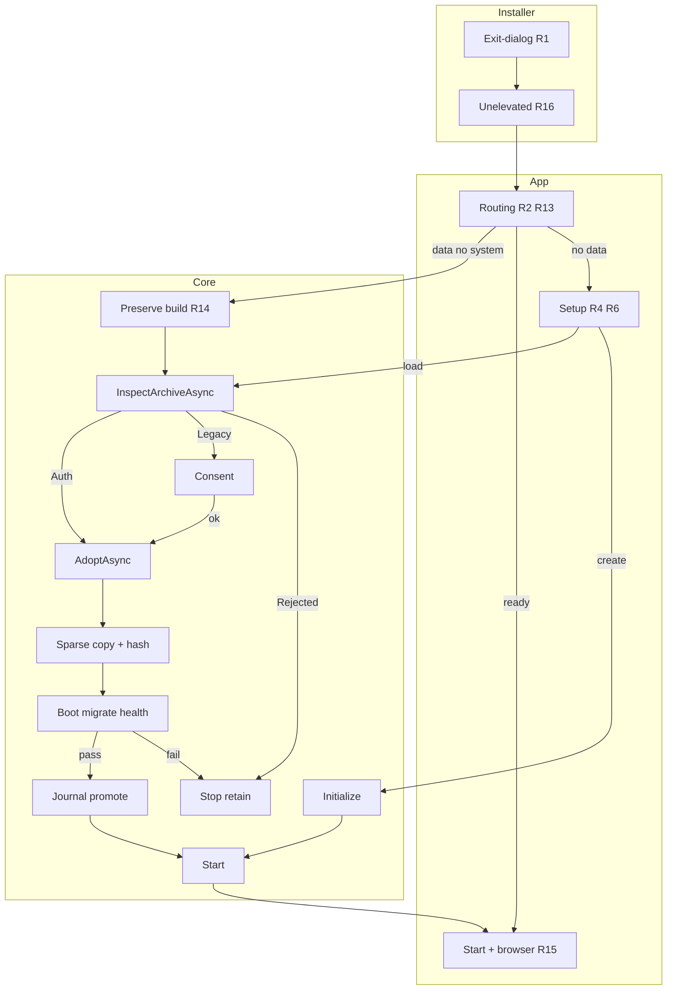

# Accountant-Friendly First-Run Experience - Plan

## Goal Capsule

- **Objective:** A person with no technical background can install Serpy, set it up, and reach a working ERPNext in their browser without encountering terms like "appliance," "Build," "Initialize," or "QEMU" — while a curious user can still reveal the technical detail on demand.
- **Product authority:** ce-brainstorm. Active scope: guided first-run and launch over a single active dataset.
- **Open blockers:** None. Known limitations: no password reset flow, no per-dataset version metadata yet.
- **Means:** Reframe the Avalonia dashboard, add a WiX installer UI sequence, add three new IApplianceService methods (preserve-data build, archive inspection, dataset adoption) in Serpy.Core.
- **Product Contract preservation:** R7/R8/AE4 amended (user-directed) for authenticated-provenance vs best-effort-legacy two-arm adoption. All IDs preserved.

## Product Contract

### Summary

Reshape Serpy's launch into a guided, plain-language flow for a solo non-technical operator.

### Key Decisions

- **Same person does everything.** (session-settled: user-directed.) Governs R1, R3, R11.
- **Load existing means this app's own data only.** (session-settled: user-directed.) Governs R6, R7, R8.
- **Adoption validated-preflighted for authenticated archives, best-effort-with-consent for legacy.** (session-settled: user-directed.) Governs R6, R7, R8.
- **Labels reveal via existing Show details panel.** (session-settled: user-directed.) Governs R10, R11.
- **Failure messages keep real error as primary text.** (session-settled: user-directed.) Governs R12.
- **Password set by user with write-it-down reminder.** (session-settled: user-directed.) Governs R4.
- **Load existing always asks for the ERPNext Administrator password.** (session-settled: user-directed.) Governs R8.

### Requirements

- R1. Installer presents a finish-step launch option, checked by default.
- R2. On launch, app routes to the correct next step without exposing technical decisions.
- R3. Setup/build shows plain-language progress; Show details available collapsed.
- R4. Create new: masked password entry with confirmation and write-it-down reminder.
- R5. Create new never destroys existing data; archives aside first.
- R6. Load existing enabled on presence only, disabled when no data.
- R7. Load existing: after selection, non-mutating inspection classifies the archive. Authenticated DPAPI provenance runs a real preflight; unlabeled legacy gets explicit best-effort consent. Both paths migrate on a disposable copy, activate only on healthy. Archive never mutated. (session-settled: user-directed.)
- R8. Load existing always prompts for the ERPNext Administrator password.
- R10. Show details panel reveals technical names for labels/stages.
- R11. Persistent labels/badges/stages use plain-language wording by default.
- R12. Failures show real error plainly, with doc links for known causes.
- R13. Already-set-up launch skips setup, goes straight to start.
- R14. App can build/re-establish system image while preserving committed data (new capability).
- R15. Once healthy, browser opens automatically.
- R16. Launch-on-finish runs as the interactive (unelevated) user so setup binds to the accountant's profile.

### Key Flows

- F1. First-time setup
  - **Trigger:** First launch, nothing exists.
  - **Steps:** Installer launch (R1, R16) -> setup screen, Create new enabled, Load existing disabled (R2, R6) -> password entry (R4) -> build + create dataset (R3) -> start.
  - **Outcome:** Browser opens (R15).
  - **Covers R1, R2, R3, R4, R6, R15, R16.**

- F2. Subsequent launch, already healthy
  - **Trigger:** Dataset ready.
  - **Steps:** Skip setup (R13) -> start.
  - **Outcome:** Browser opens (R15).
  - **Covers R2, R13, R15.**

- F3. Launch with existing data, state needs re-establishing
  - **Trigger:** Data on disk without matching ready state.
  - **Steps:** Setup screen with Create new (R5) and Load existing (R6). Preserve-data build if needed (R14). Load existing: inspect (R7), consent if legacy, password (R8), migrate on copy, activate if healthy.
  - **Outcome:** Success -> browser opens (R15). Failure -> explanation, archive retained, Create new available.
  - **Covers R2, R5, R6, R7, R8, R14, R15.**

### Acceptance Examples

- AE1. Launch-on-finish (Covers R1, R16): Finish -> app opens as interactive unelevated user.
- AE2. Create-new protects data (Covers R5): archives aside first.
- AE3. Load-existing presence-based (Covers R6): enabled iff data present.
- AE4. Load-existing classifies provenance (Covers R7): authenticated preflight-fail stops; legacy best-effort requires consent; both migrate on copy.
- AE5. Load-existing password (Covers R8): always prompts.
- AE6. Healthy repeat launch skips setup (Covers R13).
- AE7. Failure plainly framed (Covers R12): real error + doc link + Show details.

### Scope Boundaries

**Deferred:** Multi-dataset library. Password reset/recovery.

**Out of scope:** Cross-machine/cross-user data import.

### Outstanding Questions

- Adoption journal shape (new type vs RecoveryJournal variant).
- Plain-language wording for labels, consent prompt, failure captions.
- DPAPI provenance record serialized fields.

---

## Planning Contract

### Key Technical Decisions

- KTD1. **Reframe by changing label maps in DashboardViewModel, not adding a mode.** (session-settled: user-directed.) Governs R10, R11.
- KTD2. **Setup screen replaces CredentialInputRequested wiring.** Governs R4, R6, R8.
- KTD3. **Load existing is a distinct dispatch path calling InspectArchiveAsync then AdoptAsync.** Governs R8.
- KTD4. **Routing and cheap archive-presence on ApplianceStatus; InspectArchiveAsync decrypts only small DPAPI metadata (never reads archive); AdoptAsync computes hash during streaming copy -- one total read.** Governs R2, R7, R13.
- KTD5. **Preserve-data build and adoption are two separate operations.** Governs R14.
- KTD6. **Three new IApplianceService methods in lockstep; none relaxes CanBuildFrom.** Governs R7, R8, R14.
- KTD7. **Unknown-provenance adoption is best-effort; only DPAPI CurrentUser provenance licenses real preflight.** Governs R7.
- KTD8. **Launch-on-finish via IShellDispatch2.ShellExecute or equivalent unelevated trampoline.** Governs R1, R16.
- KTD9. **RAW sparse-aware copy; hash during copy; journaled promotion; credential via File.Replace with backup.** Governs R7, R8.

### High-Level Technical Design

### Sequencing

U4 -> U6 -> U3 -> U2 -> U5 -> U1 -> U7 -> U8. U1 and U7 independent.

## Implementation Units

### U1. Reframe dashboard labels

- **Requirements:** R10, R11.
- **Files:** `src/Serpy.App/ViewModels/DashboardViewModel.cs`, `src/Serpy.App/Views/DashboardWindow.axaml`.
- **Approach:** Replace strings in StatusBadgeText/PrimaryActionLabel; reveal technical under ShowDetails per KTD1.
- **Tests:** VM label tests for all state combinations.

### U2. Create-or-load setup screen

- **Requirements:** R4, R5, R6, R8.
- **Files:** `src/Serpy.App/Views/InitializeDialog.cs`, DashboardViewModel, Program.cs.
- **Approach:** Extend dialog per KTD2. Presence-based enabled state from routing signal.
- **Tests:** Enabled/disabled state; password confirmation; cancel.

### U3. Launch routing signal

- **Requirements:** R2, R13.
- **Files:** `src/Serpy.Core/Contracts/` (ApplianceStatus), StatusOperation.cs, DashboardViewModel.
- **Approach:** Routing + ArchiveHasProvenanceRecord (file-existence only) per KTD4.
- **Tests:** All state/disk/record combinations; no mutation during derivation.

### U4. Preserve-data system build

- **Requirements:** R14.
- **Files:** IApplianceService, ApplianceService, new operation, all implementers/test doubles.
- **Approach:** Routes around CanBuildFrom per KTD5/KTD6. Run GitNexus impact first.
- **Tests:** System image built, data byte-identical; Build still refuses with committed data.

### U5. Load-existing VM dispatch

- **Requirements:** R7, R8 (consumes U4, U6).
- **Files:** DashboardViewModel.
- **Approach:** InspectArchiveAsync -> verdict -> consent/stop/proceed -> password -> AdoptAsync per KTD4.
- **Tests:** Rejected stops; Legacy requires consent; Authenticated skips consent; password always fires.

### U6. Dataset adoption (InspectArchiveAsync + AdoptAsync)

- **Requirements:** R7 (enables R8).
- **Files:** IApplianceService, new operation, ApplianceState (adoption journal), StartOperation/StatusOperation (block Start), HealthChecker/HealthCredentials (in-memory + atomic File.Replace), DPAPI provenance record, QemuImageTool, recover.sh, VersionGate, all implementers.
- **Approach:** InspectArchiveAsync: decrypt DPAPI, validate, preflight, return ArchiveInspection (never reads archive). AdoptAsync: preflight disk space, open source deny-write/delete, sparse copy + SHA-256 single-pass, boot with restrict=on, early password QGA (best-effort), migrate, trial health (in-memory), clean halt. Journal phases. On success: File.Move, marker, state, provenance, atomic credential. On failure: discard copy, persist nothing. Orphan cleanup on startup. Per KTD4/KTD7/KTD9.
- **Tests:** Verdicts; TOCTOU hash; token/approval enforcement; disk preflight; sparse copy; archive preservation; standalone RAW; provenance on success; early password; credential timing; isolation; journal resume; orphan cleanup.

### U7. Installer launch-on-finish

- **Requirements:** R1, R16.
- **Files:** `eng/installer/Serpy.wxs`, `eng/installer/build-msi.ps1`.
- **Approach:** WixUI exit-dialog + IShellDispatch2.ShellExecute per KTD8.
- **Tests:** Smoke: MSI finish dialog, app launches as interactive user.

### U8. Failure messaging

- **Requirements:** R12.
- **Files:** DashboardViewModel, DashboardWindow.axaml.
- **Approach:** Map known failures to plain headline + doc link; unknown unchanged.
- **Tests:** Known vs unknown mapping; raw detail under Show details.

## Verification Contract

| Gate | Applies to |
|---|---|
| dotnet build Serpy.slnx -c Release | All |
| dotnet test (non-integration) | U1, U3, U4, U5, U6, U8 |
| Installer smoke | U7 |
| GitNexus impact preflight | U4, U6 |
| Manual UI walk | U1, U2, U5, U8 |
| detect_changes() before commit | U4, U6 |

## Definition of Done

- R1-R16 satisfied; AE1-AE7 pass.
- U4/U6 covered by Serpy.Core.Tests; existing tests unchanged.
- Archive never mutated; copy commits only after health + clean halt.
- Sparse-aware RAW copy with single-pass SHA-256.
- Disk preflight >= logical capacity; ENOSPC graceful; orphan cleanup.
- Early password pre-validation attempted; fallback to post-migration health.
- Trial boots: restrict=on, no host mounts.
- Password scrubbed from all output; stdin-only.
- Credential atomic via File.Replace with backup.
- Dashboard plain-language by default; technical under Show details.
- Load existing presence-based; always prompts for password.
- Installer unelevated via IShellDispatch2 or equivalent.
- GitNexus impact + detect_changes() per AGENTS.md.
- Full build + non-integration tests pass.
