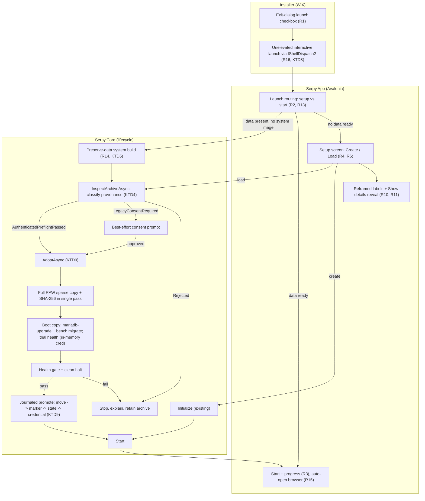

# Accountant-Friendly First-Run Experience - Plan

## Goal Capsule

- **Objective:** A person with no technical background can install Serpy, set it up, and reach a working ERPNext in their browser without encountering or needing to understand terms like "appliance," "Build," "Initialize," or "QEMU" — while a curious user can still reveal the technical detail on demand.
- **Product authority:** ce-brainstorm (this document). Active scope is the guided first-run and launch experience over a single active dataset. Managed multi-dataset libraries and cross-machine data import are explicitly not active scope (see Scope Boundaries).
- **Open blockers:** None blocking planning. Two capability gaps are recorded as known limitations: no ERPNext Administrator password reset/recovery flow, and no per-dataset version metadata exists yet.
- **Means:** Reframe the existing Avalonia dashboard surface and setup dialog, add a WiX installer UI sequence, and add three new `IApplianceService` methods — preserve-data build, non-mutating archive inspection, and dataset adoption — in `Serpy.Core`, extending existing patterns rather than rebuilding (KTD1, KTD5, KTD6).
- **Execution profile:** Smoke-first for the installer and launch-context units, behavioral tests for the new `Serpy.Core` operations and compatibility gate, manual UI verification for the reframed labels and setup screen. Per AGENTS.md, run GitNexus `impact` on each target symbol before editing and heed HIGH/CRITICAL warnings.
- **Product Contract preservation:** changed — R7, R8, and AE4 amended (user-directed, session-settled) so "Load existing" is compatibility-validated for authenticated-provenance archives and an explicitly-approved best-effort recovery for unlabeled legacy data. All R/A/F/AE IDs preserved; no requirement dropped. Planning adds Key Technical Decisions, Implementation Units, Verification Contract, and Definition of Done.

## Product Contract

### Summary

Reshape Serpy's launch and setup into a guided, plain-language flow for a solo non-technical operator: the installer offers to launch on finish; first launch auto-builds and sets up with friendly progress; a setup screen offers "create new" or "load existing" (this app's own data only); once ready, the app starts and opens the browser automatically. Persistent technical labels get plain-language defaults, with the existing "Show details" panel revealing the technical names and raw errors on demand.

### Problem Frame

The app currently presents itself in infrastructure terms. The dashboard's primary action reads "Build appliance," status badges say things like "Not set up (no data disk)," and setup is an "Initialize" dialog. The target operator is an accountant setting up their own bookkeeping system — they have no model for "appliance" or "build," and a failure or a jargon-heavy screen leaves them stuck with no path forward.

The machinery to run smoothly already exists: build/initialize/start operations stream structured progress, a splash shows during startup, the browser already auto-opens once health checks pass, and a default-off "Show details" expander already reveals raw logs. What is missing is a first-run experience shaped around a person, not a lifecycle state machine.

### Key Decisions

- **Same person does everything.** (session-settled: user-directed — chosen over an IT-admin-sets-up split: the product targets a solo accountant who installs, sets up, and uses Serpy themselves.) Governs R1, R3, R11.
- **"Load existing" means this app's own data only.** (session-settled: user-directed — chosen over general import from backups/other machines.) Governs R6, R7, R8.
- **"Load existing" adoption is a migrate-and-health trial, validated-preflighted only for authenticated app-created archives.** (session-settled: user-directed — chosen over gating the button's enabled state on compatibility, and over rejecting unlabeled legacy data.) Governs R6, R7, R8.
- **Reframed labels reveal technical names through the existing "Show details" panel.** (session-settled: user-directed — chosen over a persistent global Simple/Technical mode setting.) Governs R10, R11.
- **Failure messages keep the real technical error as primary text.** (session-settled: user-directed — chosen over a separate plain-language failure layer.) Governs R12.
- **The ERPNext Administrator password is set by the user with a write-it-down reminder, no recovery path this round.** (session-settled: user-directed.) Governs R4.
- **"Load existing" always asks for the ERPNext Administrator password.** (session-settled: user-directed — chosen over trying a stored credential first.) Governs R8.

### Requirements

**Installer handoff**

- R1. The installer presents a finish-step option to launch Serpy immediately, checked by default. This is a new installer UI sequence; the current MSI has none.
- R16. The launch-on-finish handoff runs Serpy as the interactive (unelevated) user, not in the per-machine installer's elevated administrator context, so setup binds to the accountant's profile.

**First launch and build**

- R2. On launch, the app determines what already exists and routes to the correct next step without exposing that determination as a technical decision to the user.
- R3. When setup or a build must run, the app shows plain-language progress. The existing "Show details" panel remains available and collapsed by default.
- R11. Persistent user-facing labels, status badges, and stage names present plain-language wording by default.

**Setup: create or load a dataset**

- R4. On the setup screen, "Create new" lets the user create a fresh dataset, entering an ERPNext Administrator password via a standard masked password entry with confirmation. The app reminds the user to record this password somewhere safe.
- R5. "Create new" never destroys existing data: when a dataset is already present, creating a new one first archives the existing data aside and tells the user this happened.
- R6. The setup screen offers "Load existing," enabled whenever this app's own archived or committed data is present on disk and disabled when none is. Its enabled state depends only on presence, not on compatibility.
- R7. When the user chooses "Load existing," the app attempts to activate the dataset without ever mutating the on-disk archive, and activates it only after the attempt succeeds. After selection, a one-time non-mutating inspection classifies the archive: an app-created archive accompanied by a DPAPI-protected provenance record whose schema and recorded archive digest match has **authenticated provenance**, so the app runs a real compatibility preflight (downgrade/floor) before attempting. An archive with a missing, undecryptable, schema-invalid, or mismatched record is **unlabeled legacy data**, for which the app offers a **best-effort recovery the user explicitly approves**. Both paths then attempt migration on a disposable copy and activate only if the attempt reaches a healthy state; the archive is never mutated. On failure the app stops with a plain-language explanation, the archive is retained untouched, and "Create new" remains available. (session-settled: user-directed.)
- R8. When the user chooses "Load existing" and the attempt is going to proceed (authenticated-and-preflight-passed, or approved best-effort), the app always prompts for the ERPNext Administrator password for that dataset before starting, regardless of whether any stored credential exists.

**Start and open**

- R13. When a dataset is already set up and its data is intact and matching, launch skips the setup screen entirely and proceeds directly to starting and opening ERPNext.
- R14. The app can build or re-establish the appliance system image while preserving already-present committed data. This is a new capability: today's build path refuses to run when committed data exists.
- R15. Once a dataset is mounted and ERPNext is confirmed healthy, the app opens ERPNext in the browser automatically.

**Failure and reveal**

- R12. When setup or startup fails, the app shows the real error as the primary message, reworded plainly where easy, and for known causes adds a concise next step or documentation link. The existing "Show details" panel continues to hold the raw error and logs.
- R10. Expanding the existing "Show details" panel reveals the technical names for the current labels and stages alongside the raw log and error text.

### Key Flows

- F1. First-time setup — nothing exists yet
  - **Trigger:** User completes installation and launches Serpy for the first time; no appliance system image and no data are present.
  - **Steps:** Installer finish-step launch (R1, R16) opens the app as the interactive user. The app finds nothing set up and shows the setup screen with "Create new" enabled and "Load existing" disabled (R2, R6). User picks "Create new," enters and confirms the ERPNext Administrator password, and is reminded to record it (R4). The app builds the appliance system image and creates the dataset, showing plain-language progress (R3). It mounts the data and starts ERPNext.
  - **Outcome:** ERPNext is confirmed healthy and opens in the browser automatically (R15).
  - **Covers R1, R2, R3, R4, R6, R15, R16.**

- F2. Subsequent launch — already set up and healthy
  - **Trigger:** User launches Serpy; a dataset is already set up and its data is intact and matching.
  - **Steps:** The app determines the dataset is ready and skips the setup screen entirely (R13), proceeding directly to mount and start.
  - **Outcome:** ERPNext opens in the browser automatically once healthy (R15).
  - **Covers R2, R13, R15.**

- F3. Launch with existing data but state/system needs re-establishing
  - **Trigger:** User launches Serpy; archived or committed data is present on disk without a matching ready state. The appliance system image may also need building.
  - **Steps:** The app detects the mismatch and shows the setup screen with both "Create new" (enabled; would archive current data aside first — R5) and "Load existing" (enabled — R6). If the system image must be built while the data stays intact, the preserve-data build capability runs (R14). User picks "Load existing." After selection, a one-time non-mutating inspection classifies the archive (R7): authenticated provenance runs a real compatibility preflight; unlabeled legacy data is offered as an explicitly-approved best-effort recovery. The app prompts for the ERPNext Administrator password (R8), then attempts migration on a disposable copy and activates only if it reaches a healthy state.
  - **Outcome:** On a successful attempt with the correct password, ERPNext opens in the browser automatically (R15). On a preflight rejection, a declined best-effort prompt, or a failed attempt, the user gets a clear explanation, the archive is retained untouched, and the "Create new" path remains available.
  - **Covers R2, R5, R6, R7, R8, R14, R15.**

### Acceptance Examples

- AE1. Launch-on-finish
  - **Covers R1, R16.**
  - **Given** the user is completing the Serpy installer with the launch option left checked,
  - **When** they click Finish,
  - **Then** Serpy opens without them needing to locate a Start-menu shortcut, running as the interactive (unelevated) user — so its data root and stored credential resolve to that user's profile, not the elevated installer's (R16).

- AE2. Create-new protects existing data
  - **Covers R5.**
  - **Given** a dataset is already present,
  - **When** the user chooses "Create new,"
  - **Then** the existing data is archived aside before the new dataset is created, and the user is told this happened.

- AE3. Load-existing enabled state is presence-based
  - **Covers R6.**
  - **Given** this app's own archived or committed data is present on disk,
  - **When** the setup screen is shown,
  - **Then** "Load existing" is enabled regardless of whether that data is version-compatible; and when no such data is present, "Load existing" is disabled.

- AE4. Load-existing classifies provenance, then attempts
  - **Covers R7.**
  - **Given** the user chose "Load existing" and the archive has an authenticated (DPAPI-decryptable, schema-valid, digest-matching) provenance record that fails the compatibility preflight,
  - **When** the app runs the one-time non-mutating inspection after selection,
  - **Then** it stops before any migration attempt with a plain-language explanation, and "Create new" remains available.
  - **And given** instead the archive has no such record — unlabeled legacy data,
  - **When** the user is shown the best-effort framing and approves,
  - **Then** the app attempts migration on a disposable copy and activates only if it reaches a healthy state; on failure it stops with a plain-language explanation, retains the untouched archive, and leaves "Create new" available.

- AE5. Load-existing always asks for the password
  - **Covers R8.**
  - **Given** the user chose "Load existing" and the attempt is going to proceed (authenticated-and-preflight-passed, or approved best-effort),
  - **When** the app proceeds toward start,
  - **Then** it prompts for the ERPNext Administrator password before starting, even if a stored credential exists.

- AE6. Healthy repeat launch skips setup
  - **Covers R13.**
  - **Given** a dataset is already set up and its data is intact and matching,
  - **When** the user launches Serpy,
  - **Then** the setup screen is not shown and the app proceeds directly to start and browser-open.

- AE7. Failure shows real error, plainly framed
  - **Covers R12.**
  - **Given** startup fails because host virtualization is not enabled,
  - **When** the failure is shown,
  - **Then** the primary message states the real cause in plain wording with a next step or documentation link, and the raw error remains available under "Show details."

### Scope Boundaries

**Deferred for later**

- A managed library of multiple named datasets with switching between them.
- A designed ERPNext Administrator password reset or recovery flow. Without the password, the current flow cannot authenticate against or health-validate that dataset; recovery is a capability gap this round does not fill.

**Outside this round's scope**

- Importing or restoring a `data.img` from another machine, another Windows user, or an external backup.

### Dependencies / Assumptions

- Assumes the existing progress-reporting, splash, auto-browser-open, and "Show details" affordances remain the substrate the friendly experience is layered onto, rather than being rebuilt.
- Assumes the ERPNext Administrator password set at create-new is the credential ERPNext's own login and Serpy's health check use; it is not necessarily the everyday login of the accountant, since ERPNext supports separate user accounts created later.

### Outstanding Questions

**Deferred to Planning**

- The adoption-specific journal's exact persisted shape (new type vs. an added variant alongside `RecoveryJournal`).
- The precise plain-language wording for labels, badges, stages, the best-effort consent prompt, and known-failure captions, and which failure causes get a documentation link.
- The exact serialized fields of the DPAPI provenance record (which component versions and the archive-digest form).

---

## Planning Contract

### Key Technical Decisions

- KTD1. **Reframe by changing the label maps in DashboardViewModel, not by adding a mode.** StatusBadgeText and PrimaryActionLabel switch expressions centralize every user-facing lifecycle string; plain-language wording replaces technical strings, technical names surface only when ShowDetails is expanded. (session-settled: user-directed.) Governs R10, R11.
- KTD2. **The create/load setup screen replaces the CredentialInputRequested wiring.** The new setup screen is a superset dialog returning a create-or-load choice plus credentials. Governs R4, R6, R8.
- KTD3. **Load existing is a distinct dispatch path parallel to initialize.** A sibling load path calls InspectArchiveAsync then AdoptAsync. Governs R8.
- KTD4. **Routing and cheap archive-presence on ApplianceStatus; InspectArchiveAsync decrypts only the small DPAPI metadata (never reads the archive); AdoptAsync computes the one actual hash during its streaming copy -- one total read of the large file.** Status carries two cheap per-poll signals: routing (readiness + HasCommittedDataOnDisk) and ArchiveHasProvenanceRecord (file-existence only, no decrypt). After selection, InspectArchiveAsync decrypts the DPAPI record, schema-validates, reads the recorded expected digest and versions, runs the VersionGate preflight from those versions, and returns an ArchiveInspection with verdict (AuthenticatedPreflightPassed / Rejected / LegacyConsentRequired), canonical path, and expected digest (null for legacy). Never reads the archive -- inspection is fast. AdoptAsync under LifecycleLock opens the source deny-write/delete, streams the sparse copy computing SHA-256 in-pass, compares to the token expected digest (mismatch = reject); for legacy tokens with no digest, records the computed hash for future provenance. One 20GiB read total. Governs R2, R7, R13.
- KTD5. **Preserve-data system build and dataset adoption are two separate operations.** Splitting keeps each testable and lets F3 build while data is present without entangling migration. Governs R14.
- KTD6. **Three new IApplianceService methods added in lockstep; none relaxes CanBuildFrom.** CanBuildFrom is HIGH risk; IApplianceService HIGH lower-bound. Only AdoptAsync serializes through LifecycleLock; InspectArchiveAsync is read-only. Governs R7, R8, R14.
- KTD7. **Unknown-provenance adoption is best-effort; only authenticated (DPAPI CurrentUser) provenance licenses a real preflight.** Authenticated + matching digest + passing VersionGate = AuthenticatedPreflightPassed; authenticated + failing = Rejected; missing/undecryptable/mismatched = LegacyConsentRequired. DPAPI CurrentUser keying makes the record unforgeable by other user accounts but does not protect against same-user malware -- that threat is out of scope for a single-user desktop appliance. Legacy is reported honestly as best-effort (R7). Both arms migrate on a disposable copy; neither silently downgrades; the source is never attached. Governs R7.
- KTD8. **Launch-on-finish uses IShellDispatch2.ShellExecute (or equivalent unelevated trampoline).** The MSI is perMachine/elevated; launch must drop to the interactive desktop so %LOCALAPPDATA% and DPAPI bind to the accountant profile. Governs R1, R16.
- KTD9. **Working copy is full standalone RAW sparse-aware; hash computed during copy (never separately); promotion journaled; credential write uses File.Replace with backup.** Sparse-aware streaming copy; source opened FileShare.Read (deny write/delete); SHA-256 in-stream compared to token expected digest (mismatch rejects). Preflight: free space >= logical capacity + margin; ENOSPC handled gracefully; orphaned .pending-adopted-data.img cleaned on startup. Trial health against in-memory credential (HealthChecker overload). Early password pre-validation via QGA attempted (best-effort). Journal: ReadyToCommit -> DataPromoted -> StateCommitted -> CredentialStored; crash after DataPromoted blocks Start, re-prompts. Credential: temp file written, flushed, then File.Replace(destination, temp, backup) -- atomic on NTFS, preserves old or new on crash, restore hidden attrs after. Password scrubbed from OperationUpdate/DetailLog/commands; stdin-only. Trial boots: -netdev user,...,restrict=on,hostfwd=... (verified QEMU 11.1.0) blocks guest outbound; host mounts disabled. Governs R7, R8.

### High-Level Technical Design

Three cooperating layers change; the boundary between them is the existing "lifecycle rules live in Serpy.Core, the VM only maps status" rule.

The routing signal (KTD4), the preserve-data build (KTD5), the non-mutating archive inspection (KTD4), and the adopt operation (KTD9) are the Serpy.Core contract changes; everything else is App-layer wording and wiring, or installer XML.

### Sequencing

U4 (preserve-data system build) and U6 (dataset adoption) share the IApplianceService interface change and carry the widest blast radius; U6 gates U5 (load path), and U5 depends on U2 (setup screen) and U3 (routing signal). U1 (reframe) and U7 (installer) are independent and can proceed in parallel. Suggested order: U4 -> U6 -> U3 -> U2 -> U5 -> U1 -> U7 -> U8.

### Assumptions

- The existing splash, BrowserLauncher.OpenOnce, progress streaming, and ShowDetails expander remain in place and are extended, not rebuilt.
- WixUI extension can be added to the existing wix build invocation in eng/installer/build-msi.ps1 without restructuring the package.

## Implementation Units

### U1. Reframe dashboard labels and add technical-names reveal

- **Goal:** Plain-language wording is the default for persistent labels, badges, and stage names; technical names appear under the existing "Show details" expander.
- **Requirements:** R10, R11.
- **Files:** `src/Serpy.App/ViewModels/DashboardViewModel.cs`, `src/Serpy.App/Views/DashboardWindow.axaml`, VM label tests.
- **Approach:** Replace the technical strings in the StatusBadgeText and PrimaryActionLabel switch expressions with plain-language equivalents. Surface the technical name through a property revealed only when ShowDetails is true. Per KTD1, no new mode/setting.
- **Test Scenarios:** Badge and primary-action label return plain-language strings for each ReadinessState/HealthState combination; the technical-name reveal property returns the prior technical string.
- **Verification:** VM label tests pass; manual check that the dashboard reads plainly by default.

### U2. Create-or-load setup screen

- **Goal:** A setup screen offers "Create new" and "Load existing" (enabled only when data is present on disk), collecting the ERPNext Administrator password where needed.
- **Requirements:** R4, R5, R6, R8.
- **Files:** `src/Serpy.App/Views/InitializeDialog.cs` (evolve into setup screen), `src/Serpy.App/ViewModels/DashboardViewModel.cs`, `src/Serpy.App/Program.cs` / `App.axaml.cs`, App.Tests.
- **Approach:** Extend the existing code-built dialog into a setup screen returning a choice (create vs load) plus credentials. "Load existing" enabled state is presence-based (R6) from the routing signal (KTD4). Per KTD2.
- **Test Scenarios:** "Load existing" disabled when no data present, enabled when present; create requires password confirmation; cancel returns null.
- **Verification:** Manual walk of both branches; App.Tests for enabled-state logic.

### U3. Launch routing signal (setup vs start)

- **Goal:** On launch, the app routes to setup-or-start from readiness plus on-disk facts, exposed by Serpy.Core so the VM stays a pure mapper.
- **Requirements:** R2, R13.
- **Files:** `src/Serpy.Core/Contracts/` (ApplianceStatus — routing signal plus ArchiveHasProvenanceRecord presence signal), `src/Serpy.Core/Operations/StatusOperation.cs`, `src/Serpy.App/ViewModels/DashboardViewModel.cs`, `App.axaml.cs`/`Program.cs`.
- **Approach:** Extend ApplianceStatus with the routing signal and the cheap provenance-presence signal, both derived non-mutatingly (file-existence only, no decrypt, no hash). The authoritative verdict comes from U6's InspectArchiveAsync after selection (KTD4). Per KTD4 the VM only reads the signals.
- **Test Scenarios:** Ready-and-matching yields start route; data-present-without-ready yields setup route; nothing-present yields create-only; provenance record present reports true, absent reports false; no disk mutation during derivation.
- **Verification:** Serpy.Core.Tests for routing and provenance-presence signal derivation.

### U4. Preserve-data system build operation on IApplianceService

- **Goal:** A new lifecycle operation produces or re-establishes system.qcow2 while leaving committed data.img untouched.
- **Requirements:** R14.
- **Files:** `src/Serpy.Core/Contracts/IApplianceService.cs`, `src/Serpy.Core/Operations/ApplianceService.cs`, new operation class, all implementers/test doubles.
- **Approach:** Add the operation, serialized through LifecycleLock. Routes around CanBuildFrom (KTD6) rather than relaxing it. Does not migrate or adopt data; that is U6. Per KTD5/KTD6 update all implementers in lockstep. **Run GitNexus impact before editing (both HIGH).**
- **Test Scenarios:** With committed data and no system image, establishes the system image and leaves data byte-identical; Build still refuses when committed data exists.
- **Verification:** Serpy.Core.Tests; existing Build/Recover tests pass unchanged.

### U5. Load-existing dispatch path in the VM

- **Goal:** Choosing "Load existing" inspects the archive, acts on the verdict, prompts for the password, then runs the adopt operation with the inspection token.
- **Requirements:** R7, R8 (consumes U4, U6).
- **Files:** `src/Serpy.App/ViewModels/DashboardViewModel.cs`.
- **Approach:** Add a load path implementing the KTD4 sequence. Call InspectArchiveAsync to get an ArchiveInspection. On Rejected, stop; on LegacyConsentRequired, show best-effort consent and require approval; on AuthenticatedPreflightPassed, proceed. Always prompt for the ERPNext Administrator password (R8), then call AdoptAsync(parameters, inspection, approval). The VM does not decide compatibility.
- **Test Scenarios:** Rejected stops; LegacyConsentRequired shows consent and does not proceed without approval; AuthenticatedPreflightPassed skips consent; password always fires; adopt failure surfaces a plain explanation.
- **Verification:** App.Tests for verdict-branch and consent-gate logic; manual walk of all branches.

### U6. Dataset adoption operation (disposable-copy migrate + health-gate)

- **Goal:** Two new lifecycle methods: InspectArchiveAsync (read-only, returns bound ArchiveInspection token) and AdoptAsync (given token and consent, makes archive Start-ready via disposable-copy migration).
- **Requirements:** R7 (enables R8; consumes U4 when a system build is needed first).
- **Files:** `src/Serpy.Core/Contracts/IApplianceService.cs`, new operation class, `src/Serpy.Core/Coordination/ApplianceState.cs` (adoption journal), `src/Serpy.Core/Operations/StartOperation.cs` + `StatusOperation.cs` (block Start on incomplete journal), `src/Serpy.Core/Health/HealthChecker.cs` + `HealthCredentials.cs` (in-memory credential + atomic File.Replace store), DPAPI provenance record writer/reader, `src/Serpy.Core/Images/QemuImageTool.cs`, `guest/recover.sh`, `src/Serpy.Core/Versions/VersionGate.cs`, implementers/test doubles.
- **Approach:** InspectArchiveAsync decrypts the DPAPI record, schema-validates, reads recorded digest/versions, runs VersionGate preflight, returns ArchiveInspection with verdict + expected digest (null for legacy). Never reads the archive. AdoptAsync under LifecycleLock: (1) preflight free-disk-space (>= logical capacity + margin); (2) open source deny-write/delete; (3) single-pass sparse-aware RAW copy computing SHA-256, compare to token (mismatch = reject); (4) boot copy with QEMU guest isolation (restrict=on, host mounts disabled); (5) early password pre-validation via QGA (best-effort); (6) mariadb-upgrade + bench migrate; (7) trial health against in-memory credential; (8) clean halt. Journal ReadyToCommit -> DataPromoted -> StateCommitted -> CredentialStored; crash after DataPromoted blocks Start, re-prompts. On success: File.Move to canonical data.img, marker, state, provenance record, atomic credential store (File.Replace with backup). On failure: discard copy, persist nothing, retain archive. Orphaned .pending-adopted-data.img cleaned on startup. Password scrubbed from all UI/log output; stdin-only.
- **Test Scenarios:** InspectArchiveAsync returns correct verdicts mutating nothing; AdoptAsync rejects on TOCTOU hash mismatch, missing approval, insufficient disk space; single-pass copy preserves sparse allocation and correct digest; source archive byte-identical after success and failure; committed data.img is standalone RAW; successful adopt writes provenance record; early password catches typos; migration/health failure discards copy, persists no credential; guest isolation enforced; password never in logs; interrupted adopt blocks Start and re-prompts; orphans cleaned on startup.
- **Verification:** Serpy.Core.Tests for verdicts, TOCTOU, token enforcement, disk-space preflight, sparse-copy, hash, archive preservation, standalone-RAW, provenance, credential timing, isolation, journal resume, orphan cleanup.

### U7. Installer launch-on-finish, unelevated

- **Goal:** The MSI offers a checked-by-default "Launch Serpy" on finish that runs the app as the interactive (unelevated) user.
- **Requirements:** R1, R16.
- **Files:** `eng/installer/Serpy.wxs`, `eng/installer/build-msi.ps1`.
- **Approach:** Add the WixUI exit-dialog pattern using IShellDispatch2.ShellExecute via Explorer.exe (or equivalent unelevated trampoline — KTD8) to start the app as the interactive user. Target [#SerpyAppExe].
- **Test Scenarios:** Smoke — build MSI, run, confirm finish dialog shows checked "Launch Serpy" and app launches; confirm resolved %LOCALAPPDATA% matches the interactive user.
- **Verification:** Manual installer smoke on a Windows host.

### U8. Plain-framed failure messaging

- **Goal:** Failures show the real error plainly, with a next step or doc link for known causes.
- **Requirements:** R12.
- **Files:** `src/Serpy.App/ViewModels/DashboardViewModel.cs`, `src/Serpy.App/Views/DashboardWindow.axaml`.
- **Approach:** Map known failure causes (starting with WHPX not enabled) to a plainly-reworded headline plus a doc link; unknown failures show the existing message unchanged. Raw error stays in DetailLog under ShowDetails.
- **Test Scenarios:** Known-cause failure yields plain headline plus link; unknown failure yields unchanged message; raw detail available under Show details.
- **Verification:** VM/unit test for known-vs-unknown mapping; manual check against a real WHPX-disabled failure if reproducible.

## Verification Contract

| Gate | Command / method | Applies to |
|---|---|---|
| Build | `dotnet build Serpy.slnx -c Release` | All units |
| Unit + VM tests | `dotnet test Serpy.slnx -c Release --filter "FullyQualifiedName!~IntegrationTests"` | U1, U3, U4, U5, U6, U8 |
| Installer smoke | Build MSI via eng/installer/build-msi.ps1, run, verify exit-dialog launch and unelevated identity | U7 |
| Impact preflight | GitNexus `impact <symbol> --direction upstream` before editing HIGH-risk symbols | U4, U6 |
| Manual UI check | Launch app, walk first-run, create, load (migrating + failing), failure; confirm plain wording and Show-details reveal | U1, U2, U5, U8 |
| Regression | `detect_changes()` before commit; existing Build/Recover/Initialize tests unchanged | U4, U6 |

## Definition of Done

- Every requirement R1-R16 is satisfied by its owning unit(s) and its Acceptance Example passes.
- New preserve-data build (U4) and adoption (U6) operations covered by Serpy.Core.Tests; existing Build/Recover/Initialize tests pass unchanged.
- Adoption never mutates the archived data.img; the migrated copy commits only after health passes and a clean halt (U6).
- The adoption working copy is sparse-aware RAW, produced in a single streaming pass that also computes SHA-256 (U6/KTD9).
- Adoption preflights free disk space >= logical capacity + margin; ENOSPC handled gracefully; orphaned .pending-adopted-data.img cleaned on startup (U6/KTD9).
- Early password pre-validation attempted before migration; if unavailable, post-migration health catches it (U6/KTD9).
- Trial adoption boots use slirp restrict=on (verified in QEMU 11.1.0) blocking guest outbound; host mounts disabled (U6/KTD9).
- Password values never appear in OperationUpdate, DetailLog, or guest command lines; stdin-only delivery (U6/KTD9).
- HealthCredentials.Store is atomic via File.Replace with backup file; interrupted writes leave the prior credential intact (U6/KTD9).
- Dashboard reads in plain language by default; technical names only under "Show details" (U1).
- Setup screen enables "Load existing" on presence only; load path always prompts for the ERPNext Administrator password (U2, U5).
- Installer launch-on-finish starts the app as the interactive (unelevated) user via IShellDispatch2.ShellExecute or equivalent, verified by resolved data root (U7/KTD8).
- GitNexus impact was run before editing HIGH-risk symbols and detect_changes() before commit, per AGENTS.md.
- Abandoned or experimental code from approaches that did not pan out is removed from the diff.
- Full build and the non-integration test suite pass.
