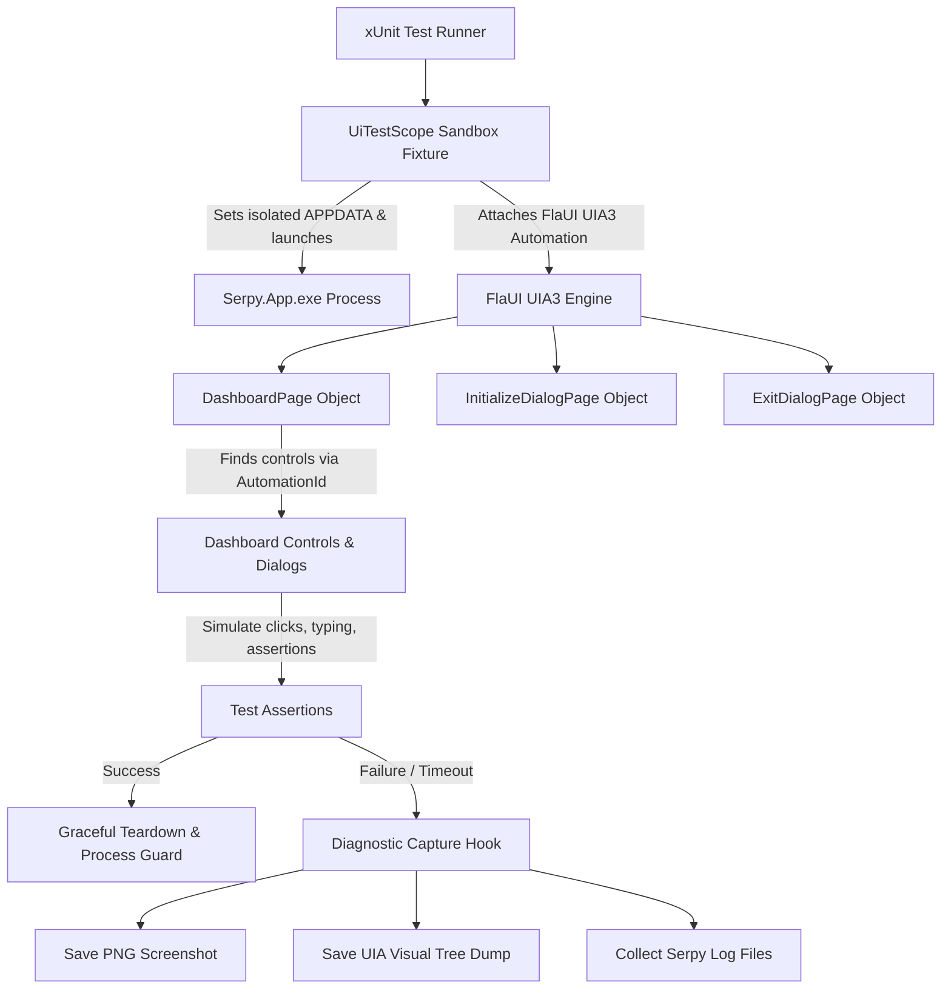

# Automated End-to-End GUI and Installation Testing Suite for Serpy

## Goal Capsule
- **Objective:** Build a comprehensive, automated end-to-end GUI and installation testing suite for Serpy on Windows using FlaUI (UIAutomation) that launches the real compiled application, validates every UI component, exercises the complete installation and lifecycle flow, and automatically captures visual screenshots, UI tree dumps, and logs upon any failure.
- **Means:** Create a dedicated `Serpy.Windows.UiTests` test project using `FlaUI.UIA3`, provide a test runner fixture that manages sandbox test directories and process lifecycles, add explicit UI Automation IDs across all Avalonia windows and dialogs, implement page-object models for the Dashboard and Modal Dialogs, build both fast-fixture and live-VM installation test workflows, and hook diagnostic failure screenshot/dump captures.
- **Product Authority:** User-directed via `ce-brainstorm` session.
- **Open Blockers:** None.

## Product Contract

### Summary
An automated Windows E2E desktop test suite (`Serpy.Windows.UiTests`) powered by FlaUI that launches the real compiled `Serpy.App.exe`, exercises every window, dialog, button, and input control, tests the end-to-end installation lifecycle, and automatically captures screenshots and UI tree dumps whenever a test fails or UI breaks.

### Problem Frame
The Serpy desktop application UI frequently suffers from breakages, modal dialog validation errors, button action crashes, UI freezes, or state desynchronization during long-running appliance operations. While headless unit tests exist in `Serpy.App.Tests`, they run in-memory and do not catch OS-level desktop interaction bugs (such as window focus loss, real modal dialog deadlocks, taskbar/tray interaction bugs, Avalonia rendering failures, or multi-window threading issues on Windows). Developers need an automated test suite that tests the application exactly as an end-user experiences it on Windows desktop.

### Actors
- **A1: Serpy Developer**: Runs the E2E test suite locally or in self-hosted CI to instantly detect any regression in UI components, dialogs, or installation workflows.
- **A2: Quality Engineer / CI Pipeline**: Automatically runs fast fixture E2E tests on pull requests and captures visual screenshots and log diagnostics on failure.

### Requirements
- **R1: Dedicated Windows Desktop E2E Test Project**:
  - Add a dedicated test project `tests/Serpy.Windows.UiTests` using `FlaUI.UIA3` and `xUnit`.
  - Automatically resolve or launch the published `Serpy.App.exe` binary.
  - Automatically manage test isolation (isolated temp `%LOCALAPPDATA%\Serpy` workspace per test run to prevent polluting user data).
- **R2: Comprehensive UI Component & Window Coverage**:
  - **Dashboard Window**: Verify brand header, status badge transitions (NotBuilt, Built, Initialized, Starting, Running, Stopped, Crashed), loopback URL visibility, primary action button label/state, and auxiliary buttons (Build, Initialize, Stop, Restart, Recover, Open ERPNext, Cancel).
  - **Show Details Expander**: Verify expanding/collapsing details and live log streaming text.
  - **Start at Sign-In Checkbox**: Verify toggling the autostart checkbox and registry reflection.
  - **Initialize / Setup Modal Dialog**: Verify modal opening, radio button switching between "Create new database" and "Load existing database", input field validation (site name format, empty password, mismatched confirmation passwords), and successful submission.
  - **Exit While Running Modal Dialog**: Verify prompt when closing the app while appliance is running, testing both "Stop" and "Leave running" actions.
  - **Recovery Confirmation Modal Dialog**: Verify image file selection and confirmation prompt.
  - **System Tray Icon**: Verify notification area tray icon presence, context menu items, window minimize-to-tray, and restore-from-tray.
- **R3: Installation & Lifecycle End-to-End Execution**:
  - Exercise the complete sequence: NotBuilt → Build → Built → Initialize → Initialized → Start → Running (Healthy) → Stop → Stopped.
  - Verify progress bar values, stage text updates, and button enablement states at each phase.
  - Test cancellation: trigger Cancel button during long operation and verify graceful abort.
- **R4: Dual Execution Profiles**:
  - **Fast Fixture Profile (Default)**: Runs in ~1–2 minutes using controlled test harnesses/mock VM loops to thoroughly exercise all UI components, dialogs, button actions, and state transitions.
  - **Full Live Profile (Opt-in via `--filter Category=LiveE2E`)**: Executes the full real 30–45 minute QEMU cloud-init build from Debian scratch to verified ERPNext health.
- **R5: Rich Diagnostic Failure Capture**:
  - When an assertion fails or an unexpected exception occurs, automatically:
    1. Capture a full desktop and application window screenshot saved as PNG.
    2. Dump the FlaUI visual element tree (all automation IDs, names, control types, bounding rectangles, and enabled states) to a text/JSON file.
    3. Collect and attach Serpy application and QEMU logs from `%LOCALAPPDATA%\Serpy\logs\`.
- **R6: Clean Teardown & Process Guard**:
  - Ensure all spawned `Serpy.App` and child `qemu-system-x86_64` processes are cleanly terminated at test completion or failure to prevent zombie processes.

### Key Decisions
- **KD1: Windows UI Automation via FlaUI (UIA3)**: `session-settled: user-directed`. Provides real OS-level desktop automation, driving real mouse and keyboard inputs and testing the actual published executable on Windows.
- **KD2: Dual Profile Strategy (Fast Fixture vs Full Live)**: `session-settled: user-directed`. Guarantees developers can run comprehensive UI regression tests in 1–2 minutes on every commit, while reserving the full 40-minute live VM build for release/endurance checks.
- **KD3: Automated Screenshot and UI Tree Dump on Failure**: `session-settled: user-directed`. Eliminates guesswork when GUI tests break by providing visual and structural evidence of the exact state of the screen.

### Key Flows
- **F1: Dashboard & Modal Component Verification Flow**:
  1. FlaUI launches `Serpy.App.exe` with clean test environment.
  2. Inspects DashboardWindow controls (status badge, buttons, expander).
  3. Clicks "Initialize…" button; verifies `InitializeDialog` appears as modal child.
  4. Tests validation: enters mismatched passwords, asserts validation error label appears.
  5. Corrects inputs and submits; asserts dialog closes and parameters are applied.
- **F2: Complete Lifecycle Automation Flow**:
  1. Starts from clean state (NotBuilt).
  2. Clicks Build; asserts progress bar animates and stage text updates.
  3. Awaits Built state; verifies Initialize button activates.
  4. Fills setup credentials and submits; awaits Initialized state.
  5. Clicks Start; verifies status transitions to Starting then Running with active loopback URL.
  6. Clicks Stop; verifies graceful shutdown to Stopped state.
- **F3: Failure Diagnostic Capture Flow**:
  1. Test encounters unexpected state or timeout.
  2. Test runner hook captures desktop screenshot to `artifacts/screenshots/{test_name}_{timestamp}.png`.
  3. Dumps visual tree hierarchy to `artifacts/uitrees/{test_name}_{timestamp}.txt`.
  4. Copies log directory to `artifacts/logs/`.
  5. Throws test failure with artifact links.

### Scope Boundaries
- **In Scope**: Windows OS-level UI automation with FlaUI, DashboardWindow, InitializeDialog, RecoveryDialog, ExitWhileRunningDialog, TrayIcon, progress monitoring, lifecycle execution, fast fixture profile, live profile, failure screenshot/dump capture.
- **Out of Scope**: macOS/Linux GUI automation (Serpy GUI is Windows-first Native-AOT), internal ERPNext Web UI business flows inside the browser (covered by guest-level ERPNext tests).

*Product Contract preservation: Product Contract unchanged.*

---

## Planning Contract

### Key Technical Decisions
- **KTD1: Central Package Management with `FlaUI.UIA3`**: Add `FlaUI.Core` (v4.0.0) and `FlaUI.UIA3` (v4.0.0) to `Directory.Packages.props`. Create `tests/Serpy.Windows.UiTests/Serpy.Windows.UiTests.csproj` targeting `net10.0-windows` with `<IsTestProject>true</IsTestProject>`.
- **KTD2: Explicit UI Automation IDs across Avalonia Views**: Add `AutomationProperties.AutomationId` to all key controls in `DashboardWindow.axaml`, `InitializeDialog.cs`, `ExitWhileRunningDialog.cs`, and `RecoveryConfirmationDialog.cs`. This prevents fragile text-based matching and guarantees FlaUI locates controls reliably across localization and theme changes.
- **KTD3: Test Environment Isolation via `SERPY_TEST_APPDATA` Override**: When FlaUI launches `Serpy.App.exe`, it passes a clean temporary directory in environment variables (or CLI option) so that tests operate on an isolated workspace (`appliance`, `settings`, `logs`, `runtime`) without touching the developer's real `%LOCALAPPDATA%\Serpy` data.
- **KTD4: Page Object Pattern for UI Windows & Dialogs**: Implement strongly typed Page Objects:
  - `DashboardPage`: `StatusBadge`, `StageText`, `ProgressBar`, `PrimaryActionButton`, `BuildButton`, `InitializeButton`, `StopButton`, `RestartButton`, `RecoverButton`, `OpenErpNextButton`, `CancelButton`, `DetailsExpander`, `DetailsLogText`.
  - `InitializeDialogPage`: `CreateNewRadio`, `LoadExistingRadio`, `SiteNameBox`, `ArchivePathBox`, `PasswordBox`, `ConfirmPasswordBox`, `ValidationMessage`, `OkButton`, `CancelButton`.
  - `ExitDialogPage`: `StopButton`, `LeaveRunningButton`, `CancelButton`.
- **KTD5: Diagnostic Capture Extension on Test Failure**: Implement an xUnit fixture / wrapper (`UiTestScope`) that wraps each test execution. In a `catch` block, it uses `FlaUI.Core.Capturing.Capture.Screen()` to write a PNG screenshot, calls `element.GetTreeAsText()` to dump the full UIA hierarchy, and copies the test instance's `%LOCALAPPDATA%\Serpy\logs\` to the test failure artifact folder.

### Assumptions & Environment Prerequisites
- **Runner Desktop Session Prerequisite**: FlaUI drives the Windows UIAutomation tree directly on the Windows desktop. Therefore, tests must execute within an active interactive Windows user session (e.g. local developer workstation, or a self-hosted Windows CI runner configured to run with an interactive desktop session / auto-logon, NOT a headless Windows service account with session isolation / Session 0).
- **Fast-Fixture Image Prerequisite**: The fast fixture profile (`Category!=LiveE2E`) requires a pre-built verified `system.qcow2` appliance image to be present on the runner (copied or cached under `KnownPaths.ApplianceDir` or test fixture location). If absent on the runner, the test framework will skip the fast fixture lifecycle tests with an informative message rather than failing silently or triggering an unexpected 40-minute build.
- **Published Binary Dependency**: Tests target the compiled Windows binary (`bin/Release/net10.0/win-x64/publish/Serpy.App.exe`). Test runners will automatically trigger a build/publish step if the target executable is absent.
### High-Level Technical Design



---

## Implementation Units

### U1: FlaUI Package Configuration & Test Project Setup
- **Target:**
  - `Directory.Packages.props`
  - `Serpy.slnx`
  - `tests/Serpy.Windows.UiTests/Serpy.Windows.UiTests.csproj` (new)
  - `tests/Serpy.Windows.UiTests/GlobalUsings.cs` (new)
- **Approach:**
  1. Add `FlaUI.Core` and `FlaUI.UIA3` to `Directory.Packages.props`.
  2. Create `tests/Serpy.Windows.UiTests/Serpy.Windows.UiTests.csproj` targeting `net10.0-windows`, referencing `FlaUI.UIA3`, `xunit`, `Microsoft.NET.Test.Sdk`, and `src/Serpy.Core/Serpy.Core.csproj`.
  3. Add the project to `Serpy.slnx` under `/tests/`.
- **Patterns to follow:** `tests/Serpy.Windows.IntegrationTests/Serpy.Windows.IntegrationTests.csproj`.
- **Test scenarios:**
  - `dotnet build tests/Serpy.Windows.UiTests/Serpy.Windows.UiTests.csproj -c Release` succeeds with zero warnings.

### U2: AutomationProperties.AutomationId in Avalonia Views
- **Target:**
  - `src/Serpy.App/Views/DashboardWindow.axaml`
  - `src/Serpy.App/Views/InitializeDialog.cs`
  - `src/Serpy.App/Views/ExitWhileRunningDialog.cs`
  - `src/Serpy.App/Views/RecoveryConfirmationDialog.cs`
- **Approach:**
  1. In `DashboardWindow.axaml`, add `AutomationProperties.AutomationId`:
     - `StatusBadge` on TextBlock
     - `StageText` on TextBlock
     - `ProgressBar` on ProgressBar
     - `PrimaryActionButton`
     - `BuildButton`
     - `InitializeButton`
     - `StopButton`
     - `RestartButton`
     - `RecoverButton`
     - `OpenErpNextButton`
     - `CancelButton`
     - `StartAtSignInCheckbox`
     - `DetailsExpander`
     - `DetailsLogText`
  2. In `InitializeDialog.cs`, set `AutomationProperties.SetAutomationId` for radios, textboxes, validation message, and submit/cancel buttons.
  3. In `ExitWhileRunningDialog.cs`, set AutomationId for `StopChoiceButton`, `LeaveRunningChoiceButton`, and `CancelChoiceButton`.
- **Patterns to follow:** Avalonia `AutomationProperties` API (`using Avalonia.Automation;`).
- **Test scenarios:**
  - Existing `Serpy.App.Tests` continue to pass without regression.

### U3: Test Fixture, Sandboxing & Failure Diagnostics Capture
- **Target:**
  - `tests/Serpy.Windows.UiTests/Infrastructure/UiTestApp.cs` (new)
  - `tests/Serpy.Windows.UiTests/Infrastructure/DiagnosticCapture.cs` (new)
- **Approach:**
  1. Implement `UiTestApp`:
     - Creates isolated temp directory for test run.
     - Locates published `Serpy.App.exe` (or builds if needed).
     - Launches `Serpy.App.exe` passing test sandbox environment override.
     - Attaches `UIA3Automation` instance.
     - Implements `IAsyncDisposable` / `IDisposable` ensuring `Serpy.App.exe` and any child QEMU processes are strictly killed on cleanup.
  2. Implement `DiagnosticCapture`:
     - `CaptureFailureArtifacts(Application app, string testName)`: captures full screen/window screenshot via `Capture.Screen().ToFile(path)`, dumps element hierarchy to text, and copies `%TEMP%\SerpyTest\logs\` to the test artifact folder.
- **Patterns to follow:** `Serpy.Windows.IntegrationTests` test fixture pattern.
- **Test scenarios:**
  - Verify `UiTestApp` cleanly spawns process and terminates it without leaving orphaned processes.

### U4: Page Objects for Dashboard and Modal Dialogs
- **Target:**
  - `tests/Serpy.Windows.UiTests/PageObjects/DashboardPage.cs` (new)
  - `tests/Serpy.Windows.UiTests/PageObjects/InitializeDialogPage.cs` (new)
  - `tests/Serpy.Windows.UiTests/PageObjects/ExitDialogPage.cs` (new)
- **Approach:**
  1. Implement `DashboardPage`:
     - Properties wrapping FlaUI controls: `Button PrimaryAction`, `Button Build`, `Button Initialize`, `Button Stop`, `Button Restart`, `Label StatusBadge`, `ProgressBar Progress`, etc.
     - Helper methods: `WaitForStatus(string expectedText, TimeSpan timeout)`, `OpenInitializeDialog()`, `ToggleDetails()`.
  2. Implement `InitializeDialogPage`:
     - Properties: `RadioButton CreateNew`, `RadioButton LoadExisting`, `TextBox SiteName`, `TextBox Password`, `TextBox ConfirmPassword`, `Label ValidationMessage`, `Button Submit`, `Button Cancel`.
     - Helper method: `FillAndSubmit(string site, string password, string confirmPassword)`.
  3. Implement `ExitDialogPage`:
     - Properties: `Button Stop`, `Button LeaveRunning`, `Button Cancel`.
- **Patterns to follow:** FlaUI Page Object Model best practices.
- **Test scenarios:**
  - Page objects locate all controls reliably without timing out when dashboard is visible.

### U5: Comprehensive UI Component & Validation Tests (Fast Fixture Profile)
- **Target:**
  - `tests/Serpy.Windows.UiTests/DashboardComponentTests.cs` (new)
  - `tests/Serpy.Windows.UiTests/InitializeDialogValidationTests.cs` (new)
  - `tests/Serpy.Windows.UiTests/ExitDialogInteractionTests.cs` (new)
- **Approach:**
  1. Implement `DashboardComponentTests`:
     - Test dashboard opens, initial controls exist with proper default states.
     - Test expanding and collapsing details log.
     - Test autostart checkbox toggle.
  2. Implement `InitializeDialogValidationTests`:
     - Open Initialize dialog from Dashboard.
     - Test empty password validation error.
     - Test mismatched password validation error.
     - Test invalid domain site name error.
     - Test cancel button dismisses modal cleanly without crashing.
  3. Implement `ExitDialogInteractionTests`:
     - Test close button on dashboard triggers exit confirmation when running, and test cancel/stop options.
- **Patterns to follow:** xUnit test fixtures.
- **Test scenarios:**
  - All fast-fixture tests run and pass within ~1 minute.

### U6: End-to-End Installation & Lifecycle Workflow Test
- **Target:**
  - `tests/Serpy.Windows.UiTests/ApplianceLifecycleE2ETests.cs` (new)
- **Approach:**
  1. Fast Fixture Lifecycle Test:
     - Pre-configure a ready test fixture image in the isolated sandbox.
     - Launch `Serpy.App.exe`.
     - Click Initialize, fill default credentials, click Submit.
     - Await Initialized state.
     - Click Start, verify status transitions to Starting then Running with active loopback URL.
     - Click Stop, verify graceful halt to Stopped state.
  2. Opt-in Live Lifecycle Test (`[Trait("Category", "LiveE2E")]`):
     - Starts completely clean (NotBuilt).
     - Clicks Build, waits for cloud-init provisioning.
     - Fills credentials and initializes data.img.
     - Verifies healthy start and loopback HTTP response.
- **Patterns to follow:** `ApplianceWorkflowTests.cs` from integration test project.
- **Test scenarios:**
  - Fast fixture lifecycle test completes and verifies all state transitions.
  - Live E2E test passes when executed with `--filter Category=LiveE2E`.

---

## Verification Contract

### Automated Verification
- **Build verification:**
  ```bash
  dotnet build Serpy.slnx -c Release
  ```
  Must build with 0 errors and 0 warnings.
- **Fast Fixture UI tests execution:**
  ```bash
  dotnet test tests/Serpy.Windows.UiTests/Serpy.Windows.UiTests.csproj -c Release --filter "Category!=LiveE2E"
  ```
  All component and dialog UIAutomation tests pass within 2 minutes on Windows desktop.
- **Existing suite verification:**
  ```bash
  dotnet test Serpy.slnx -c Release --filter "FullyQualifiedName!~IntegrationTests&Category!=LiveE2E"
  ```
  All existing unit and app tests continue to pass.

---

## Definition of Done
- [ ] `Serpy.Windows.UiTests` project created and added to `Serpy.slnx`.
- [ ] `FlaUI.Core` and `FlaUI.UIA3` integrated via `Directory.Packages.props`.
- [ ] `AutomationProperties.AutomationId` assigned to all interactive controls in `DashboardWindow` and modal dialogs.
- [ ] Sandboxed test fixture (`UiTestApp`) implemented with automatic teardown and process cleanup.
- [ ] Automated failure diagnostics capture (PNG screenshot + UIA element tree dump + log collection) implemented.
- [ ] Page objects created for `DashboardPage`, `InitializeDialogPage`, and `ExitDialogPage`.
- [ ] Component tests verify all buttons, expander, autostart checkbox, and status updates.
- [ ] Dialog tests verify all validation paths (empty password, mismatched passwords, invalid site name) and cancel behavior.
- [ ] Full installation and lifecycle state transitions tested end-to-end.
- [ ] All tests compile cleanly and pass in Release configuration.
